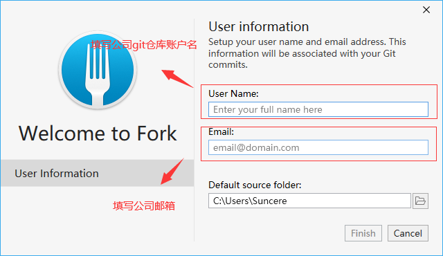

# Fork

---

`Fork` 是一个可视化的git管理工具，目前统一使用 `1.62.1.0` 版本。

如果只安装了原生的 Git 的情况下所有版本管理的操作只能通过命令行来实现，这样子很不方便，而且对使用人员的要求太高。虽然一些开发工具也一定程度上集成了Git的操作，但是大多操作不是很方便，特别是对于分支切换，代码合并、提交回归、更改暂存等操作，所以我们推荐统一使用 `Fork` 进行代码提交等版本管理操作。

安装包地址如下：[Fork-1.62.1.0](http://10.10.204.156:8001/第三方工具/03开发工具、运行环境/Fork)

## 安装

`Fork` 的安装非常简单，运行安装程序之后只有一个页面，如下：

其中用户名填写公司git仓库账户名，之后这个名称也会成为代码提交操作中包含的操作人名称，邮箱地址填写公司企业邮箱地址，工作目录一般不做修改

填写完成，点击 `Finish` 等待初始化即可。

## 使用

待补充
