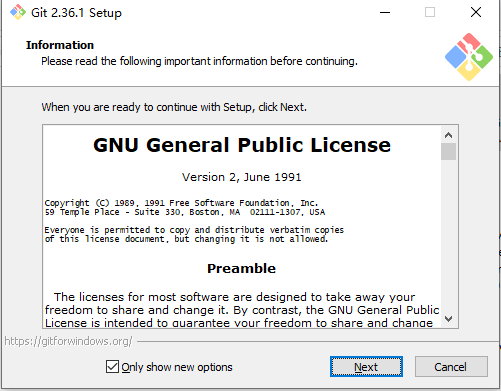
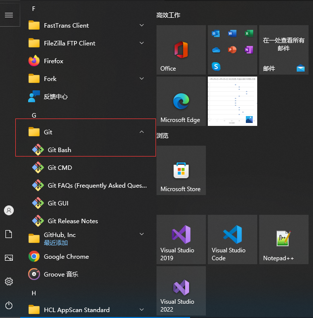
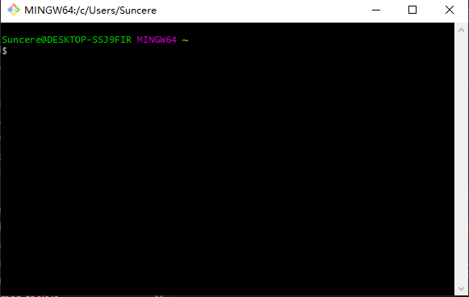

# Git

---

`Git` 是一个开源的分布式版本控制系统，用于敏捷高效地处理任何或小或大的项目。要连接远程git仓库，需要先在本地安装 Git，以实现本地版本控制。目前 Git 统一使用 `2.36.1` 版本。

安装包地址如下：[Git-2.36.1](http://10.10.204.156:8001/第三方工具/03开发工具、运行环境/git)

## 安装

运行 `Git-2.36.1-64-bit.exe`，一直下一步即可

安装完成之后，在电脑右下角 `开始` 处可以找到安装好的 Git 工具。

点击 `Git Bash` 即可通过命令行进行一系列的版本控制操作

注意 `Git Bash` 当前所指向的文件夹目录，也可以在代码、文件所在文件夹下用鼠标右键打开 `Git Bash`
