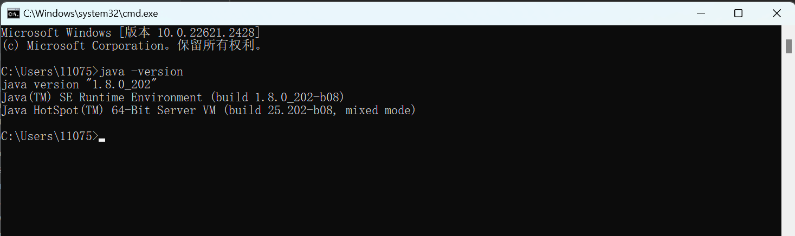

# jdk

---

**jdk** 是 `java` 应用运行环境，服务器或开发机器上运行java应用需要安装环境，目前统一使用 `jdk-1.8` 版本。

安装包地址如下：[jdk-1.8](http://10.10.204.156:8001/第三方工具/03开发工具、运行环境/jdk)

## 1.安装

### 1.1 Windows下安装

（1）将压缩包传输到服务器

（2）解压压缩包，之后配置window的环境变量[环境变量配置](https://blog.csdn.net/weixin_45287177/article/details/131443550)

（3）环境变量配置完成后，cmd命令行运行java指令，如看到以下界面则配置成功



如提示“java”不是内部或外部命令，也不是可运行的程序或批处理文件。
需要检查环境变量是否配置正确。

### 1.2 Linux安装

Linux系统默认安装有java环境，可以直接用java命令测试。

```shell
java -version
```

如果没有java环境，需要手动安装。

（1）将安装包传输到服务器

（2）在安装包所在的目录下运行以下命令进行安装

```shell
rpm -ivh jdk-8u202-linux-x64.rpm
```

（3）配置环境变量
使用命令进入：

```shell
vi /etc/profile
```

在文件的最后面输入以下内容:

```shell
JAVA_HOME=/usr/java/jdk1.8.0_60 # 这里根据实际安装路径填写
CLASSPATH=%JAVA_HOME%/lib:%JAVA_HOME%/jre/lib
PATH=$PATH:$JAVA_HOME/bin:$JAVA_HOME/jre/bin
export PATH CLASSPATH JAVA_HOME
```

保存并退出

刷新环境变量:

```shell
source /etc/profile
```
