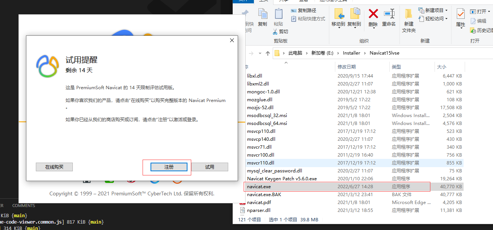

# Navicate

---

`Navicat` 是一个可多重连接的数据库管理工具，它可以连接到MySQL、Oracle、PostgreSQL、SQLite、SQL Server和/或MariaDB数据库，让数据库管理更加方便。目前统一使用 `15.0.23.0` 版本。

安装包地址如下：[Navicate-15](http://10.10.204.156:8001/第三方工具/03开发工具、运行环境/navicate)

## 1. 破解

以上提供的navicate版本是免安装版，下载压缩包解压后进行激活即可使用。

运行解压后的文件夹下的 `Navicat Keygen Patch v5.6.0.exe`

运行之后出现以下界面，点击 `Patch`

之后暂时断开电脑网络

再运行 `navicate.exe`，会出现注册弹窗，点击注册

再在破解程序界面，点击 `Generate`，注册界面会自动填充注册码

点击注册页面的激活，复制请求码到破解工具中，再点击下方的 `Generate` 生成激活码，激活码会自动填充到激活页面

点击激活页面的 `激活` 按钮，即可激活成功

激活成功进行 navicate 使用页面如下，通过右上角的连接选择需要连接的数据库类型，配置数据库连接信息

