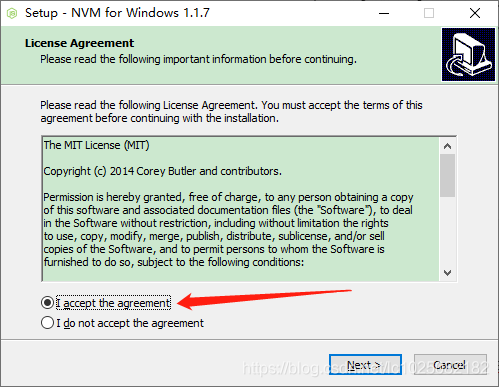
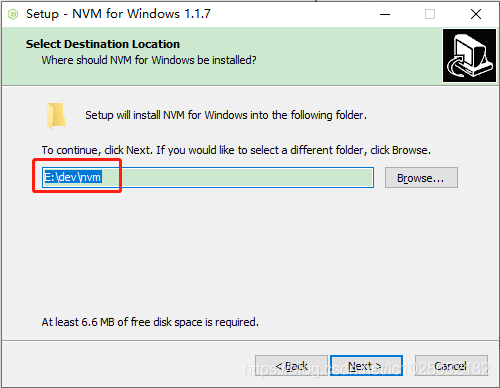
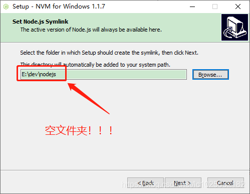
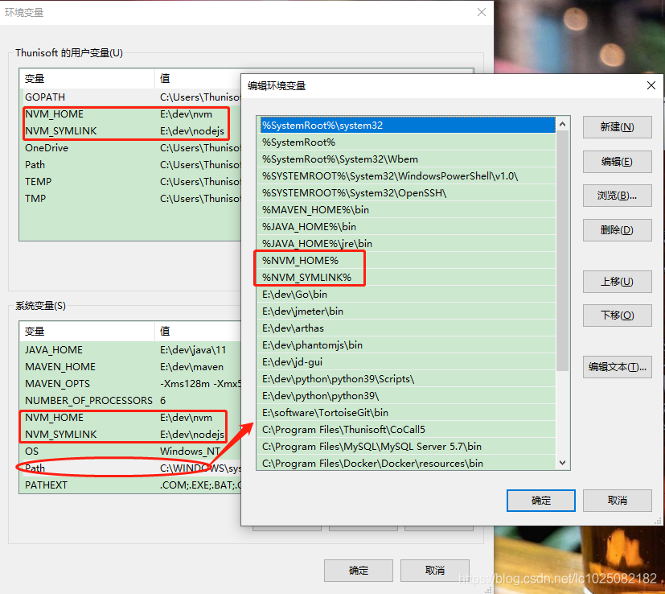
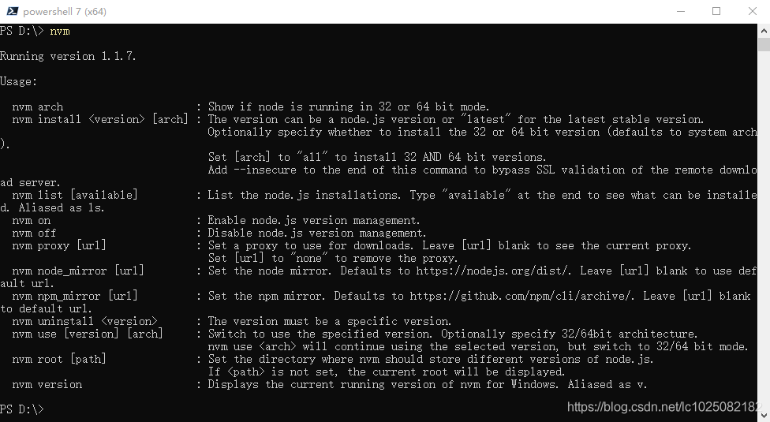
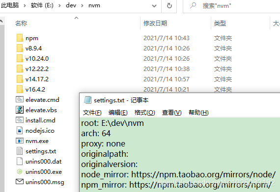
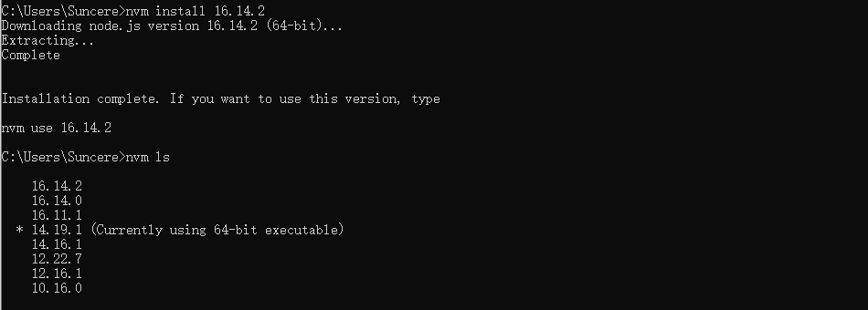
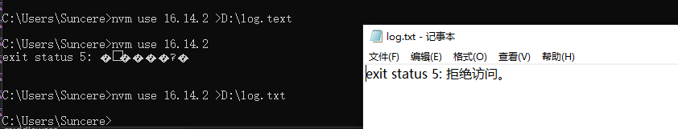
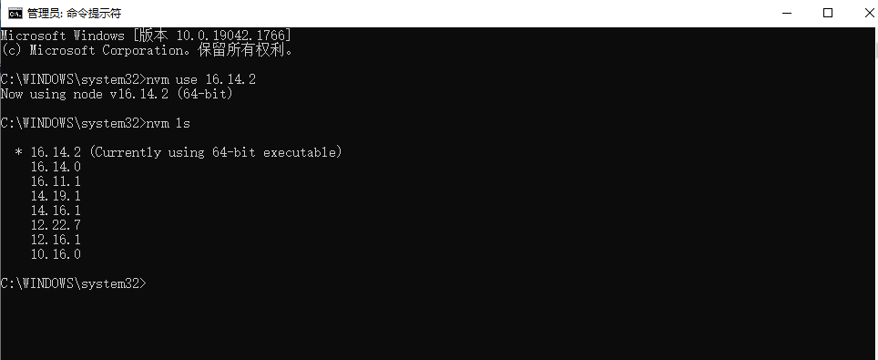
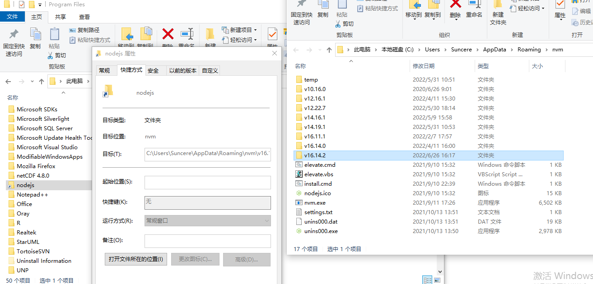

# nvm

---

由于不同的项目在安装依赖时可能会和node版本有关，这就需要我们在不同的项目下使用不同的node版本。这种情况下，对于维护多个版本的node将会是一件非常麻烦的事情，NVM(node.js version management)就是为解决这个问题而产生的，顾名思义这是一个nodejs的版本管理工具,他可以方便的在同一台设备上进行多个node版本之间切换。

安装包下载地址如下：[nvm-1.1.9](http://10.10.204.156:8001/第三方工具/03开发工具、运行环境/nvm)

## 1. 安装

如果电脑上之前已经单独安装了node，先卸载删除（原先的环境变量也不需要了可以删除），然后解压nvm-setup.zip安装包，进入解压的文件夹，双击exe后缀文件进行安装：



选择nvm的安装路径：



选择nodejs的快捷方式路径（这里一定得是空文件夹或者不创建这个文件夹，因为nvm会自动创建这个文件夹为快捷方式）：



下一步后确认安装即可
验证：
安装完成后查看环境变量会发现新增了NVM_HOME(nvm安装路径)和NVM_SYMLINK(nvm自动创建的nodejs文件夹的快捷方式路径)，如下图：



在命令行窗口输入nvm后有如下图信息证明安装成功：



## 2. 使用

### 2.1.设置nvm环境

nvm默认会从github下载npm，可能会有网络问题，所以最好设置为淘宝镜像。nvm的配置也很简单，可以采用命令方式，在shell中执行：

```shell
nvm node_mirror https://npm.taobao.org/mirrors/node/
nvm npm_mirror https://npm.taobao.org/mirrors/npm/
```

或者直接修改配置文件（在nvm安装路径下的settings.txt），如下图：



### 2.2.安装nodejs

Nodejs 统一使用 `16.14.2` 版本，直接命令行执行：

```shell
nvm install 16.14.2
```

执行nvm list查看效果如下：



带有 `*` 号的版本是当前使用的版本

### 2.3.使用或切换nodejs版本

命令行执行命令：

```shell
nvm use 16.14.2
```

如执行未成功，出现以下情况，可以将错误信息输出，查看具体原因



拒绝访问是命令行未以管理员身份运行，缺乏权限导致。以管理员身份运行cmd，在执行命令即可正常切换

效果如下：



这时你会发现原先指定的E:/dev/nodejs目录变成了快捷方式，并且指向了E:/dev/nvm下安装的nodejs目录，如下图：



### 2.4.建议

通过npm安装的全局node_modules应该统一放在一个文件夹
所以建议设置npm的全局参数：

```shell
npm config set prefix E:\dev\nvm\npm
npm config set cache E:\dev\nvm\npm\node_cache
```

> Tips:记得把设置的prefix目录加到系统环境变量的PATH变量内

### 2.5 5.nvm命令总结

```
nvm arch ：显示node是运行在32位还是64位。
nvm install <version> [arch] ：安装node， version是特定版本也可以是最新稳定版本latest。可选参数arch指定安装32位还是64位版本，默认是系统位数。可以添加–insecure绕过远程服务器的SSL。
nvm list [available] ：显示已安装的列表。可选参数available，显示可安装的所有版本。list可简化为ls。
nvm on ：开启node.js版本管理。
nvm off ：关闭node.js版本管理。
nvm proxy [url] ：设置下载代理。不加可选参数url，显示当前代理。将url设置为none则移除代理。
nvm node_mirror [url] ：设置node镜像。默认是https://nodejs.org/dist/。如果不写url，则使用默认url。设置后可至安装目录settings.txt文件查看，也可直接在该文件操作。
nvm npm_mirror [url] ：设置npm镜像。https://github.com/npm/cli/archive/。如果不写url，则使用默认url。设置后可至安装目录settings.txt文件查看，也可直接在该文件操作。
nvm uninstall <version> ：卸载指定版本node。
nvm use [version] [arch] ：使用制定版本node。可指定32/64位。
nvm root [path] ：设置存储不同版本node的目录。如果未设置，默认使用当前目录。
nvm version ：显示nvm版本。version可简化为v。
```

>nvm 的安装和使用请参考：[nvm介绍、nvm下载安装及使用](https://blog.csdn.net/qq_30376375/article/details/115877446) 、[NVM安装教程使用手册](https://lichong.blog.csdn.net/article/details/118756713)
