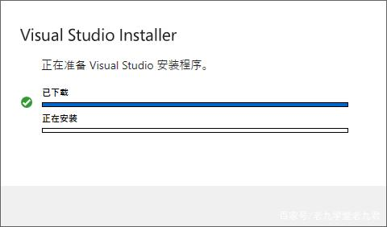

# Visual Studio

Visual Studio（简称VS）是微软公司的开发工具包系列产品，是.net开发人员最常用的集成开发环境（IDE），最常用的开发工具。

目前推荐统一使用 `企业(Enterprise)` 版。安装工具地址如下：[Visual Studio Enterprise Installer](http://10.10.204.156:8001/第三方工具/03开发工具、运行环境/vs)

# 安装

上面提供的应用程序是微软官方提供的一个 Visual Studio 安装向导，用于安装和管理 Visual Studio，需要先安装该应用，再进行 Visual Studio 的安装。

双击运行 安装向导，安装向导会进行安装或升级

安装想到本身安装完成后，即可开始 Visual Studio 安装，Visual Studio 请选择 `2019版本` 或者 `2022版本`。

在以下界面勾选最基本的依赖，后续开发中有遇到其他需要的话再按需求进行额外的依赖安装，根据需要选择安装路径，然后进行安装即可，安装过程可能较久，需要稍微等待。

安装完成之后，打开 Visual Studio，会提示只有30天的试用期限，需要进行授权，可在网上搜索 `vs 2020 企业版密钥`，然后点击上方菜单栏的帮助，选择 注册 visual studio，填写密钥进行授权。

以下提供一个密钥，如不可以请自行网上查找：

VHF9H-NXBBB-638P6-6JHCY-88JWH

