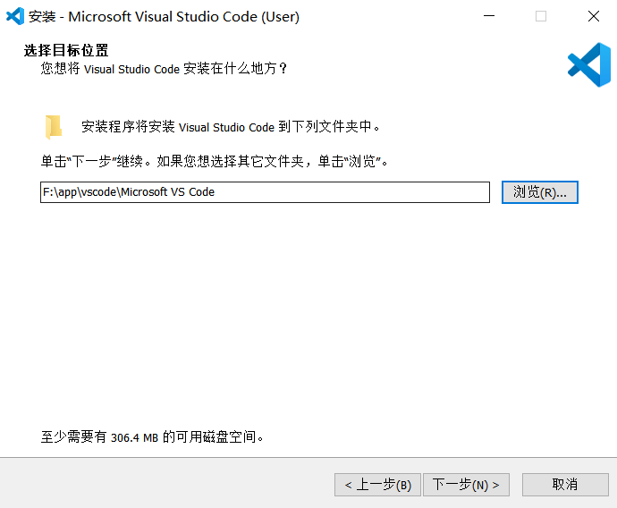
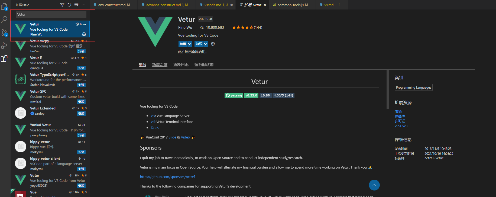
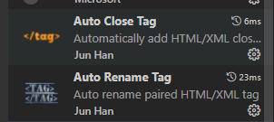
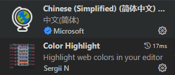
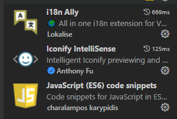
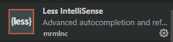
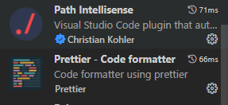
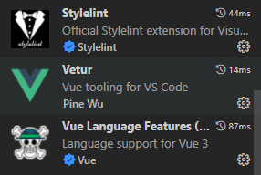

# Visual Studio Code

---

Visual Studio Code是微软公司的开源的一款轻量级IDE，支持插件扩展，用户可以通过安装各种以支持开发语言环境。在我们公司现行技术栈下，我们一般将其作为前端开发IDE，可以作为Python开发IDE。

VS code 不固定版本，在关闭的时候会自动检测更新，使用最新版即可。安装包地址如下：[Visual Studio Code](http://10.10.204.156:8001/第三方工具/03开发工具、运行环境/VSCode)

## 安装

运行exe文件，一直下一步即可，期间可以根据需要选择安装文件夹

## 插件安装

最新版本vs code 在安装完成之后，打开软件会有使用指引，可以根据指引安装一些通用插件，也可以自行安装需要的插件

点击 vs code 左侧最后一个标签，进入应用扩展商店，进行插件安装，在搜索栏输入插件名称之后，点击插件，进入安装页面

推荐安装以下插件：

