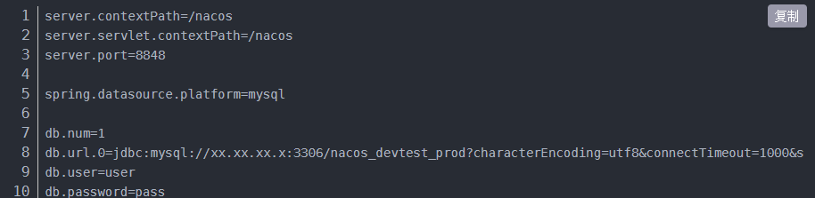
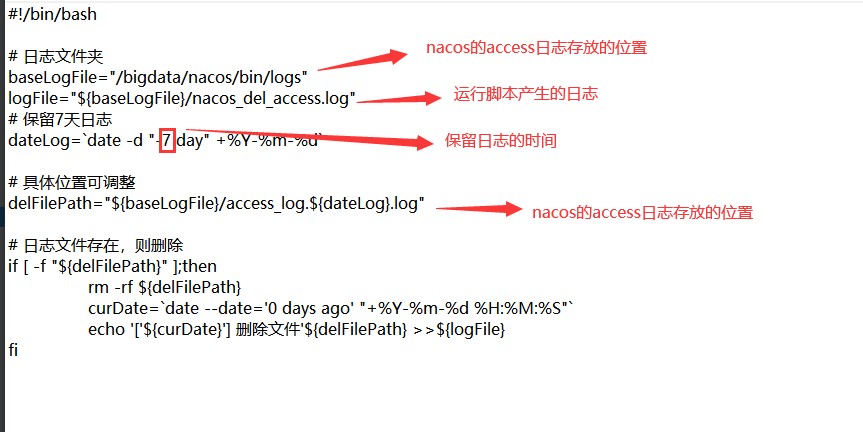
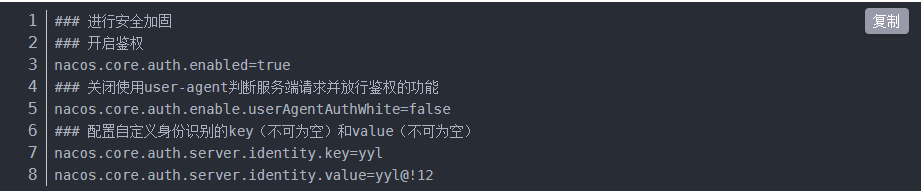
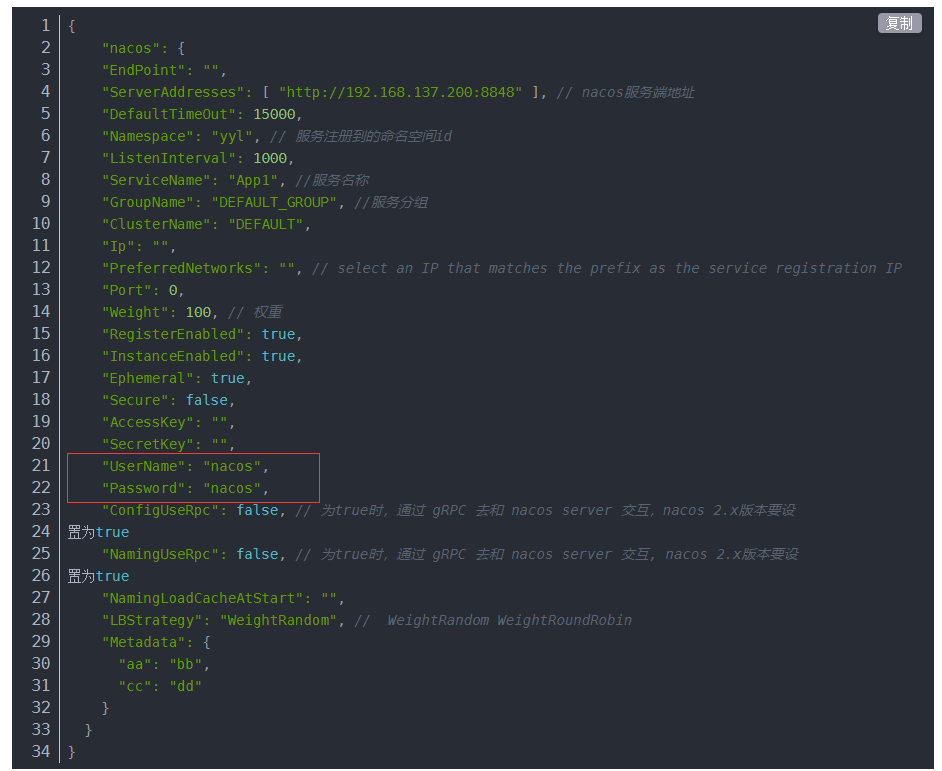
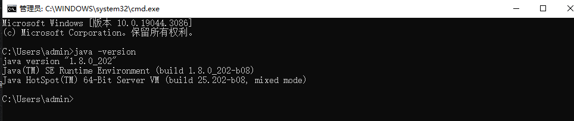

# Nacos

---

`Nacos` 是一个第三方服务发现中间件，用于微服务架构中实现服务发现、服务管理功能。安装包地址：[Nacos-2.2.3](http://10.10.204.156:8001/第三方工具/01中间件/nacos/安装包/nacos-server-2.2.3.zip)

**特别说明**

1、如果是从1.4.x版本升级到2.2.3的话，需要整个重新部署(测试过直接替换jar,但是替换后启动不了)，需要将旧nacos的配置信息导出，之后解压整个2.2.3版本的nacos压缩包，启动2.2.3之后重新创建命名空间，之后将导出的配置重新导入进去

2、nacos2.2.3包的默认密码已经修改成强密码Suncere*0626（该密码是默认密码，安装之后必须登录修改）

3、需要从这里下载的nacos包，因为官网上的最新的2.2.3的nacos还是存在漏洞，当前这里这个包是通过下载官网上源码，修改好漏洞后重新打包的

4、nacos修改密码的特殊字符不要使用$或者@，程序链接会有问题。当前测试过的$在linux系统上有问题，@在window系统上有问题,$已经有多台服务器也出现过问题，本地测试没有问题，所以建议windows也不使用$

&nbsp;

## 1. 安装

### 1.1 环境准备

Nacos是java开发的应用，依赖java环境，请先安装 `jdk-1.8`，jdk安装请见 [第三方工具-开发工具、运行环境-jdk](http://10.10.204.156:8000/#/common-tools/develop-tools/jdk) 。

&nbsp;

### 1.2 Nacos安装

（1）将安装包传输到服务器上

（2）解压

Windows环境下直接解压

Linux环境下请使用以下命令解压

```shell
unzip nacos-server-1.4.2.zip
```

（3）配置

修改 conf文件夹下的application.properties 文件，将mysql连接改为实际的连接地址



（4）启动

切换到bin目录下，windows下在命令行中执行以下命令：

```shell
startup.cmd -m standalone
```

Windows下需要保持命令行窗口不被关闭

Linux下执行以下命令：

```shell
./startup.sh -m standalone
```

如需关闭Nacos，在bin目录下执行以下命令：

```shell
./shutdown.sh
```

（5）查看Nacos管理平台

访问以下地址：http://ip:8848/nacos

注意修改实际ip，注意防火墙是否开发端口。

因为等保安全问题，公司内部提供的Nacos安装包已统一修改了Nacos管理平台的默认用户密码，默认用户密码为 nacos/Suncere*0626，在.net应用接入Nacos时，请注意密码问题，避免服务无法注册

> Nacos 相关可参考以下文章：[服务发现—nacos部署](https://blog.csdn.net/weixin_37648525/article/details/124220790?spm=1001.2014.3001.5501)

### 1.3 Nacos配置自动清理access log 日志功能（基于linux服务器）
Nacos的没有配置自动清理的日志信息的配置项，所以当Nacos在开启access log日志记录时，会不断的写入日志信息，并且不会自动删除，运行时间久了就会产生大量的日志信息占用了磁盘空间，所以这里提供一种配置Nacos自动清理access log功能

（1）编写删除日志文件执行脚本
    
新建一个delNacosAccessLog.sh脚本文件，内容如下

> 脚本下载地址：[delNacosAccessLog.sh](http://10.10.204.156:8001/第三方工具/01中间件/nacos/delNacosAccessLog.sh)



（2）初始化清除现有的日志信息

如果Nacos是新安装的则不需要进行这一步，如果Nacos已经运行了一段时间了，产生了日志信息则需要先初始清除一部分日志信息，如果脚本配置的只保留七天的日志信息，那这批已产生的日志信息则删除七天以前的所有日志

（3）配置定时执行日志删除脚本

1）将脚本上传到服务器随便的一个目录（没有指定要求，只要能通过路径找到文件就行），如/home/nacos/delLog/delNacosAccessLog.sh

2）root用户登录，给脚本文件赋予执行权限，运行如下命令

```shell
chmod 755 /home/nacos/delLog/delNacosAccessLog.sh
```

3）配置服务器定时任务，添加或更新linux系统中crontab指令，运行如下命令

```shell
crontab -e
```

4）添加定时执行指令（23点执行脚本）,执行时间可以根据具体情况进行修改（但是必须每天执行一次）

```shell
0 23 * * * /home/nacos/delLog/delNacosAccessLog.sh
```

5）重新载入定时任务配置，执行命令如下

```shell
service crond reload或者systemctl reload crond.service
```

&nbsp;

## 2. 过往问题记录

### 2.1 Nacos未授权访问问题

Nacos 1.x版本<=1.4.1的版本和2.x版本<=2.0.0-ALPHA.1的版本存在未授权漏洞

解决方案：将Nacos版本升级至 1.4.2版本，并且修改application.properties



应用在接入Nacos时，必须配置UserName和Password



### 2.2 启动报错 Cannot determine JNI library name for ARCH='x86' OS='windows server 2012 r2' name='rocksdb'

该问题的主要原因是jdk的版本较低（小于1.8），或者jdk不是64位导致的，排查直接打开命令行，运行java -version，看打印信息是否是64位的



如果不是64位的jdk是没有截图圈起来的那个提示

### 2.2 启动报错 'C:\xxx\Temp\xxx.dll: Can't find dependent libraries

启动阿里巴巴nacos项目的时候，报Can't find dependent libraries这个错。这是因为缺少了依赖库Visual C++ Redistributable for Visual Studio 2015

处理方式是安装windows补丁 [Visual C++ Redistributable for Visual Studio 2015](https://www.microsoft.com/zh-cn/download/confirmation.aspx?id=48145)
