# 初始化数据库

关系型数据库是我们日常开发中最常见的数据持久化技术，主要包括 MySql、SqlServer 和其他国产数据库等，项目默认使用 MySql。为了减少切换数据库的成本和困难，我们将数据库交互集中在**仓储层**，并且尽可能使用 ORM 框架而不是 SQL。

我们通常使用的 ORM 框架主要是 EntityFrameworkCore 和 FreeSql，一般情况下我们优先使用 EntityFrameworkCore，在一些不适合 EntityFrameworkCore 的情况下，使用 FreeSql 作为补充，例如

1. EntityFrameworkCore 不支持、不兼容或者不友好的数据库，例如 Dameng（达梦）、KingbaseES（人大金仓）等
2. 数据量大，需要分表分库

本教程同样优先使用 EntityFrameworkCore，并使用 FreeSql 补充。

## 数据迁移

先手动新建数据库，然后使用程序包管理器控制台完成数据迁移。在程序包管理器控制台选择默认项目为 Suncere.Sample.EntityFrameworkCore.DbMigrations，然后输入指令添加迁移

```shell
Add-Migration Init
```

添加迁移后，Suncere.Sample.EntityFrameworkCore.DbMigrations 项目会新建 Migrations 文件夹，并新增迁移类，如下图

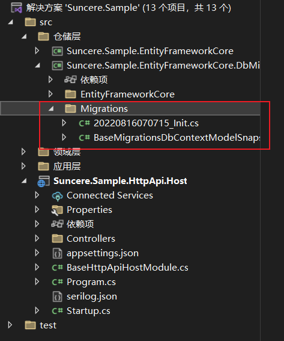

然后输入更新数据库指令

```shell
Update-Database
```

更新数据库后，会新建数据库表，如下图

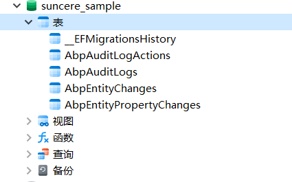

# 站点管理

## 创建 Station 实体

模板中的**领域层**包括两个项目：

- Suncere.Sample.Domain 包含实体、领域服务和其他核心域对象。
- Suncere.Sample.Domain.Shared 包含可与客户共享的常量、枚举或其他域相关对象。

在 Suncere.Sample.Domain 项目中定义实体，新建 Stations 文件夹，并在其中添加 Station 类：

```csharp
    /// <summary>
    /// 站点
    /// </summary>
    public class Station : AggregateRoot<Guid>
    {
        /// <summary>
        /// 编码
        /// </summary>
        public string Code { get; set; }
        /// <summary>
        /// 名称
        /// </summary>
        public string Name { get; set; }
        /// <summary>
        /// 经度
        /// </summary>
        public double? Longitude { get; set; }
        /// <summary>
        /// 纬度
        /// </summary>
        public double? Latitude { get; set; }
    }
```

### 将 Station 实体添加到 DbContext 中

EntityFrameworkCore 需要将实体和 DbContext 建立关联，最简单的做法是在 Suncere.Sample.EntityFrameworkCore 项目中的 BaseDbContext 类中添加 DbSet 属性：

```csharp
    public class BaseDbContext : AbpDbContext<BaseDbContext>
    {

        /* Add DbSet properties for your Aggregate Roots / Entities here.
         * Also map them inside CommonDbContextModelCreatingExtensions.ConfigureCommon
         */

        public BaseDbContext(DbContextOptions<BaseDbContext> options)
            : base(options)
        {

        }

        public DbSet<Station> Stations { get; set; }

        protected override void OnModelCreating(ModelBuilder builder)
        {
            base.OnModelCreating(builder);

            /* Configure the shared tables (with included modules) here */


            /* Configure your own tables/entities inside the ConfigureCommon method */

            builder.ConfigureBase();
        }
    }
```

### 将 Station 实体映射到数据库表并配置实体特性

打开 BaseDbContextModelCreatingExtensions 类的 ConfigureBase 方法，配置 Station 实体的实体特性：

```csharp
    public static class BaseDbContextModelCreatingExtensions
    {
        public static void ConfigureBase(this ModelBuilder builder)
        {
            Check.NotNull(builder, nameof(builder));

            /* Configure your own tables/entities inside here */

            builder.Entity<Station>(b =>
            {
                b.ToTable(BaseConsts.DbTablePrefix + "Stations", BaseConsts.DbSchema);
                b.ConfigureByConvention(); //auto configure for the base class props
                b.Property(x => x.Code).IsRequired().HasMaxLength(8);
                b.Property(x => x.Name).IsRequired().HasMaxLength(128);
            });
        }
    }
```

### 数据迁移

在程序包管理器控制台输入添加迁移指令：

```shell
Add-Migration Created_Station_Entity
```

添加迁移后，Suncere.Sample.EntityFrameworkCore.DbMigrations 项目中的 Migrations 文件夹会新增迁移类，如下图

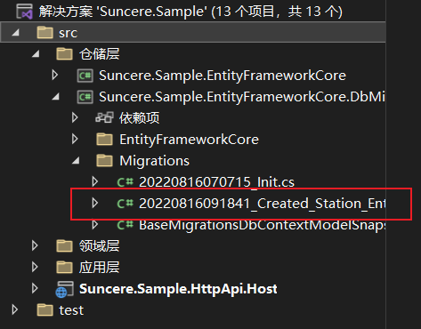

然后输入更新数据库指令：

```shell
Update-Database
```

更新数据库后，会新建 AppStations 数据库表，如下图

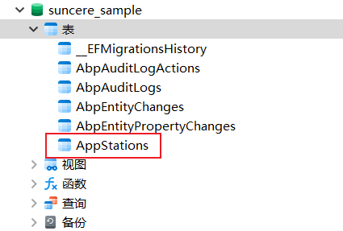

## 创建应用服务

**应用层**包括两个项目：

- Suncere.Sample.Application 包含应用服务实现。
- Suncere.Sample.Application.Contracts 包含 DTO 和应用服务接口。

### StationDto

在 Suncere.Sample.Application.Contracts 项目中新建 Stations 文件夹，并在其中添加 StationDto 类：

```csharp
    /// <summary>
    /// 站点数据传输对象
    /// </summary>
    public class StationDto : EntityDto<Guid>
    {
        /// <summary>
        /// 编码
        /// </summary>
        public string Code { get; set; }
        /// <summary>
        /// 名称
        /// </summary>
        public string Name { get; set; }
        /// <summary>
        /// 经度
        /// </summary>
        public double? Longitude { get; set; }
        /// <summary>
        /// 纬度
        /// </summary>
        public double? Latitude { get; set; }
    }
```

在将站点返回到**表示层**时，需要将 Station 实体转换为 StationDto 对象。AutoMapper 库可以在定义了正确的映射时自动执行此转换。模板配置了 AutoMapper，因此只需在 Suncere.Sample.Application 项目新建 BaseApplicationAutoMapperProfile 类定义映射：

```csharp
    public class BaseApplicationAutoMapperProfile : Profile
    {
        public BaseApplicationAutoMapperProfile()
        {
            CreateMap<Station, StationDto>();
        }
    }
```

### CreateUpdateStationDto

在 Suncere.Sample.Application.Contracts 项目中的 Stations 文件夹中添加 CreateUpdateStationDto 类：

```csharp
    /// <summary>
    /// 站点创建更新数据传输对象
    /// </summary>
    public class CreateUpdateStationDto
    {
        /// <summary>
        /// 编码
        /// </summary>
        [Required]
        [StringLength(8)]
        public string Code { get; set; }
        /// <summary>
        /// 名称
        /// </summary>
        [Required]
        [StringLength(128)]
        public string Name { get; set; }
        /// <summary>
        /// 经度
        /// </summary>
        public double? Longitude { get; set; }
        /// <summary>
        /// 纬度
        /// </summary>
        public double? Latitude { get; set; }
    }
```

就像上面的 StationDto 一样，创建一个从 CreateUpdateStationDto 对象到 Station 实体的映射，最终映射配置类如下：

```csharp
    public class BaseApplicationAutoMapperProfile : Profile
    {
        public BaseApplicationAutoMapperProfile()
        {
            CreateMap<Station, StationDto>();
            CreateMap<CreateUpdateStationDto, Station>();
        }
    }
```

### IStationAppService

下一步是为应用服务定义接口，在 Suncere.Sample.Application.Contracts 项目中的 Stations 文件夹中添加 IStationAppService 接口：

```csharp
    /// <summary>
    /// 站点应用服务接口
    /// </summary>
    public interface IStationAppService :
        ICrudAppService< // Defines CRUD methods
        StationDto, // Used to show stations
        Guid,  // Primary key of the station entity
        PagedAndSortedResultRequestDto, // Used for paging/sorting
        CreateUpdateStationDto> // Used to create/update a station
    {
    }
```

- ICrudAppService 定义了常见的 **CRUD** 方法：GetAsync、GetListAsync、CreateAsync、UpdateAsync 和 DeleteAsync。从这个接口扩展不是必需的，也可以从空的 IApplicationService 接口继承并手动定义自己的方法。
- ICrudAppService 有一些变体，可以在每个方法中使用单独的 DTO。

### StationAppService

在 Suncere.Sample.Application 项目中创建 Stations 文件夹，并在其中添加 StationAppService 类：

```csharp
    /// <summary>
    /// 站点应用服务
    /// </summary>
    public class StationAppService : CrudAppService<Station, StationDto, Guid, PagedAndSortedResultRequestDto, CreateUpdateStationDto>, IStationAppService
    {
        public StationAppService(IRepository<Station, Guid> repository) : base(repository)
        {
        }
    }
```

### 运行应用程序

键入 Ctrl + F5，运行应用程序，之后使用浏览器打开 http://localhost:45678，新增了 Station 应用服务

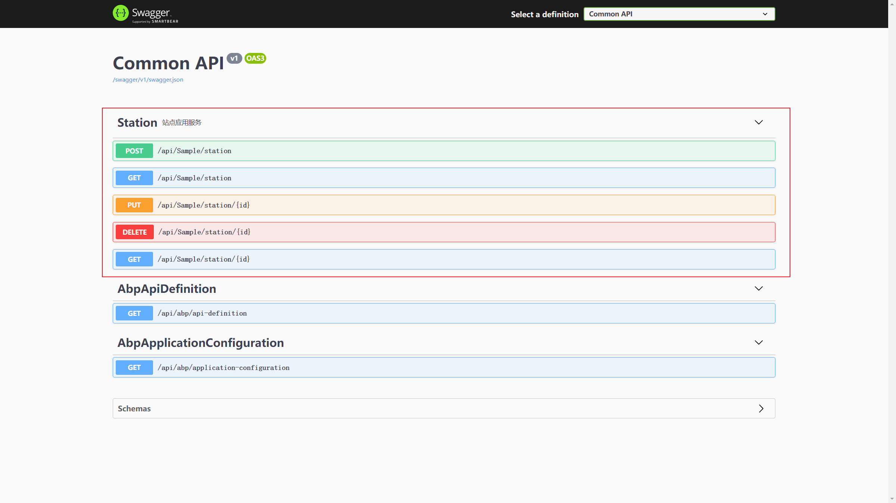

单击选择第一个方法，点击 Try it out 按钮，输入站点信息

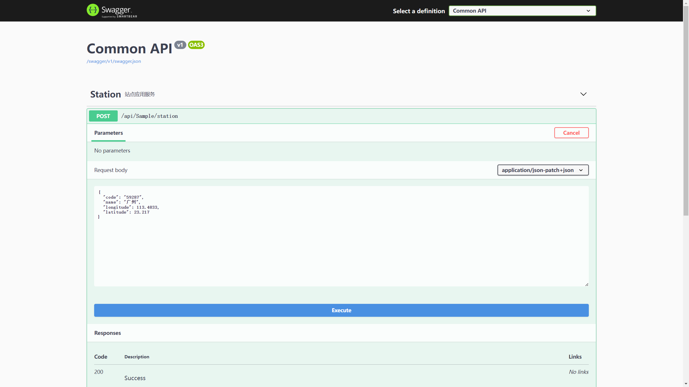

点击 Execute 按钮，提交站点信息，方法返回200，添加成功

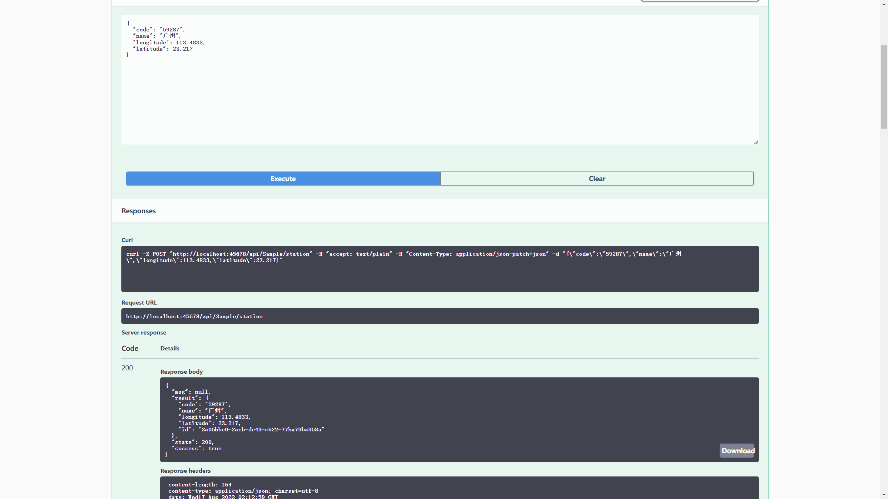

查询数据库，看到站点表里新增了一条记录

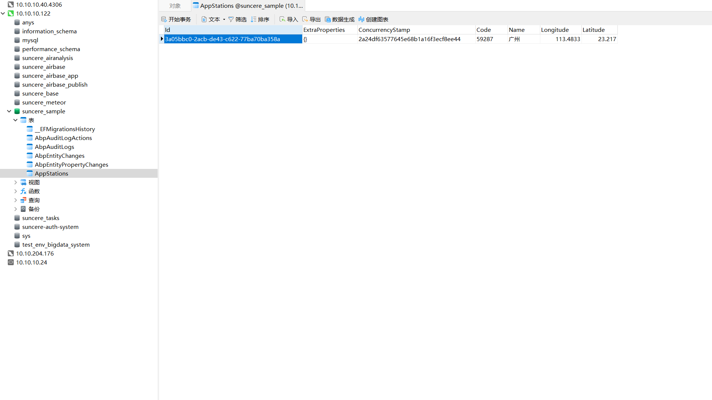

# 站点小时气象监测数据

## 添加 FreeSql 仓储项目

右键仓储层文件夹，选择添加-新建项目，如下图

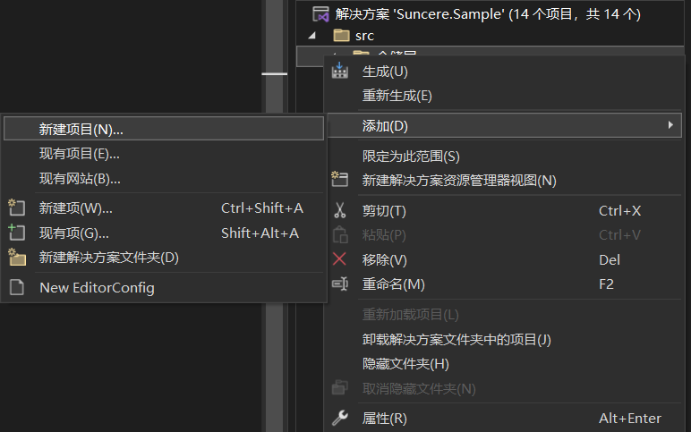

选择类库，点击下一步，然后键入 Suncere.Sample.FreeSql 作为项目名称，点击下一步，然后选择 .NET Core 3.1 作为框架，点击创建按钮，如下图

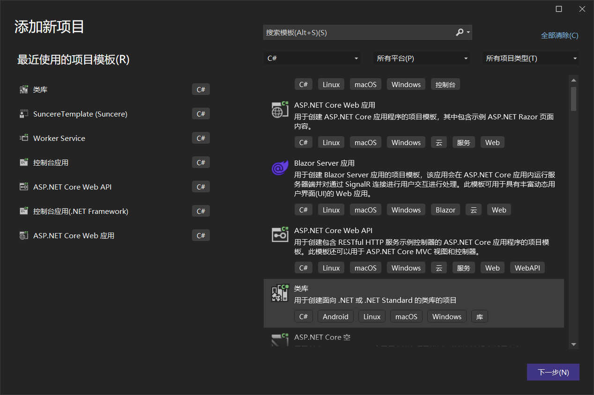

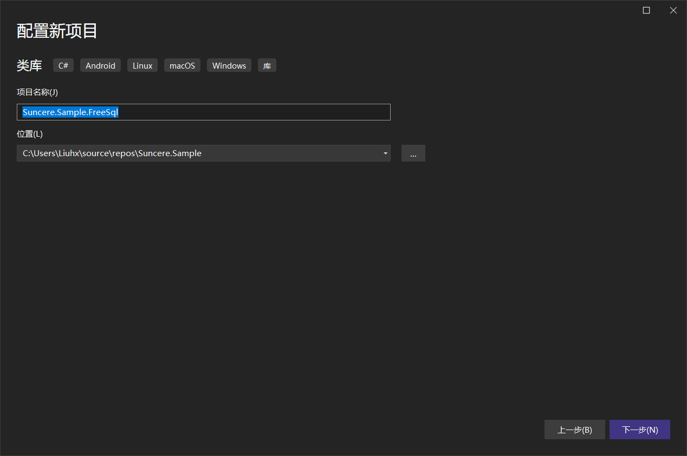

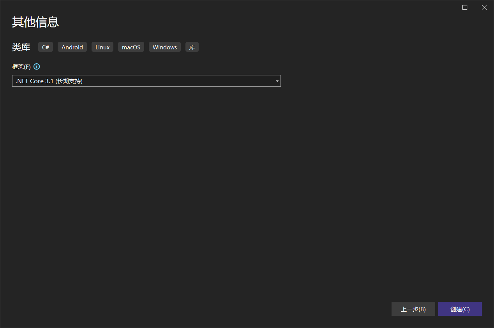

右键 Suncere.Sample.FreeSql 项目，选择管理 NuGet 程序包，然后安装 Suncere.Abp.FreeSql.MySql 程序包（对应项目使用的数据库，如果项目使用的是 SqlServer 数据库，则安装 Suncere.Abp.FreeSql.SqlServer），如下图

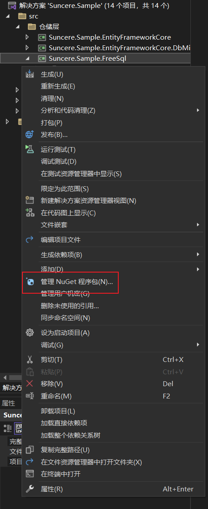

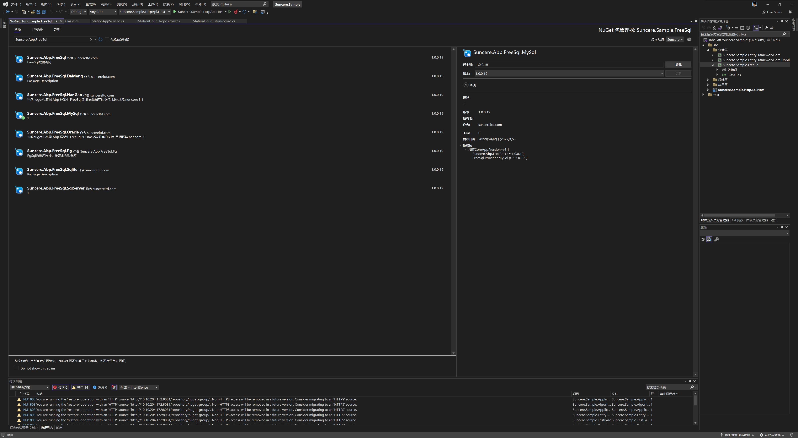

将 Suncere.Sample.FreeSql 项目中的 Class1.cs 重命名为 SuncereSampleFreeSqlModule.cs，并修改

```csharp
    [DependsOn(typeof(SuncereAbpFreeSqlMySqlModule))]
    public class SuncereSampleFreeSqlModule : AbpModule
    {
        public override void ConfigureServices(ServiceConfigurationContext context)
        {
            Configure<FreeSqlConnectionOptions>(options =>
            {
                options.UseMySql();
            });
        }
    }
```

修改 Suncere.Sample.HttpApi.Host 项目中的 BaseHttpApiHostModule 类，添加 SuncereSampleFreeSqlModule 依赖

```csharp
    [DependsOn(
        typeof(BaseHttpApiModule),
        typeof(AbpAutofacModule),
        typeof(AbpCachingStackExchangeRedisModule),
        typeof(AbpAspNetCoreMvcUiModule),
        typeof(BaseApplicationModule),
        typeof(BaseEntityFrameworkCoreDbMigrationsModule),
        typeof(AbpAspNetCoreSerilogModule),
        typeof(SuncereMicroServiceModule),
        typeof(SuncereSampleFreeSqlModule)
    )]
    public class BaseHttpApiHostModule : AbpModule
    {
        
    }
```

## 创建 StationHourlyWeatherMonitorRecord 实体

在 Suncere.Sample.Domain 项目中定义实体，新建 StationHourlyWeatherMonitorRecords 文件夹，并在其中添加 StationHourlyWeatherMonitorRecord 类：

```csharp
    /// <summary>
    /// 站点小时气象监测记录
    /// </summary>
    public class StationHourlyWeatherMonitorRecord : Entity
    {
        /// <summary>
        /// 编码
        /// </summary>
        public string Code { get; set; }
        /// <summary>
        /// 时间
        /// </summary>
        public DateTime Time { get; set; }
        /// <summary>
        /// 降水量
        /// </summary>
        public double? Precipitation { get; set; }
        /// <summary>
        /// 温度
        /// </summary>
        public double? Temperature { get; set; }
        /// <summary>
        /// 相对湿度
        /// </summary>
        public double? RelativeHumidity { get; set; }
        /// <summary>
        /// 气压
        /// </summary>
        public double? AirPressure { get; set; }
        /// <summary>
        /// 风向
        /// </summary>
        public double? WindDirection { get; set; }
        /// <summary>
        /// 风速
        /// </summary>
        public double? WindSpeed { get; set; }

        public override object[] GetKeys()
        {
            return new object[] { Code, Time };
        }
    }
```

### 配置分表规则

在 Suncere.Sample.HttpApi.Host 项目中添加 subsetting.json 文件，如下图

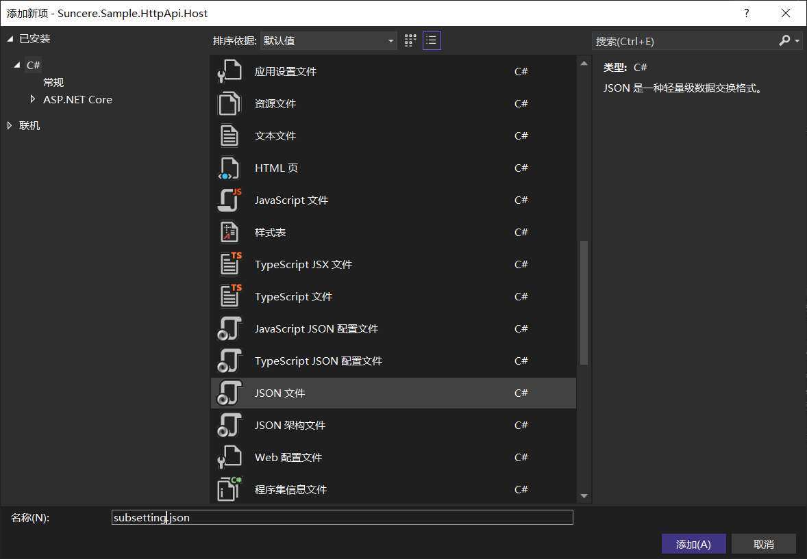

修改 subsetting.json 文件，配置分表规则。气象站点数量大概2400个，每个站点每小时一条记录，一年大概2100万，根据一张表大概500万的推荐容量，我们需要分成4张表，正好可以按照季度分表。

```json
{
  // 分表规则配置
  "Suncere.Sample.StationHourlyWeatherMonitorRecords.StationHourlyWeatherMonitorRecord": {
    "SubRuleType": "Suncere.Abp.Data.DateSubRule",
    "SubRoute": "Time",
    "DateRules": [
      {
        "StartTimeStamp": 1640966400, // 2022-01-01 时间戳（秒）
        "EndTimeStamp": 1648742399, // 2022-03-31 23:59:59 时间戳（秒）
        "Suffix": "202201"
      },
      {
        "StartTimeStamp": 1648742400, // 2022-04-01
        "EndTimeStamp": 1656604799, // 2022-06-30 23:59:59
        "Suffix": "202202"
      },
      {
        "StartTimeStamp": 1656604800, // 2022-07-01
        "EndTimeStamp": 1664553599, // 2022-09-30 23:59:59
        "Suffix": "202203"
      },
      {
        "StartTimeStamp": 1664553600, // 2022-10-01
        "EndTimeStamp": 1672502399, // 2022-12-31 23:59:59
        "Suffix": "202204"
      }
    ]
  }
}
```

### 将 StationHourlyWeatherMonitorRecord 实体映射到数据库表并配置实体特性

在 Suncere.Sample.FreeSql 项目中添加 CodeFirstConfigEntityExtensions 类，并在类中添加名为 ConfigSampleEntities 的扩展方法，配置 StationHourlyWeatherMonitorRecord 实体的实体特性：

```csharp
    public static class CodeFirstConfigEntityExtensions
    {
        public static void ConfigSampleEntities(this ICodeFirst codeFirst)
        {
            codeFirst.ConfigEntity<StationHourlyWeatherMonitorRecord>(entity =>
            {
                entity.Property(x => x.Code).IsPrimary(true).StringLength(8);
                entity.Property(x => x.Time).IsPrimary(true);
            });
        }
    }
```

在 SuncereSampleFreeSqlModule 类中重写 OnPostApplicationInitialization 方法，调用上面的扩展方法：

```csharp
        public override void OnPostApplicationInitialization(ApplicationInitializationContext context)
        {
            context.ServiceProvider.GetRequiredService<IFreeSqlSession>().Get().CodeFirst.ConfigSampleEntities();
        }
```

### 数据迁移

修改 SuncereSampleFreeSqlModule 类中的 ConfigureServices 方法，配置 StationHourlyWeatherMonitorRecord 实体迁移到默认数据库：

```csharp
        public override void ConfigureServices(ServiceConfigurationContext context)
        {
            Configure<FreeSqlConnectionOptions>(options =>
            {
                options.UseMySql();
            });

            Configure<DbMigrationOptions>(options =>
            {
                options.Config("Default").Entity<StationHourlyWeatherMonitorRecord>();
            });
        }
```

修改 SuncereSampleFreeSqlModule 类中的 OnPostApplicationInitialization 方法，调用数据迁移方法：

```csharp
        public override void OnPostApplicationInitialization(ApplicationInitializationContext context)
        {
            context.ServiceProvider.GetRequiredService<IFreeSqlSession>().Get().CodeFirst.ConfigSampleEntities();

            var config = context.GetConfiguration();
            if (bool.TryParse(config["Initialization:Migrate"], out bool migirate) && migirate)
            {
                // 在应用启动之后，检查数据库，进行表结构迁移，如不需要在启动时进行检查，可将下面一句代码注释
                context.ServiceProvider.GetRequiredService<IMigrator>().Migrate();
            }
        }
```

修改 Suncere.Sample.HttpApi.Host 项目中的 appsettings.json 文件，将 Initialization 节点的 Migrate 属性修改为 true，开启数据迁移：

```json
  "Initialization": {
    "Migrate": true,
    "DataSeed": false
  }
```

键入 Ctrl + F5，运行应用程序，程序在数据库中创建对应数据库表，如下图

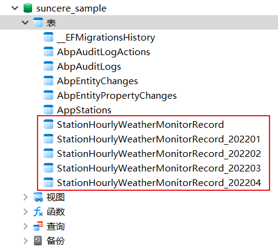

### IStationHourlyWeatherMonitorRecordRepository

在 Suncere.Sample.Domain 项目中的 StationHourlyWeatherMonitorRecords 文件夹中添加 IStationHourlyWeatherMonitorRecordRepository 接口：

```csharp
    /// <summary>
    /// 站点小时气象监测记录仓储接口
    /// </summary>
    public interface IStationHourlyWeatherMonitorRecordRepository
    {
        /// <summary>
        /// 插入 StationHourlyWeatherMonitorRecord 实体
        /// </summary>
        /// <param name="entity"></param>
        /// <param name="cancellationToken"></param>
        /// <returns></returns>
        Task InsertAsync(StationHourlyWeatherMonitorRecord entity, CancellationToken cancellationToken = default);

        /// <summary>
        /// 获取 StationHourlyWeatherMonitorRecord 集合
        /// </summary>
        /// <param name="predicate"></param>
        /// <param name="cancellationToken"></param>
        /// <returns></returns>
        Task<List<StationHourlyWeatherMonitorRecord>> GetListAsync(Expression<Func<StationHourlyWeatherMonitorRecord, bool>> predicate, CancellationToken cancellationToken = default);

        /// <summary>
        /// 获取 StationHourlyWeatherMonitorRecord 集合
        /// </summary>
        /// <param name="time"></param>
        /// <param name="cancellationToken"></param>
        /// <returns></returns>
        Task<List<StationHourlyWeatherMonitorRecord>> GetListAsync(DateTime time, CancellationToken cancellationToken = default);
    }
```

### StationHourlyWeatherMonitorRecordRepository

在 Suncere.Sample.FreeSql 项目中添加 StationHourlyWeatherMonitorRecords 文件夹，并在其中添加 StationHourlyWeatherMonitorRecordRepository 类：

```csharp
    /// <summary>
    /// 站点小时气象监测记录仓储类
    /// </summary>
    public class StationHourlyWeatherMonitorRecordRepository : IStationHourlyWeatherMonitorRecordRepository, ITransientDependency
    {
        private IFreeSql _freeSql;
        private SubRuleContext _subRuleContext;

        public StationHourlyWeatherMonitorRecordRepository(IFreeSqlSession freeSqlSession, ISubRuleResolver subRuleResolver)
        {
            _freeSql = freeSqlSession.Get();
            _subRuleContext = subRuleResolver.Resolve<StationHourlyWeatherMonitorRecord>();
        }

        /// <summary>
        /// 获取数据库表名
        /// </summary>
        /// <param name="exp"></param>
        /// <returns></returns>
        private IList<string> GetTables(Expression<Func<StationHourlyWeatherMonitorRecord, bool>> exp)
        {
            DataSubContext<StationHourlyWeatherMonitorRecord> dataSubContext = new DataSubContext<StationHourlyWeatherMonitorRecord>(_subRuleContext.DefaultName, _subRuleContext.SubRoute, _subRuleContext.SubRouteType, exp, null);
            return _subRuleContext.SubRule.GetTables(dataSubContext);
        }

        /// <summary>
        /// 获取 Linq 表达式
        /// </summary>
        /// <param name="entity"></param>
        /// <returns></returns>
        private Expression<Func<StationHourlyWeatherMonitorRecord, bool>> GetExpression(StationHourlyWeatherMonitorRecord entity)
        {
            PropertyInfo pi = typeof(StationHourlyWeatherMonitorRecord).GetProperty(_subRuleContext.SubRoute);
            return LambdaUtils.CreateEqual<StationHourlyWeatherMonitorRecord>(_subRuleContext.SubRoute, pi.GetValue(entity), _subRuleContext.SubRouteType);
        }

        /// <summary>
        /// 插入 StationHourlyWeatherMonitorRecord 实体
        /// </summary>
        /// <param name="entity"></param>
        /// <param name="cancellationToken"></param>
        /// <returns></returns>
        public async Task InsertAsync(StationHourlyWeatherMonitorRecord entity, CancellationToken cancellationToken = default)
        {
            Expression<Func<StationHourlyWeatherMonitorRecord, bool>> exp = GetExpression(entity);
            string table = GetTables(exp).First();
            IInsert<StationHourlyWeatherMonitorRecord> insert = _freeSql.Insert(entity).AsTable(defaultTable => table);
            await insert.ExecuteAffrowsAsync(cancellationToken);
        }

        /// <summary>
        /// 获取 StationHourlyWeatherMonitorRecord 集合
        /// </summary>
        /// <param name="predicate"></param>
        /// <param name="cancellationToken"></param>
        /// <returns></returns>
        public async Task<List<StationHourlyWeatherMonitorRecord>> GetListAsync(Expression<Func<StationHourlyWeatherMonitorRecord, bool>> predicate, CancellationToken cancellationToken = default)
        {
            IList<string> tables = GetTables(predicate);
            ISelect<StationHourlyWeatherMonitorRecord> select = _freeSql.Select<StationHourlyWeatherMonitorRecord>().Where(predicate);
            foreach (string table in tables)
            {
                select.AsTable((type, defaultTable) => table);
            }
            return await select.ToListAsync<StationHourlyWeatherMonitorRecord>(cancellationToken);
        }

        /// <summary>
        /// 获取 StationHourlyWeatherMonitorRecord 集合
        /// </summary>
        /// <param name="time"></param>
        /// <param name="cancellationToken"></param>
        /// <returns></returns>
        public async Task<List<StationHourlyWeatherMonitorRecord>> GetListAsync(DateTime time, CancellationToken cancellationToken = default)
        {
            return await GetListAsync(x => x.Time == time, cancellationToken);
        }
    }
```

## 创建应用服务

### StationHourlyWeatherMonitorRecordDto

在 Suncere.Sample.Application.Contracts 项目中新建 StationHourlyWeatherMonitorRecords 文件夹，并在其中添加 StationHourlyWeatherMonitorRecordDto 类：

```csharp
    /// <summary>
    /// 站点小时气象监测记录数据传输对象
    /// </summary>
    public class StationHourlyWeatherMonitorRecordDto: EntityDto
    {
        /// <summary>
        /// 编码
        /// </summary>
        public string Code { get; set; }
        /// <summary>
        /// 时间
        /// </summary>
        public DateTime Time { get; set; }
        /// <summary>
        /// 降水量
        /// </summary>
        public double? Precipitation { get; set; }
        /// <summary>
        /// 温度
        /// </summary>
        public double? Temperature { get; set; }
        /// <summary>
        /// 相对湿度
        /// </summary>
        public double? RelativeHumidity { get; set; }
        /// <summary>
        /// 气压
        /// </summary>
        public double? AirPressure { get; set; }
        /// <summary>
        /// 风向
        /// </summary>
        public double? WindDirection { get; set; }
        /// <summary>
        /// 风速
        /// </summary>
        public double? WindSpeed { get; set; }
    }
```

在 Suncere.Sample.Application 项目中的 BaseApplicationAutoMapperProfile 类中定义映射：

```csharp
        public BaseApplicationAutoMapperProfile()
        {
            CreateMap<Station, StationDto>();
            CreateMap<CreateUpdateStationDto, Station>();
            CreateMap<StationHourlyWeatherMonitorRecord, StationHourlyWeatherMonitorRecordDto>();
        }
```

### CreateUpdateStationHourlyWeatherMonitorRecordDto

在 Suncere.Sample.Application.Contracts 项目中的 StationHourlyWeatherMonitorRecords 文件夹中添加 CreateUpdateStationHourlyWeatherMonitorRecordDto 类：

```csharp
    /// <summary>
    /// 站点小时气象监测记录创建/更新数据传输对象
    /// </summary>
    public class CreateUpdateStationHourlyWeatherMonitorRecordDto
    {
        /// <summary>
        /// 编码
        /// </summary>
        [Required]
        [StringLength(8)]
        public string Code { get; set; }
        /// <summary>
        /// 时间
        /// </summary>
        public DateTime Time { get; set; }
        /// <summary>
        /// 降水量
        /// </summary>
        public double? Precipitation { get; set; }
        /// <summary>
        /// 温度
        /// </summary>
        public double? Temperature { get; set; }
        /// <summary>
        /// 相对湿度
        /// </summary>
        public double? RelativeHumidity { get; set; }
        /// <summary>
        /// 气压
        /// </summary>
        public double? AirPressure { get; set; }
        /// <summary>
        /// 风向
        /// </summary>
        public double? WindDirection { get; set; }
        /// <summary>
        /// 风速
        /// </summary>
        public double? WindSpeed { get; set; }
    }
```

就像上面的 StationHourlyWeatherMonitorRecordDto 一样，创建一个从 CreateUpdateStationHourlyWeatherMonitorRecordDto 对象到 StationHourlyWeatherMonitorRecord 实体的映射：

```csharp
        public BaseApplicationAutoMapperProfile()
        {
            CreateMap<Station, StationDto>();
            CreateMap<CreateUpdateStationDto, Station>();
            CreateMap<StationHourlyWeatherMonitorRecord, StationHourlyWeatherMonitorRecordDto>();
            CreateMap<CreateUpdateStationHourlyWeatherMonitorRecordDto, StationHourlyWeatherMonitorRecord>();
        }
```

### IStationHourlyWeatherMonitorRecordAppService

在 Suncere.Sample.Application.Contracts 项目中的 StationHourlyWeatherMonitorRecords 文件夹中添加 IStationHourlyWeatherMonitorRecordAppService 接口，用于数据库操作：

```csharp
    /// <summary>
    /// 站点小时气象监测记录应用服务接口
    /// </summary>
    public interface IStationHourlyWeatherMonitorRecordAppService : IApplicationService
    {
        /// <summary>
        /// 创建站点小时气象监测记录
        /// </summary>
        /// <param name="dto"></param>
        /// <returns></returns>
        Task CreateAsync(CreateUpdateStationHourlyWeatherMonitorRecordDto dto);

        /// <summary>
        /// 获取站点小时气象监测记录集合
        /// </summary>
        /// <param name="getListDto"></param>
        /// <returns></returns>
        Task<List<StationHourlyWeatherMonitorRecordDto>> GetListAsync(GetListDto getListDto);
    }
```

在 StationHourlyWeatherMonitorRecords 文件夹中添加 GetListDto 类：

```csharp
    /// <summary>
    /// 获取集合参数数据传输对象
    /// </summary>
    public class GetListDto
    {
        /// <summary>
        /// 时间
        /// </summary>
        public DateTime Time { get; set; }
    }
```

### StationHourlyWeatherMonitorRecordAppService

在 Suncere.Sample.Application 项目中创建 StationHourlyWeatherMonitorRecords 文件夹，并在其中添加 StationHourlyWeatherMonitorRecordAppService 类：

```csharp
    /// <summary>
    /// 站点小时气象监测记录应用服务
    /// </summary>
    public class StationHourlyWeatherMonitorRecordAppService : BaseAppService, IStationHourlyWeatherMonitorRecordAppService
    {
        private IStationHourlyWeatherMonitorRecordRepository _stationHourlyWeatherMonitorRecordRepository;

        public StationHourlyWeatherMonitorRecordAppService(IStationHourlyWeatherMonitorRecordRepository stationHourlyWeatherMonitorRecordRepository)
        {
            _stationHourlyWeatherMonitorRecordRepository = stationHourlyWeatherMonitorRecordRepository;
        }

        [HttpPost]
        [Route("CreateAsync")]
        public async Task CreateAsync(CreateUpdateStationHourlyWeatherMonitorRecordDto dto)
        {
            StationHourlyWeatherMonitorRecord record = ObjectMapper.Map<CreateUpdateStationHourlyWeatherMonitorRecordDto, StationHourlyWeatherMonitorRecord>(dto);
            await _stationHourlyWeatherMonitorRecordRepository.InsertAsync(record);
        }

        [HttpGet]
        [Route("GetListAsync")]
        public async Task<List<StationHourlyWeatherMonitorRecordDto>> GetListAsync(GetListDto getListDto)
        {
            List<StationHourlyWeatherMonitorRecord> list = await _stationHourlyWeatherMonitorRecordRepository.GetListAsync(getListDto.Time);
            return ObjectMapper.Map<List<StationHourlyWeatherMonitorRecord>, List<StationHourlyWeatherMonitorRecordDto>>(list);
        }
    }
```

### 运行应用程序

键入 Ctrl + F5，运行应用程序，之后使用浏览器打开 http://localhost:45678，新增了 StationHourlyWeatherMonitorRecord 应用服务

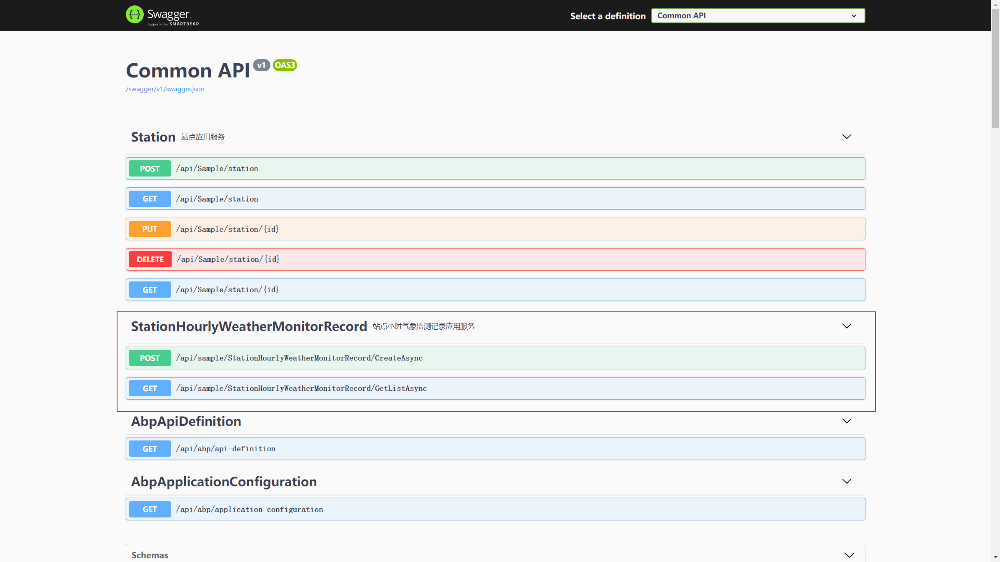

单击选择第一个方法，点击 Try it out 按钮，输入站点小时气象监测记录

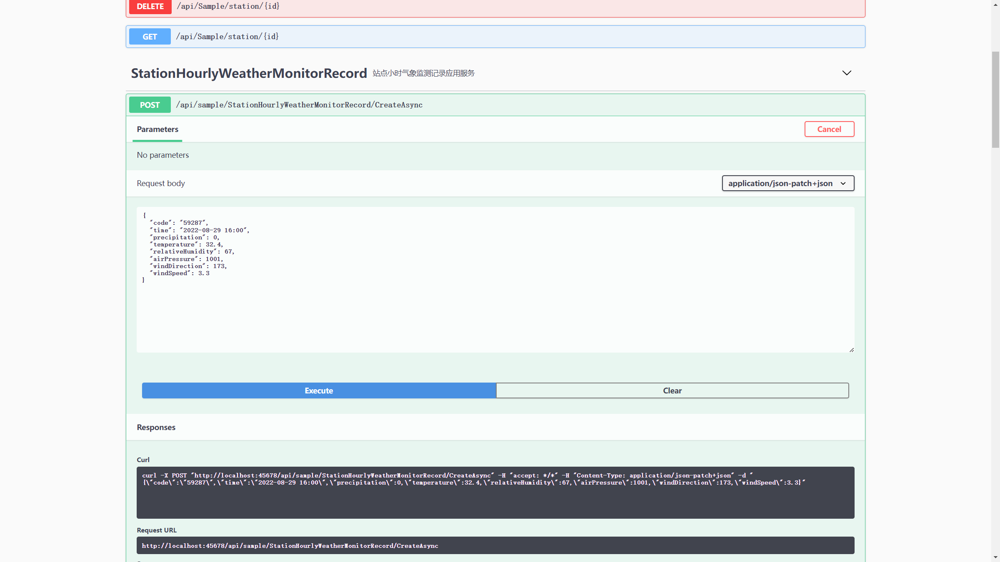

点击 Execute 按钮，提交站点小时气象监测记录，方法返回204，添加成功

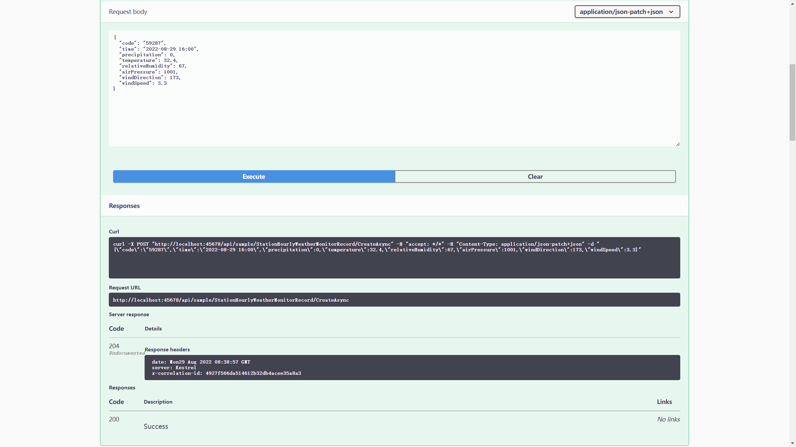

查询数据库，看到站点小时气象监测记录表里新增了一条记录

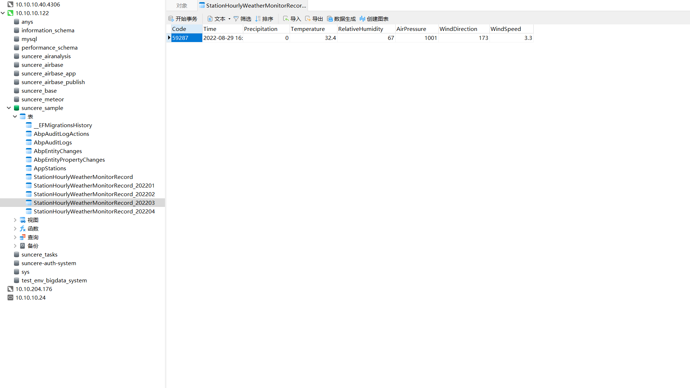

## 源代码

[Suncere.Sample](http://10.10.204.156:8001/%E8%87%AA%E7%A0%94%E8%BD%AF%E4%BB%B6/%E5%90%8E%E7%AB%AF%E7%BB%84%E4%BB%B6/%E6%95%B0%E6%8D%AE%E5%BA%93%E9%80%82%E9%85%8D%E4%B8%8E%E5%88%86%E8%A1%A8%E5%88%86%E5%BA%93/%E7%A4%BA%E4%BE%8B/Suncere.Sample.zip)