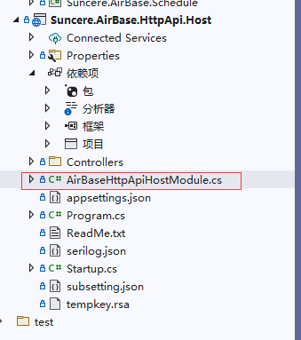

# 框架功能介绍

---

> 现行 .net 框架基于微软 .net core3.1版本和abp vnext，在 `Abp 3.3.1` 版本的基础上根据公司业务需求对其中的一些功能进行了调整，abp 框架相关功能和特性都可以使用，为减少框架使用难度，避免日常开发过程的一些问题，开发人员请先阅读 [Abp官方文档](https://docs.abp.io/zh-Hans/abp/3.1/Getting-Started-AspNetCore-Application)。

## 1. 模块化

现行后端框架遵循 Abp 框架的模块化设计方式，解决方案中的每个类库工程都是一个模块，每个类库中必需添加一个 module 类，module 类是一个类库工程的入口文件，相当于一个小型的 startup 文件，遵循一定的依赖关系，会按照依赖顺序在应用启动的时候承接 .net core 模型管道，对当前类库工程进行必要的依赖配置和管道设置。



关于 模块化设计 可以查看以下文章：[Abp 模块化加载机制](https://blog.csdn.net/weixin_37648525/article/details/114766485?spm=1001.2014.3001.5501)

&nbsp;

## 2. Ioc

    - 使用dotnet core 依赖注入体系，按abp的方式使用autofac替换
    - 支持按约定自动发现进行注册、编码声明式注册
    - 支持构造函数注入、属性注入、容器解析
    - 封装ServiceManager静态类

Ioc使用规范：

1、优先使用构造函数注入，即声明式注入。

2、对于某些横切关注点，没有的情况下并不会影响类的功能的，可以考虑使用属性注入，属性注入需要在构造函数为属性赋值空实现。

3、以上两种情况都不能满足需要的情况下，可以直接通过IServiceProvider进行解析。

4、系统提供了ServiceManager静态类，管理容器对象，也可以通过它解析出需要的实例，但除了某些特殊情况，如在静态类中，其余的不推荐使用。

&nbsp;

## 2. api规范

框架 webapi 服务接口采用get、post两种http请求格式，需要开发人员在请求对于的类或方法上标注[HttpGet]、[HttpPost]，注意命名空间using Microsoft.AspNetCore.Mvc

接口url格式规范如下：api/[AppName]/[controller]/[action], AppName为当前应用名称，用于区别不同应用的接口
接口url有两种生成规则

 (1) 根据控制器名称和方法名称自动生成，此时AppName需要通过AbpAspNetCoreMvcOptions选项进行配置

 (2) 通过Route()进行标注，可通过服务基类进行基本模板的设置

特别注意，第二种方式会覆盖第一种方式，特别是只标注方法没有标注类的情况下，接口命名只根据Route()标注生成

框架下所有接口返回值会自动进行包装，按照固定格式规范返回，如下：

```json
{
  "msg":null, // 如有异常，msg 返回异常信息
  "result": [], // 接口实际返回的结果
  "state": 200, // 请求状态码
  "success": true // 请求是否成功
}
```

&nbsp;

## 3. 注入拦截

现行框架通过中间件实现了对接口请求的时候非法参数进行拦截，防止非法注入，默认拦截以下字符串，一旦queryString中包含以下字符串，请求直接失败：
"script", "javascript", "insert", "select", "delete", "eval","'", "\"", "`", ";", "--", "\\", "(", "<", ">"

另外，框架提供了配置项，可以由开发人员根据实际情况对拦截的字符串进行配置，可通过以下方式配置：

```C
Configure<InjectFilterOptions>(c => c.InjectItems.Add("+"));
```
&nbsp;

## 4. 缓存

dotnet core中存在分布式缓存的实现，abp基于它进行了自己的缓存封装，可以通过简单的nuget包的引用，实现redis缓存的使用，或者直接使用内存缓存
但是，abp的缓存实现是基于泛型类，使用并不方便，如果一个地方有多个类型数据需要缓存，则需要基于这些数据类型注入多个logger，而且对于list这些集合类不友好，不能够灵活的设置其缓存key
我们学习abp对缓存进行了自己的封装，沿用以前通过泛型方法的方式，进行获取的管理。

项目开发中缓存请注入 `ISuncereDistributedCache` 接口进行使用，默认情况下使用内存缓存，如需使用redsi缓存，请在 `<项目名>.HttpApi.Host` 工程添加 `Volo.Abp.Caching.StackExchangeRedis` nuget包，注意使用 `3.3.1`版本。

并在 `<项目名>.HttpApi.Host` 工程的 Module 类中配置使用 `redis`

(1) 在 Module 类中添加特性 [DependsOn(typeof(AbpCachingStackExchangeRedisModule))]

(2) 添加以下配置代码

```C
public override void ConfigureServices(ServiceConfigurationContext context)
{
    var configuration = context.Services.GetConfiguration();
    var hostingEnvironment = context.Services.GetHostingEnvironment();
    // 新增以下代码，启用redis
    ConfigureRedis(context, configuration, hostingEnvironment);
}


private void ConfigureRedis(
    ServiceConfigurationContext context,
    IConfiguration configuration,
    IWebHostEnvironment hostingEnvironment)
{
    if (!hostingEnvironment.IsDevelopment())
    {
        var redis = ConnectionMultiplexer.Connect(configuration["Redis:Configuration"]);
        context.Services
            .AddDataProtection()
            .PersistKeysToStackExchangeRedis(redis, "Common-Protection-Keys");
    }
}
```

(3) 在 `appsettings.json` 文件增加redis连接配置

```json
"Redis": {
  "Configuration": "127.0.0.1"
}
```

项目中缓存key请按照规范: a:appname,c:cachename,k:key

&nbsp;

## 5. 领域驱动设计


wiki释义：

领域驱动设计（英语：Domain-driven design，缩写 DDD）是一种通过将实现连接到持续进化的模型来满足复杂需求的软件开发方法。领域驱动设计的前提是：

    把项目的主要重点放在核心领域（core domain）和域逻辑把复杂的设计放在有界域（bounded context）的模型上发起一个创造性的合作之间的技术和域界专家以迭代地完善的概念模式，解决特定领域的问题

领域驱动设计是一种由域模型（墙裂推荐@阿白 的域模型系列）来驱动着系统设计的思想，不是通过存储数据词典(DB表字段、ES Mapper字段等等)来驱动系统设计。领域模型是对业务模型的抽象，DDD是把业务模型翻译成系统架构设计的一种方式。