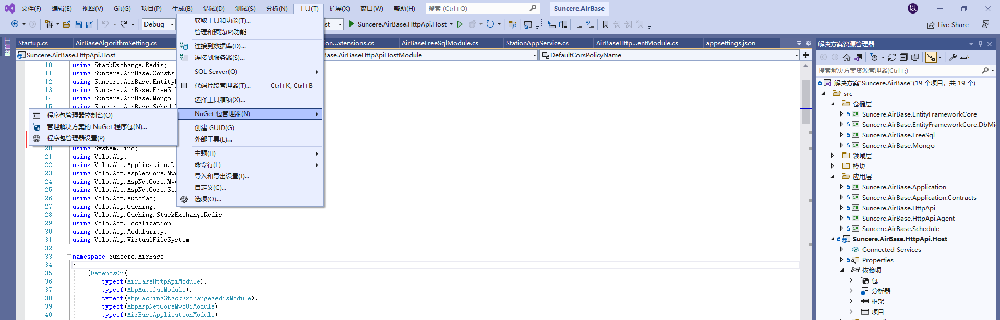
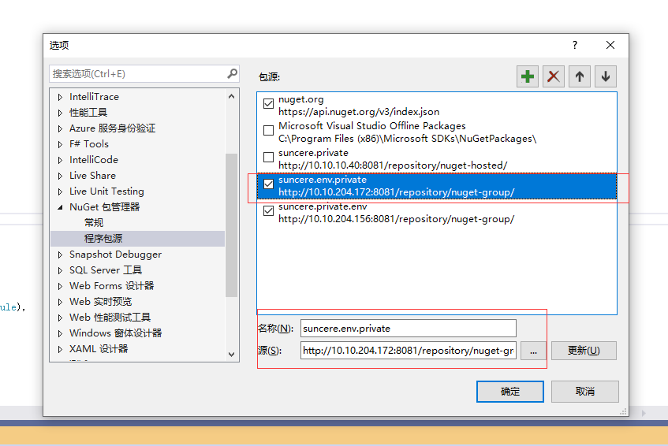
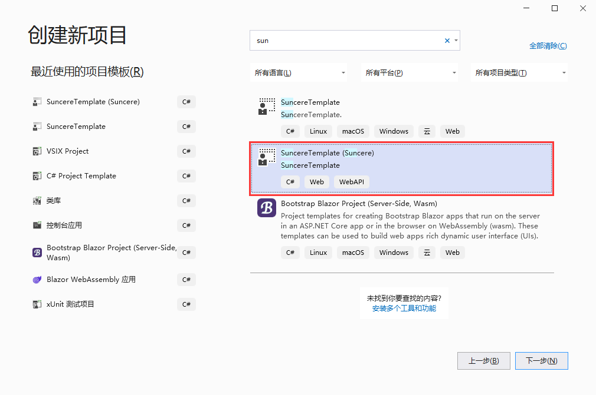
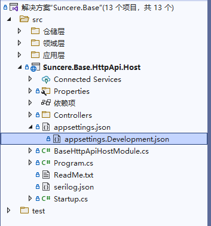
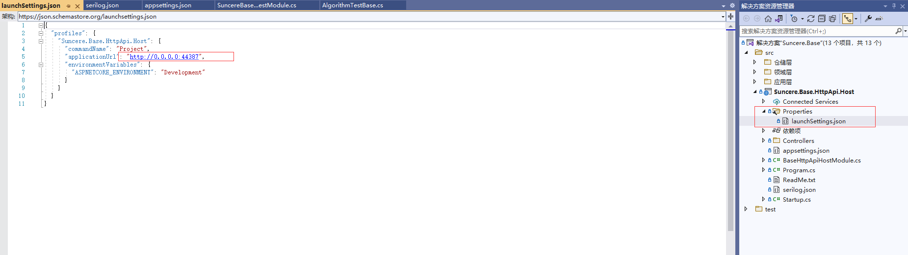

# 安装模板

---

## 包源配置

如开发环境未配置公司私有包源管理地址，请先配置包源管理

打开 vs , 在上方的菜单中选择 工具 -> nuget包管理器 -> 程序包管理器设置



选择程序包源，添加一个配置，自定义名称，源地址为：`http://10.10.204.172:8081/repository/nuget-group/`



填写完成记得勾选，然后点击确定。

## 安装

### 1、NuGet 包安装方式

```bash
dotnet new --install Suncere.Template
```

### 2、模板文件安装方式

- 下载 模板文件压缩包并解压，如：SuncereTemplate.zip

- 进入解压后的根目录

- 输入以下命令进行安装

```bash
dotnet new --type solution -i .
```

## 卸载模板

- 输入以下命令，显示安装的模板列表

```bash
dotnet new --uninstall
```

- 根据提示，删除对应模板即可

```bash
dotnet new --uninstall Suncere.Template
```

## 使用模板创建项目

> 项目名称请使用 `Suncere.<微服务名>` 格式

1、命令行创建

```bash
dotnet new SuncereTemplate -n <项目名>
```

2、Visual Studio 2022

Visual Studio 2022 支持在创建项目时选择自定义模板进行创建



## 修改配置文件 appsetting.json

- 主要修改

1、修改连接字符串 ConnectionStrings，默认数据库为 `mysql`，请根据项目实际情况修改

2、修改 nacos 节点中 ServerAddresses、Namespace、ServiceName

```json
{
  "ConnectionStrings": {
    "Default": "Server=10.10.10.122;Port=3308;Database=suncere_base; User=root;Password=****;character set=utf8;Max Pool Size=200;Min Pool Size=3;pooling=true;Connection Lifetime=0"
  },
  "nacos": {
    "ServerAddresses": [ "http://10.10.204.165:8848" ],
    "DefaultTimeOut": 15000,
    "Namespace": "xining",
    "ListenInterval": 1000,
    "ServiceName": "suncere-base",
    "GroupName": "DEFAULT_GROUP",
    "ClusterName": "DEFAULT",
    "Weight": 100,
    "RegisterEnabled": true,
    "InstanceEnabled": true,
    "PreferredNetworks": "", // select an IP that matches the prefix as the service registration IP
    "UserName": "nacos",
    "Password": "nacos",
    "AccessKey": "",
    "SecretKey": "",
    "ConfigUseRpc": false, // 为true时，通过 gRPC 去和 nacos server 交互，nacos 2.x版本要设置为true
    "NamingUseRpc": false, // 为true时，通过 gRPC 去和 nacos server 交互, nacos 2.x版本要设置为true
    "LBStrategy": "WeightRandom", //WeightRandom WeightRoundRobin
    "Metadata": {
      "aa": "bb",
      "cc": "dd"
    }
  }
}

```

为避免开发环境和测试环境相互干扰，请将 `appsettings.json` 文件复制一份，命名为 `appsettings.Development.json`，将`appsettings.Development.json` 中nacos配置的权重更改为 `1` ，`appsettings.Development.json` 只保存在本地，不上传到 Git 仓库，一般情况下开发环境只修改`appsettings.Development.json`，不修改 `appsettings.json`



## 修改常量值

- 修改 <项目名>.Domain.Shared 中的 BaseSharedConst 类中的常量

```C
/// <summary>
/// 应用名称，请根据不同应用修改
/// </summary>
public const string AppName = "Base";

/// <summary>
/// 微服务注册名称，根据服务修改
/// </summary>
public const string ServiceName = "suncere-base";

/// <summary>
/// api url 模板，请根据不同应用修改
/// base 替换成对应的项目名称
/// </summary>
public const string ApiUrlTemplate = "api/base/[controller]";
```

## 修改日志配置

- 后端为了在统一的一个地方管理各个服务的日志，使用 `Seq` 分布式日志中间件，修改 HttpApi.Host 类库下的 `serilog.json` 文件，根据实际情况修改 `serverUrl`、`apiKey`，`serverUrl`、`apiKey` 请根据 `Seq` 使用教程获取。

```json
{
  "Serilog": {
    "WriteTo": [
      {
        "Name": "Seq", // 配置seq日志记录器
        "Args": {
          "outputTemplate": "{Timestamp:yyyy-MM-dd HH:mm:ss.fff zzz} [{Level:u3}] [{CorrelationId}] {Message:lj}{NewLine}{Exception}",
          "serverUrl": "http://10.10.204.165:5341", // seq api 地址
          "apiKey": "gV5HmVyYMA5YPDh8doXW" // api key
        }
      }
    ],
    "MinimumLevel": { // 配置日志最小级别，这里的级别是本地应用的级别，写入seq时会被Api key中配置的级别再次过滤
      "Default": "Information",
      "Override": {
        "Microsoft": "Information",
        "System": "Information",
        "Microsoft.EntityFrameworkCore": "Information"
      }
    }
  }
}
```

## 启动项目

将 `<项目名>.HttpApi.Host` 设为启动项目

开发环境下，在 `<项目名>.HttpApi.Host` 类库下的 `/Properties/launchSettings.json` 文件修改应用端口



启动之后，通过 `http://localhost:<port>/swagger/index.html` 访问应用接口文档

可以在 `Nacos` 相应命名空间下的服务列表看到相应的服务，可以在 `Seq` 上看到日志输出

即当前服务开发环境搭建完成，可以进行正常开发了
