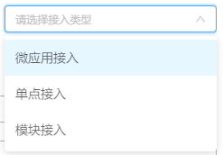

# 应用配置说明

---




按照应用使用场景分为3个接入方式

&nbsp;

## 微应用接入
详情请查看微前端升级指南

&nbsp;

## 模块接入
详情请查看模块集成文档

&nbsp;

## 单点接入

如果需要应用可跳转至第三方的系统，则需要先将应用的接入类型改成`单点接入`，是否子平台选项选为`否`，然后根据需求配置跳转路径

1、如果不需要登录直接跳转到新开窗口的第三方系统，则直接配置应用的URL即可。

2、如果需要验证登录跳转，则需要在项目的`extend.js`文件的`platform.projectList`下配置对应要跳转应用和自定义应用的`redirectTo`跳转函数，这样点击应用就能跳转到自定义路径；`redirectTo`函数的参数为后台所配置的应用信息。（如跳转函数里面需要请求数据，需要引入`import axios from 'axios'`，不能引入框架封装的request请求）

```
platform:{
  projectList: [
    {
      label: '测试外部应用',
      img: require('/src/assets/platform/login-icon-1.png'),
      backgroundColor: 'rgba(27, 27, 27, 0.3)',
      // 跳转函数
      redirectTo(menu) {
        console.log('自定义菜单跳转当前应用信息', menu)
        const link = ''  // 要跳转的路径
        window.open(link, '_blank')
      }
    }
  ]
}

```


