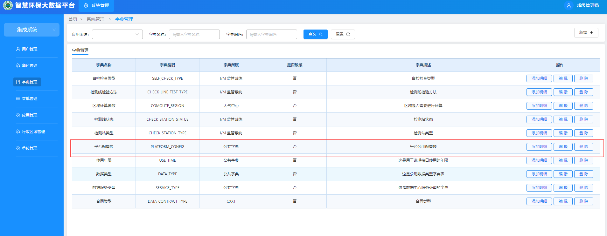
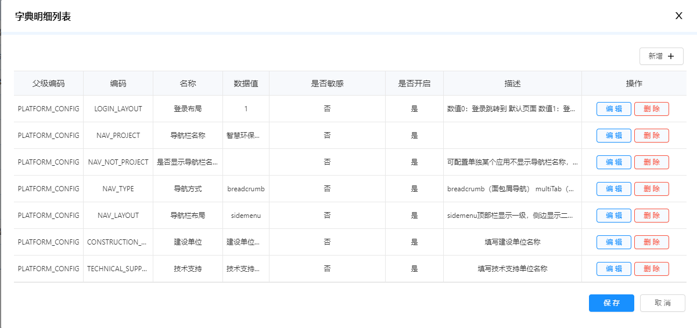

# 配置扩展
文件位于项目根目录下的`extend.js`，用于覆盖sys基础框架的默认设置
```
export const expand = {
  // 路由扩展
  router: {

    // vue路由配置，举例
    config: [
      {
        path: '/403',
        component: () => import('../views/exception/403')
      },
    ],

    // 路由白名单，路由组件名称数组
    white: ['aComponent','bComponent'],

    /**
    *  关联系统视图（如果某些页面来自其他项目，则需在此扩展配置其他项目的页面路径）
    *  其他项目引入需要在package.json的依赖中引入安装才能关联项目视图
    *  dependencies: {
    *    "project1": "file:../project1",
    *    "project2": "file:../project2",
    *  }
    */
    views: function (packName, item) {
      const pack = [item.businessSystemPackage, packName]
      // 举例项目1，根据后台配置的应用名匹配对应的项目文件夹名下的页面名称
      if (pack.indexOf('project1') !== -1) {
        const pageFileUrl = item.pageFileUrl ? item.pageFileUrl : item.url
        return import('project1/src/views' + pageFileUrl)
      }
      // 举例项目2
      if (pack.indexOf('project2') !== -1) {
        const pageFileUrl = item.pageFileUrl ? item.pageFileUrl : item.url
        return import('project2/src/views' + pageFileUrl)
      }
    }
  },

  // 主题( default | white | light )
  themes: {
    skin: 'default'
  },

  // 重命名扩展
  rename: {
    // 项目重命名
    project: '西宁市智慧环保平台',
    nav: {
      //  导航栏 logo图标
      logoImg: require('/src/assets/img/login-logo.png')
    }
  },

  // 登录界面配置
  login: {
    // 项目重命名
    project: ' ',
    // 项目名称style样式：Object
    projectStyle: {},
    // 背景图
    backgroundImg: require('/src/assets/img/login-bg.jpg'),
    // 登录Logo 图片
    loginLogoImg: require('/src/assets/img/login-title.png'),
    // 登录左侧 图片
    leftAreaImg: null,
    // 登录左侧 图片
    leftAreaImgHtml: ``,
    // 建设单位重命名
    constructionUnit: '  建设单位：西宁市生态环境局',
    // 技术支持重命名
    technicalSupport: '技术支持：广东旭诚科技有限公司',
    // 是否显示记住密码功能项
    isShowRememberMe: true
  },

  // 导航栏的配置
  nav: {
    project: '西宁市智慧环保平台',
    // 不显示名称
    not_project: null,
    //  导航栏 logo图标
    logoImg: require('/src/assets/img/login-logo.png'),
    //  显示左右两侧的图标
    showMenuIcon: true
  },

  // 平台配置
  platform: {
    // 登录后要跳转的布局，0（null），1（platformSelection）
    loginLayout: '1',
    // 界面整体布局方式 ['sidemenu', 'topmenu] 三种布局
    navLayout: 'sidemenu',
    // 限制multiTab数量
    multiTabMax: 15, // 如果导航方式是multiTab，可设置限制tab数量
    //是否隐藏顶部和侧边的菜单栏
    hideMenu: false,
    //导航类型（breadcrumb，multiTab）
    navType: 'breadcrumb',
    // 平台配置 名称
    project: '西宁市智慧环保平台',
    // 登录Logo 图片
    projectImg: require('/src/assets/img/login-logo.png'),
    // 背景图
    backgroundImg: null,
    // 建设单位重命名
    constructionUnit: '建设单位：西宁市生态环境局',
    // 技术支持重命名
    technicalSupport: '技术支持：广东旭诚科技有限公司',
    // 平台列表配置
    projectList: [
      // {
      //   label: '系统名称',
      //   img: require(对应的资源图片 例如 '/src/assets/platform/login-icon-2.png'),
      //   backgroundColor: '背景颜色 例如 rgb(253, 239, 236)',
      //   // 自定义应用路径跳转
      //   redirectTo(menu) {
      //    console.log('当前应用信息', menu)
      //    const link = ''  
      //    window.open(link, '_blank')
      //   }
      // }
    ],
    // 模块菜单布局配置
    moduleMenuLayout: {
      row: 2, // 行数
      col: 5, // 列数
      menuWidth: 200, // 模块菜单宽度
      margin: 20 // 间距
    },
    // 是否微前端
    microApp: false,
    microAppType: ''// 'main'或'child' 
  }
}
```

&nbsp;

# 注意

后台字典管理的`PLATFORM_CONFIG`配置项会优先覆盖本地`extend.js`的platform配置项，如果后台没设置platform配置项，则使用本地extend的platform配置项。

后台配置项位于：集成系统-字典管理-平台配置项-添加明细（明细编码有以下6种）





&nbsp;

1、`LOGIN_LAYOUT`（登录后布局配置）

数值0：登录跳转到 默认页面

数值1：登录跳转到 平台选择页面

&nbsp;

2、`NAV_LAYOUT`（导航栏布局配置）

sidemenu：顶部栏显示一级，侧边显示二三级）

topmenu：侧边显示三级，顶部栏显示一二级

&nbsp;

3、`NAV_PROJECT`（导航栏名称）

值为系统名称字符

&nbsp;

4、`NAV_NOT_PROJECT`（单独设置某个应用不显示系统名称）

值为空字符串/系统应用代码ID；在应用管理可以查看应用ID，如果需要某个应用不显示导航栏名称，则值设置为此应用的ID，多个应用ID以英文逗号隔开

&nbsp;

5、`CONSTRUCTION_UNIT`（建设单位名称）

值为建设单位名称字符

&nbsp;

6、`TECHNICAL_SUPPORT`（技术支持单位名称）

值为技术支持单位名称字符

&nbsp;

7、`NAV_TYPE`（导航方式）

breadcrumb：面包屑导航

multiTab：多tab栏切换
