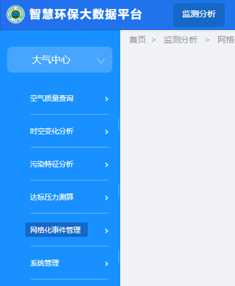
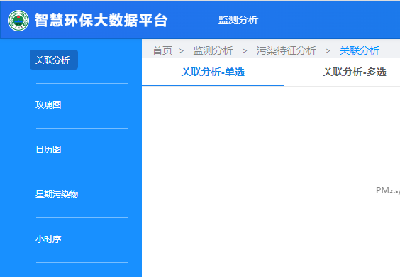

# 介绍

---

`suncere-sys` 是一款基于 `Vue.js 2.6.14`、 `ant-vue-design 1.7.8` 和公司自有`Suncere-UI`组件库的基础上进行系统集成的系统，集成多种页面布局、http请求封装、前端路由、统一的登录界面、用户管理页面、错误重定向页面、权限校验、应用模块切换功能。

&nbsp;
&nbsp;

# 安装

---

进行以下操作之前，请确保安装了 `Nodejs` 环境，并且已经安装了 yarn 工具

Nodejs 统一使用 `16.14.2` 版本，请安装 [前端环境准备](http://10.10.204.156:8000/#/framework/frontend/env) 中提到的 `nvm` 插件，使用 `nvm` 进行管理 Nodejs 环境管理

yarn 工具在 Nodejs 环境安装完毕之后，通过以下命令进行安装：

```shell
npm install -g yarn
```

## 通过模板安装

1、全局安装`suncere-cli`工具

```shell
npm i @suncereltd/suncere-cli -g --registry=http://10.10.10.163:8081/repository/npm-group/

# 若使用nrm包源管理插件，请切换到私有包源，直接安装即可
npm i @suncereltd/suncere-cli -g
```

&nbsp;

2、打开命令行工具，执行命令

```shell
suncere-cli create
```

接着按照提示输入项目名称，选择模板`suncere-project-template(vuecli-antd1.4-vue2.6)`，等待下载成功即可，下载成功后可选择是否为此项目安装依赖（如选是即执行`yarn instal`命令安装依赖）。

注意： 此项目模板已添加`SuncereUI`和`SuncereSys`依赖，因此无需再手动加入依赖。

&nbsp;

3、项目根目录的`vue.config.js`配置后台接口代理

```js
devServer: {
  port: 8000,
  proxy: {
    '/api/': {
      target: 'http://xxx.xxx',  // 需要配置实际项目api接口IP地址
      ws: false,
      changeOrigin: true
    }
  }
}
```

&nbsp;

4、`yarn run serve`运行模板。

&nbsp;

## 手动安装

以vue2.0版本的前端为基础，在项目根目录命令行执行安装命令

```shell
yarn add @suncereltd/suncere-sys --registry=http://10.10.10.163:8081/repository/npm-group/
yarn add @suncereltd/suncere-ui --registry=http://10.10.10.163:8081/repository/npm-group/

# 若使用nrm包源管理插件，请切换到私有包源，直接安装即可
yarn add @suncereltd/suncere-sys
yarn add @suncereltd/suncere-ui
```

在 `main.js` 配置使用，需要同时安装使用`SuncereSys`和`SuncereUI`才会起作用。

```vue
import SuncereSys from '@suncereltd/suncere-sys/src/index'
import SuncereUI from '@suncereltd/suncere-ui/src/index'
Vue.use(SuncereUI)
Vue.use(SuncereSys)
```

&nbsp;
&nbsp;

# 项目模板主要文件目录结构规范说明
----
如果项目模板里面没有所提及的目录或文件时，新建相关的文件目录需统一按此规范结构来命名

```
-src
| --assets（资源文件夹）
| --config（配置文件夹）
| --api（统一管理api请求的文件夹）
| --components（公共组件文件夹）
   | -- componentA（组件A文件夹）
   | -- componentB（组件B文件夹）
| --store（vuex文件夹）
   | --index.js（vuex注册和初始化）
   | --getters.js（vuex的getters文件）
   | --modules（vuex模块文件夹）
      | --moduleA.js（vuex模块A）
| --utils（公共工具方法文件夹）
| --views（页面视图文件夹）
   | --pageA（举例页面A文件夹）
      | -- index.vue（页面A的具体文件）
   | --pageB（举例页面B文件夹）
      | -- index.vue（页面B的具体文件）
|-extend.js（项目配置扩展文件）
|-index.js（作为依赖文件导出的文件）
|-main.js（项目运行主入口）
-vue.config.js（vuecli配置文件）
-package.json（依赖模块管理文件）
```

&nbsp;
&nbsp;

# 页面布局
----
布局方式有2种

1、`sidemenu`（顶部菜单栏展示1级菜单，侧边菜单栏展示2、3级菜单）



2、`topmenu`（顶部菜单栏展示1、2级菜单，侧边菜单栏只展示3级菜单）



如果需要去掉头部和侧边栏，只展示内容，只需在项目的`expend.js`配置`platform.hideMenu: true`，适合用于以iframe形式嵌入其他系统

&nbsp;
&nbsp;

# 数据请求
----
```js
//方式一
import axios from 'axios'

axios({
  url: '/api/xxx',
  method: 'post',
  data: data
}).then((res) => {})


//方式二
this.$get(url,data).then((res)=>{})
this.$post(url,data).then((res)=>{})
```

&nbsp;
&nbsp;

# 页面按钮权限设置

----

在对应的按钮添加`v-auth:按钮标识`指令,如`v-auth:add`,下面为所有配置的按钮标识：

'add': 新增

'delete'：删除

'edit': 修改

'get':详情

'reset': 重置

'audit': 审核

'change': 变更

'import': 导入

'export': 导出

'enable': 启用

'disable': 禁用

'auth': 权限设置

'authorise':  应用授权

'batchDelete': 批量删除

'seeQr': '查看二维码

```vue
// 举例：
// 如果后台在当前页面配置新增按钮权限，这会命中v-auth指令的add标识，则显示此按钮，不命中则隐藏此按钮

<a-button v-auth:add>新增</a-button>
```

&nbsp;
&nbsp;

# 自带的管理页面
----
sys基础框架自带的管理页面位于`集成系统`应用里面，包含以下页面

1、用户管理

2、角色管理

3、字典管理

4、菜单管理

5、应用管理

6、行政区域管理

7、单位管理