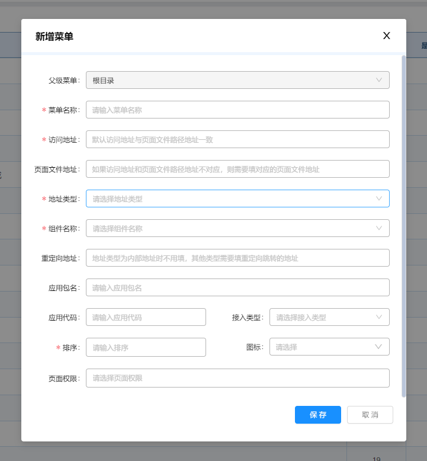
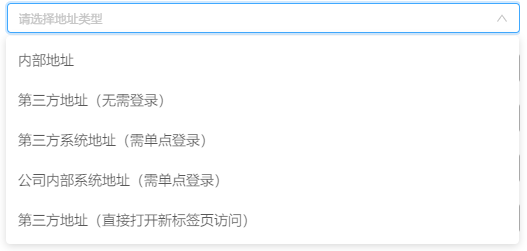
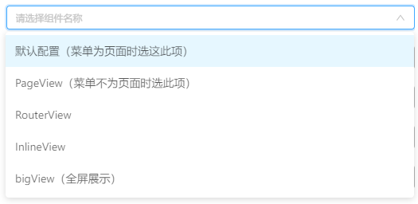
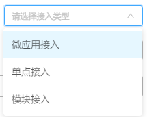

# 菜单配置说明

---

&nbsp;

## 访问地址

即系统路由访问地址，可带查询参数，如`/nsys/test?a=1&b=2`。默认情况下路由访问地址与页面文件地址相同。
&nbsp;

为了菜单高亮正常，多层级路径需要按照规范配置：
根目录：`/`，
第二级：`/a`，
第三级：`/a/b`，
第四级：`/a/b/c`，
以此类推。
&nbsp;

如果路由与页面文件地址不相同或者需要多个菜单路径指向同一个页面文件，则需要配置路由对应的页面文件地址。

&nbsp;

## 页面文件地址

即前端项目src下`views`文件夹下的文件页面的地址。例如views下面有个b文件夹下有个a.vue页面，则页面文件地址就填`/b/a`

&nbsp;

## 地址类型

### 1、内部地址
即系统路由访问地址，指向本项目的页面文件。

&nbsp;

### 2、第三方地址（无需登录）
即点击系统当前路由页面时，`页面内嵌`显示第三方的页面，需要配置`重定向地址`为第三方的访问url。

&nbsp;

### 3、第三方系统地址（单点登录）
即点击系统当前路由页面时，会`跳转到新标签页`进行访问，需要配置`重定向地址`为第三方的`带url查询参数`的url，访问参数具体由各自系统决定。

&nbsp;

### 4、公司内部系统地址（单点登录）
即点击系统当前路由页面时，`页面内嵌`显示第三方的页面，需要配置`重定向地址`为第三方的`带url查询参数`的url，访问参数具体由各自系统决定。

&nbsp;

### 5、第三方地址（直接打开新标签访问）
即点击系统当前路由页面时，会`跳转到新标签页`进行访问，需要配置`重定向地址`为第三方的访问url。

&nbsp;

## 组件名称

### 1、默认配置

即当前页面为页面文件时选择。

&nbsp;

### 2、PageView

即当前页面不为页面文件时选择。如中间级目录

&nbsp;

### 3、BigView

即大屏展示页面，没有侧边菜单和头部菜单

&nbsp;

### 4、RouterView

暂未用到

&nbsp;

### 5、InlineView

暂未用到

&nbsp;
&nbsp;

## 重定向地址

当`地址类型`为非内部地址时需要配置

&nbsp;

## 应用包名

可以指定当前菜单页面的应用包名，不填默认为当前菜单所在应用的应用包名。
&nbsp;

若指定当前页面的应用包名，则会跳转对应包下的页面，但是不会跳转应用，如需同时跳转应用，则需要同时配置应用代码。

&nbsp;

## 应用代码

可以指定当前菜单页面的应用代码，不填默认为当前菜单所在应用的应用代码。
&nbsp;

若指定当前页面的应用代码，则会自动切换应用再跳转页面。

&nbsp;

## 接入类型

1、微应用接入

指定当前的页面访问为微前端访问，需要同时在extend.js配置微应用的项目配置，详情请看`微前端升级指南`。

&nbsp;

2、单点接入

指定当前的页面访问为单点接入访问，地址类型为非内部地址时设置此项

&nbsp;

3、模块接入

指定当前的页面访问为依赖模块接入访问，也就是通过npm的方式引入项目页面

&nbsp;
