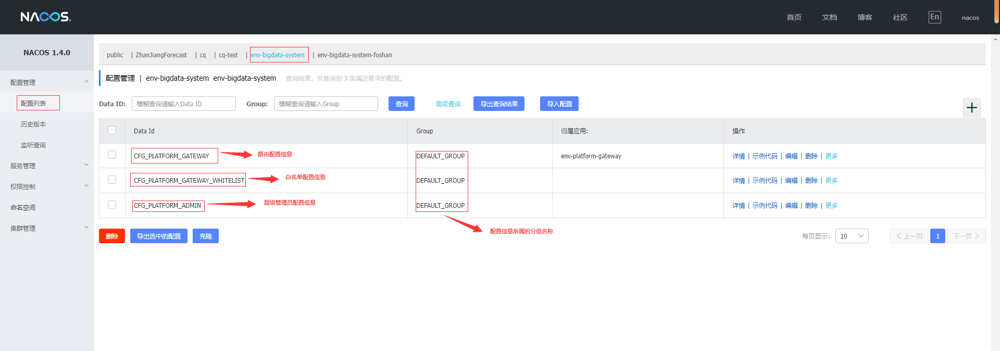
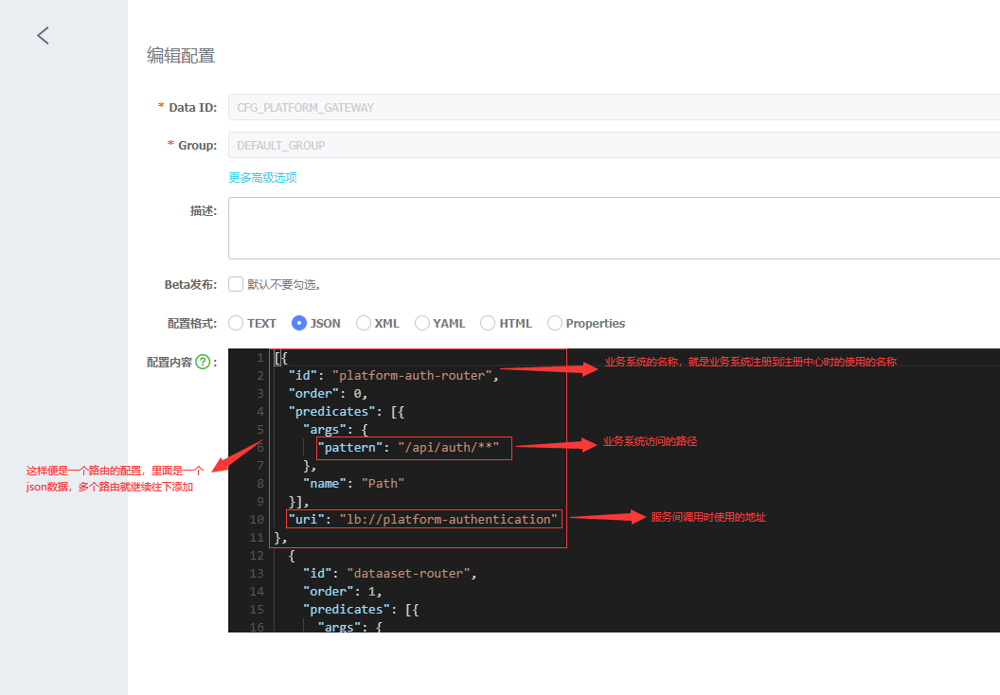
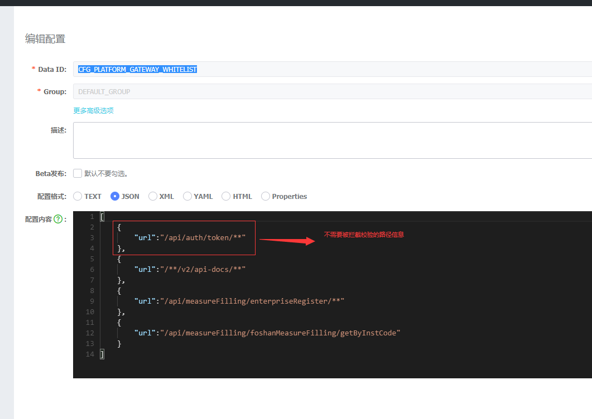
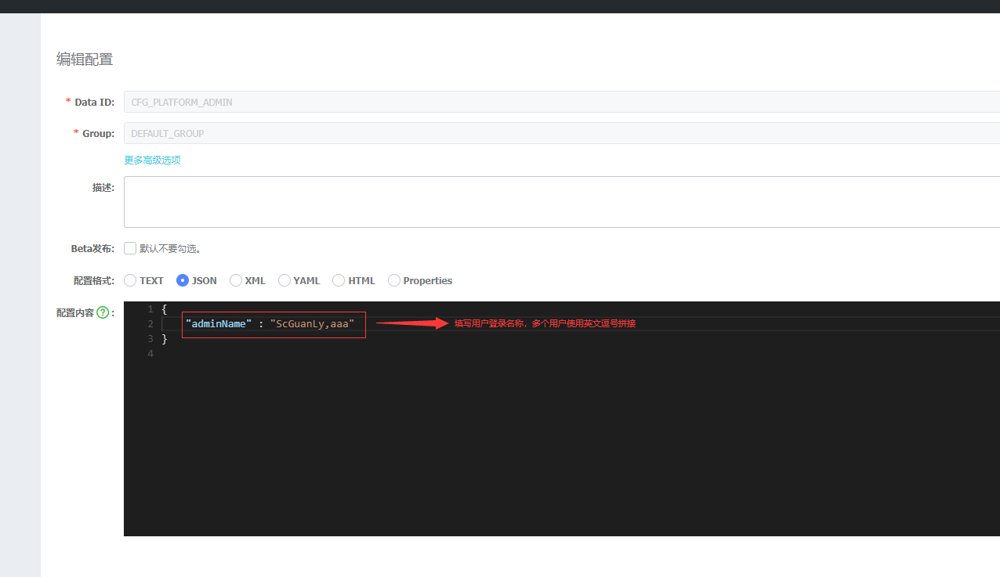

# 环境部署

---

## 1. Nacos

### 1.1 安装

现行微服务架构采用Nacos作为服务发现，微服务环境搭建需要先部署Nacos中间件，Nacos中间件部署请参阅公司 `第三方组件管理` 文档， 按照`配置管理规定版本`安装。

文档地址如下：[第三方组件 Nacos](http://10.10.204.156:8001/第三方工具/01中间件/nacos)。

或者参考以下文章：[服务发现—nacos部署](https://blog.csdn.net/weixin_37648525/article/details/124220790?spm=1001.2014.3001.5501)

### 1.2 配置

在业务系统后端接入前配置一下Nacos的相关配置信息，通过Nacos安装地址和端口（默认端口8848）访问Nacos管理平台

首先在Nacos管理平台中根据项目新建命名空间，在命名空间下需要有以下配置信息：

一个业务系统注册到Nacos注册中心之后，还不能马上对其进行访问，还需要对路由进行配置，这样在通过网关对业务系统进行访问时，网关通过路由的相关信息才能找到对应的服务器进行数据请求的处理，找到CFG_PLATFORM_GATEWAY，点击编辑，如下图

在接口开发过程中，有些接口是不需要被网关拦截做校验的，如登录接口，如果想该接口不被网关拦截，只需要在白名单上配置该接口的路径信息，那么该接口在访问过程中就不会被网关拦截校验

超级管理员配置

&nbsp;

## 2. redis

现行微服务架构网关工程、认证中心依赖于redis实现分布式缓存，微服务环境搭建需要先部署redis中间件，redis中间件暂未纳入公司 `第三方组件管理`，请自行网上查找文档进行安装。

&nbsp;

## 3. 数据库

现行微服务架构中 Nacos、网关工程和认证中心 部署依赖数据库，微服务环境搭建需要先部署数据库，推荐使用MySql 8.0.22版本，mysql 数据库暂未纳入公司 `第三方组件管理`，请自行网上查找文档进行安装。

&nbsp;

## 4. 网关工程和认证中心

现行微服务架构中，后端微服务统一入口为网关工程中间件 `platform-gateway`，整体认证授权使用认证中心中间件 `platform-authentication`，这两个中间件是整体微服务架构的入口，需要在微服务环境中先进行部署和配置，才能保证后端各个服务、平台的各个子系统运行正常。

网关工程和认证中心两个中间件是公司自研软件资产，请参考中间件部分的文档: [中间件- 网关工程](http://10.10.204.156:8000/#/framework/global/gateway) 、[中间件- 认证中心](http://10.10.204.156:8000/#/framework/global/auth)。

&nbsp;

## 5. 分布式日志

现行微服务架构使用分布式日志组件Seq作为系统运行日志记录工具，微服务环境搭建需要先部署Seq中间件，Seq中间件暂未纳入公司 `第三方组件管理`，请参考以下文章进行安装配置 [Seq安装使用](https://blog.csdn.net/weixin_37648525/article/details/124775490)。
