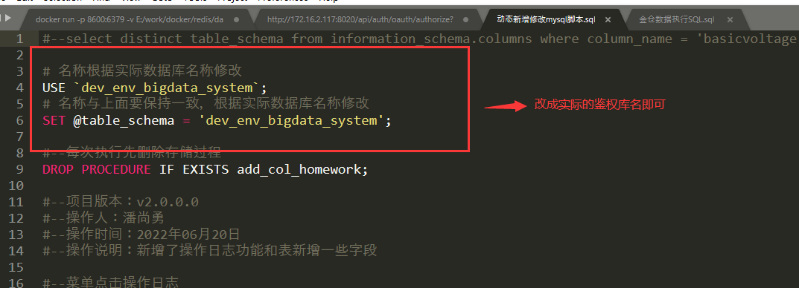

# 网关工程部署

---

网关工程为java编写，需要在服务器上安装java SDK环境，版本1.8。java SDK环境安装请查询公司 `第三方组件管理` 文档。

网关工程已纳入公司配置管理库，目前最新版本为 `2.1.2.0` , 请从以下链接下载工程文件包：[platform-gateway](http://10.10.204.156:8001/自研软件/中间件/2.1.2.0/platform-gateway.jar)。

&nbsp;

## 1. 数据库初始化

网关工程和认证中心 部署依赖于数据库，请先新建一个库用作后续的网关工程和认证中心的数据库，库名推荐为 `suncere_auth_system`，需要对数据表进行初始化。
再根据不同版本依次进行升级。

mysql 数据库使用以下sql文件进行初始化：

[mysql初始化脚本](http://10.10.204.156:8001/自研软件/中间件/新项目初始化SQL.sql)

执行完初始化SQL之后需要更新一下初始化SQL里面的默认用户信息，执行一下以下的SQL语句

```
UPDATE sys_user SET login_time=now() ,is_active=1,access_failed_count=0,access_fail_expire=null
```

初始化SQL只有一个默认的超级管理员用户ScGuanLy，登录密码为Suncere$1209，登录之后必须修改密码

如果是已在使用的项目，需要更新SQL，则下载一下SQL脚本对数据库进行增量的更新

[mysql增量修改脚本](http://10.10.204.156:8001/自研软件/中间件/动态新增修改mysql脚本.sql)

动态新增修改mysql脚本需要在文件头部修改这两地方



瀚高 数据库使用以下sql文件进行初始化：

待补充

> 备注：网关与认证中心共用一个数据库，数据库初始化只要执行一次即可。以上脚本为 2.1.2.0 版本初始化脚本，由于之前网关工程和鉴权工程没有纳入配置管理，版本迭代混乱，因此如果是2.0.0.0之前的版本升级到 2.1.2.0 无法提供数据库升级脚本，只能自行根据以上脚本初始化数据库，与项目实际使用的数据库进行结构对比，以后每次版本迭代均会提供初始化脚本和升级脚本两种。

&nbsp;

## 2. 部署

### 2.1 新建工程目录

在服务器上用于存放项目发布内容的目录上新建一个网关工程目录gateway，将网关工程文件存放在其中。

&nbsp;

### 2.2 启动脚本编写

在gateway目录里面编写java工程启动脚本，注意配置信息根据项目修改，如数据库连接、redis连接、nacos配置

Linux下, 通过以下命令创建启动脚本文件:

```shell
vi start.sh
```

脚本内容如下：

```shell
# start.sh
#!/bin/sh
#cd /home/lrh/app/bigdata/gateway
file="platform-gateway.jar"
if [ -f "$file" ];then
  if [ ! -x "$file" ];then
    echo "authrize:$file"
    chmod a+x $file
  fi
  echo "exec:$file"
  port="-Dserver.port=8025"
  active="-Dspring.profiles.active=gateway,base-test,test"
  encode="-Dbigdata.encode=SM3"
  redisHost="-Dspring.redis.host=127.0.0.1"
  redisPort="-Dspring.redis.realPort=6379"
  redisDataBase="-Dspring.redis.realDatabase=3"
  redisPassword="-Dspring.redis.password=xxxx"
  nacosAddr="-Dspring.cloud.nacos.discovery.server-addr=localhost:8848"
  nacosNamespace="-Dspring.cloud.nacos.discovery.namespace=xxx"
  nacosUsername="-Dspring.cloud.nacos.discovery.username=xxx"
  nacosPassword="-Dspring.cloud.nacos.discovery.password=xxx"
  datasourceUrl="-Dspring.datasource.url=jdbc:mysql://xxx:3306/suncere_auth_system?useUnicode=true&characterEncoding=utf8&zeroDateTimeBehavior=convertToNull&useSSL=true&serverTimezone=GMT%2B8&autoReconnect=true&failOverReadOnly=false"
  datasourceUserName="-Dspring.datasource.username=xxx"
  datasourcePassword="-Dspring.datasource.password=xxx"
  datasourceDriver="-Dspring.datasource.driver-class-name=com.mysql.cj.jdbc.Driver"
  dbType="-Dmybatis-plus.global-config.db-config.db-type=mysql"
  schema="-Dmybatis-plus.global-config.db-config.schema="
  timeOut="-Dhystrix.command.fallbackcmd.execution.isolation.thread.timeoutInMilliseconds=120000"
  nohup java $port $active $encode $redisHost $redisPort $redisDataBase $redisPassword $nacosAddr $nacosNamespace $nacosUsername $nacosPassword $datasourceUrl $datasourceUserName $datasourcePassword $datasourceDriver $dbType $schema $timeOut -jar -Xms1024m -Xmx2048m $file > ./log2.txt &
else
  echo "can not find:$file"
fi

```

> 备注：因shell脚本在linux运行的特殊性，$这个字符要慎用，因为这个字符在linux上是一个特殊字符，如果使用了该字符脚本运行是会出现参数值不对的错误，例如：redisPassword="-Dspring.redis.password=suncere$123"里面的suncere$123，当脚本运行时suncere$123会被解析成suncere23，从而导致redis的密码错误。

Windows下先右键新增text文件，文件名称改为start，后缀名改为cmd

脚本内容如下

```shell
title platform-gateway.jar
set cpath="."
set file="%cpath%/platform-gateway.jar"
set active="-Dspring.profiles.active=gateway,base-test,test"
set encode="-Dbigdata.encode=SM3"
set redisHost="-Dspring.redis.host=127.0.0.1"
set redisPort="-Dspring.redis.realPort=6379"
set redisDataBase="-Dspring.redis.realDatabase=2"
set redisPassword="-Dspring.redis.password=xxxxx"
set nacosAddr="-Dspring.cloud.nacos.discovery.server-addr=127.0.0.1:8848"
set nacosNamespace="-Dspring.cloud.nacos.discovery.namespace=xxx"
set nacosUsername="-Dspring.cloud.nacos.discovery.username=xxx"
set nacosPassword="-Dspring.cloud.nacos.discovery.password=xxx"
set datasourceUrl="-Dspring.datasource.url=jdbc:mysql://xxx:3306/suncere_auth_system?serverTimezone=UTC&characterEncoding=utf-8"
set datasourceUserName="-Dspring.datasource.username=xxx"
set datasourcePassword="-Dspring.datasource.password=xxx"
set datasourceDriver="-Dspring.datasource.driver-class-name=com.mysql.cj.jdbc.Driver"
set dbType="-Dmybatis-plus.global-config.db-config.db-type=mysql"
set dbSchema="-Dmybatis-plus.global-config.db-config.schema="
set dbColumnFormat="-Dmybatis-plus.global-config.db-config.column-format="
set timeOut="-Dhystrix.command.fallbackcmd.execution.isolation.thread.timeoutInMilliseconds=120000"
java %active% %encode% %redisHost% %redisPort% %redisDataBase% %redisPassword% %nacosAddr% %nacosNamespace% %nacosUsername% %nacosPassword% %datasourceUrl% %datasourceUserName% %datasourcePassword% %datasourceDriver% %dbType% %dbSchema% %dbColumnFormat% %timeOut% -jar -Xms1024m -Xmx2048m %file% --server.port=8025

```

启动脚本的配置信息相关说明

```
1、server.port：工程启动的端口
2、spring.profiles.active：工程启动的配置文件，保留默认即可
3、bigdata.encode：后端加密方式，主要有MD5 base64 DES SM2 SM3 SM4几种方式，新项目一律确认使用SM3(一是国密加密算法，二是摘要加密算法)
4、spring.redis.host：redis的访问地址
5、spring.redis.realPort：redis的访问端口
6、spring.redis.realDatabase：redis使用的库
7、spring.redis.password：redis的访问密码（如果不设置密码，值为空）
8、spring.cloud.nacos.discovery.server-addr：nacos的访问地址
9、spring.cloud.nacos.discovery.namespace：nacos的命名空间
10、spring.cloud.nacos.discovery.username：nacos的访问用户名
11、spring.cloud.nacos.discovery.password：nacos的访问密码
12、spring.datasource.url：数据库访问地址
13、spring.datasource.username：数据库访问用户名
14、spring.datasource.password：数据库访问密码
15、spring.datasource.driver-class-name：数据库使用的驱动包路径
16、mybatis-plus.global-config.db-config.db-type：数据库的类型（dm、mysql、KingBase）
17、mybatis-plus.global-config.db-config.schema：模式名(不填默认会根据数据库类型设置)
18、mybatis-plus.global-config.db-config.column-format：对数据库表的列名称进行格式化（一般默认保留空即可）
19、hystrix.command.fallbackcmd.execution.isolation.thread.timeoutInMilliseconds：接口请求超时时间，单位毫秒（默认是两分钟）
20、-Xms：程序启动是分配的最小内存，内存设置太小，会导致应用响应变慢，请根据服务器情况调整，推荐最小1G
21、-Xmx：程序启动后能使用的最大内存，内存设置太小，会导致应用响应变慢，请根据服务器情况调整，推荐最小2G
```

或者直接下载以下文件进行修改：

[Linux启动脚本](http://10.10.204.156:8001/自研软件/中间件/start_gateway.sh)

[Windows启动脚本](http://10.10.204.156:8001/自研软件/中间件/start_gateway.bat)

以上启动脚本均以mysql数据库示例，如使用其他数据库，需要修改脚本中的数据库连接字符串、数据库驱动等

达梦数据库修改内容如下：
```
-Dspring.datasource.url=jdbc:dm://ip地址:端口号/模式名称
-Dspring.datasource.username=用户名
-Dspring.datasource.password=密码
-Dspring.datasource.driver-class-name=dm.jdbc.driver.DmDriver
-Dmybatis-plus.global-config.db-config.db-type=dm
-Dmybatis-plus.global-config.db-config.schema=模式名称
```
金仓数据库修改内容如下：
```
-Dspring.datasource.url=jdbc:kingbase8://ip地址:端口号/模式名称
-Dspring.datasource.username=用户名
-Dspring.datasource.password=密码
-Dspring.datasource.driver-class-name=com.kingbase8.Driver
-Dmybatis-plus.global-config.db-config.db-type=kingbasees
-Dmybatis-plus.global-config.db-config.schema=
```

瀚高数据库修改内容如下：

待补充

&nbsp;

### 2.3 启动工程

进入网关工程的文件夹，执行启动脚本，如下

Linux：执行命令 ./start.sh

Windows：双击执行start.bat
