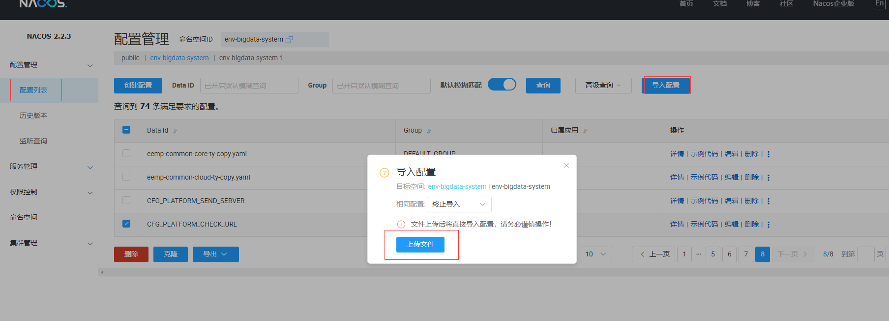
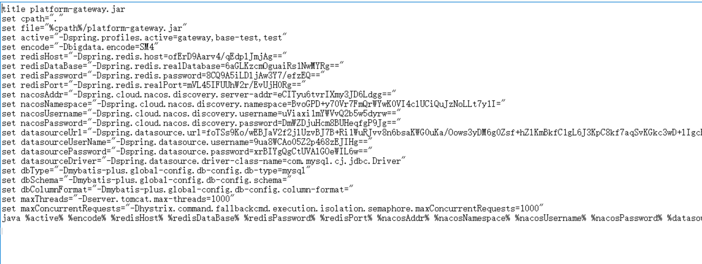

# 注意事项

---

`所有的更新必须要测试才能部署上线，禁止直接部署上线`

## 1 升级V2.1.1.0版本注意事项
### 1.1 nacos的配置
当前版本主要修改了接口越权访问问题，nacos添加了一个新的配置，用于配置接口访问超时时间和越权访问白名单，在更新2.1.1.0之前需要先在nacos导入配置，nacos配置包：[nacos_config_export_20230707101503](http://10.10.204.156:8001/自研软件/中间件/2.1.1.0/nacos_config_export_20230707101503.zip)。



### 1.2 请求方式的修改
当前越权问题由框架统一处理，因此需要调用框架统一封装的请求方法，框架统一封装的请求方法使用了统一拦截器来设置请求签名

框架统一封装的请求方法只要业务集成suncere-sys框架都可以直接调用，有这两种：this.$get(),this.$post(),请求示例如下：

```
this.$get('xxxurl', param).then((res) => {
    
})

this.$post('xxxurl', param).then((res) => {
    
})

```

如果业务在开发过程不是使用的不是框架统一封装的请求方法，而是自定义的一些请求方法，在请求接口时会因为没有签名信息导致接口请求失败

非框架统一封装的请求方法有如下示例：

```
axios.get('/your-url', {
  headers: {
    Authorization: `Bearer ${sessionStorage.getItem("token")}`,
    SysCode: 'aaaaa'
  }
});

axios.post('/your-url', data, {
  headers: {
    'Content-Type': 'application/json',
    Authorization: `Bearer ${sessionStorage.getItem("token")}`,
    SysCode: 'aaaaa'
  }
});

```

针对使用自定义的请求方法，有三种处理方式：

1、如果可以修改的话，将自定义的请求方式修改成框架统一封装的请求方法，一般如果是集成suncer-sys框架的话可以直接调用封装好的请求方法

2、开放白名单，可以将自定义请求方法的请求地址添加到nacos白名单内，白名单的配置就在1.1导入的那个nacos配置内配置，可支持正则匹配

3、可以使用框架提供的统一的签名方法来生成签名，之后再将签名设置进请求头部（注意：当前版本越权处理修改的地方比较多，虽然框架已经提测通过， 

   但是业务更新后可能会存在兼容问题，因此更新后都要测试一下才能部署上线，不要直接部署上线，具体注意事项请看 `自研软件资产 -> 中间件部署指南 -> 部署注意事项` 这篇文章），以下是请求示例：

```
import { signKey } from '@suncereltd/suncere-sys/src/utils/request'

const sign = signKey({},/your-url)
axios.get('/your-url', {
  headers: {
    Authorization: `Bearer ${sessionStorage.getItem("token")}`,
    SysCode: 'aaaaa',
    Sign: sign
  }
});

axios.post('/your-url', data, {
  headers: {
    'Content-Type': 'application/json',
    Authorization: `Bearer ${sessionStorage.getItem("token")}`,
    SysCode: 'aaaaa'
    Sign: sign
  }
});

```
需要注意一点，如果/your-url 这个请求地址是以/api开头的，则需要将/api去掉

## 2 升级V2.1.2.0版本注意事项
### 2.1 启动文件配置说明
1、当前版本的升级主要是对数据库，Redis，nacos，FTP等相关配置进行加密处理，采用的加密方法是SM4。

2、加密方式是做兼容处理，对于旧的不加密配置信息也是兼容。

3、经过加密的密文是一个字符串，但是Redis的端口和使用库标号需要填写数字类型的值，而不是字符串。因此，为了配置加密后的端口号和库标号，使用另外的别名来代替，具体的别名配置请查看`上面的部署文档`

启动文档配置`示例`，以网关启动文件配置说明如下



