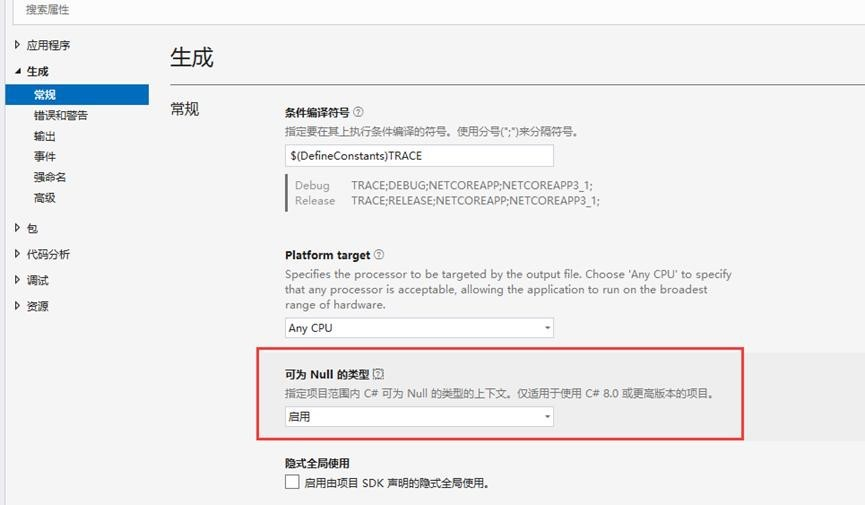
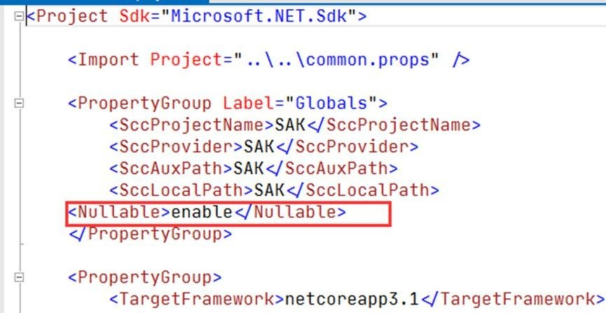

# 代码规范

---

## 1 目的
- 为了使应用程序的结构和编码风格标准化，便于阅读和理解编码，以提高开发效率和产品的标准化。此外，好的编码约定可使源代码严谨、可读性强且意义清楚，与其它语言约定相一致，并且尽可能的直观。
&nbsp;

## 2 原则
+ ### 2.1 编写能被看懂的代码
- ① 定义有意义的属性名，给予每个属性对应的中文说明，必要时附上简要的描述；
- ② 每个接口、函数除了必要的说明外，命名上请根据对应开发语言的默认规范进行定义，如异步函数以 Async 结尾、特性以 Attribute 结尾等等；
- ③ 适当使用代码块，对功能逻辑较为复杂的代码进行划分，并附上必要的描述说明；
+ ### 2.2 代码能少写绝不多写一行
- ① 能复用的代码绝不重复写一遍；
- ② 优先考虑使用框架、架构现有方法，避免重复造轮子；
- ③ 优先使用优秀的稳定的第三方组件，避免重复造轮子。
+ ### 2.3 简洁、高效、风格统一
- ① 统一的命名规范；
- ② 统一的代码缩进；
- ③ 一行代码只做一件事；
- ④ 链式调用适当进行换行；
- ⑤ 循环体避免执行耗时操作；
- ⑥ 避免编写多层循环体嵌套的代码；
&nbsp;

## 3 术语
- 在整个文档中，会有一些对于标准和实践的推荐和建议，根据约束力强弱及故障敏感性，规约依次分为强制、推荐、参考三大类。对于规约条目的延伸信息中，“说明”对内容做了适当扩展和解释；“正例”提倡什么样的编码和实现方式；“反例”说明需要提防的雷区，以及真实的错误案例。
&nbsp;

## 4 C#编码规范
+ ### 4.1 代码格式
- 1．【强制】类或者文件不应该太长一般不应超过 1000 行代码，每个函数的代码行数不超过 200 行。
  - 说明：过多的代码行数会导致阅读与维护的难度加大，将相关代码重构成一个独立函数，可以让代码逻辑更加清晰。
- 2．【强制】为每个名称空间(namespace)建立一个目录。
  - 说明：请按照功能划分你的代码，使结构保持清晰，一般情况下，一个文件应当只有一个类，并且文件名应该与类名保持一致。
正例：例如，我们可以为名称空间 MyProject.Common.Helper 建立这样的目录：MyProject/ Common /Helper。这样做可以很快定位到指定名称空间下的类文件。
- 3．【强制】应该选择 Tab 缩进作为缩进时采用的标准。
- 4．【强制】一定不要在 Window 中文操作系统下使用自带的文本应用打开并编辑代码与配置文件。
  - 说明：这会使文件编码发生改变，导致开发过程中产生各种无法理解的 bug，如代码能正常启动却无法调试或能编译发布却不能运行；如果是部署在 Linux上，极大可能无法正常运行，出现报错、乱码的情况。
- 5．【强制】一定不要更改代码与配置文件的文件编码。
- 6．【强制】一定请将代表某些值的参数、属性或返回值声明为枚举类型。
说明：以入参举例，下面的入参类中，数据来源、数据类型、时间类型、观测类型几个属性值是具有特定意义的，以枚举表示，能让使用者对于参数代表的意义一目了然，同时增加了代码的可读性。

- #### 正例:
``` csharp
public class Input
{
    /// <summary>
    /// 数据来源
    /// </summary>
    public DataSource DataSource { get; set; }
    /// <summary>
    /// 数据类型
    /// </summary>
    public DataType DataType { get; set; }
    /// <summary>
    /// 时间类型
    /// </summary>
    public DateType DateType { get; set; }
    /// <summary>
    /// 观测类型
    /// </summary>
    public ObservationType ObservationType { get; set; }
}
//调用
public void GetData(Input input)
{
    //TODO
}
var input = new Input()
{
    DataSource = DataSource.Act,
    DataType = DataType.App,
    DateType = DateType.Day,
    ObservationType = ObservationType.Station
};
GetData(input);
```

- ### 反例：
``` csharp
public class Input
{
    /// <summary>
    /// 数据来源
    /// </summary>
    public int DataSource { get; set; }
    /// <summary>
    /// 数据类型
    /// </summary>
    public int DataType { get; set; }
    /// <summary>
    /// 时间类型
    /// </summary>
    public int DateType { get; set; }
    /// <summary>
    /// 观测类型
    /// </summary>
    public int ObservationType { get; set; }
}
//调用
public void GetData(Input input)
{
    //TODO
}
var input = new Input()
{
    DataSource = 2,
    DataType = 2,
    DateType = 2,
    ObservationType = 1
};
GetData(input);
```
- 7．【强制】请为枚举提供一个 0 值枚举量。
  - 说明：可以考虑将之命名为 “None”。如果这个名称对于特定的枚举并不合适，可以自行定义为更准确的名称。
- #### 正例:
``` csharp
public enum Compression
{
  None = 0,
  GZip,
  Deflate
}
```
- 8．【强制】一定请在合适的情况下尽量使用枚举类型，而不是静态常量。
- 说明：枚举类型是一个具有一个静态常量集合的结构体。如果遵守这些规范，定义枚举类型，而不是带有静态常量的结构体，您便会得到额外的编译器和反射支持。
- #### 正例:
``` csharp
public enum Color
{
  Red,
  Green,
  Blue
}
```
- #### 反例:
``` csharp
public static class Color
{
  public const int Red = 0;
  public const int Green = 1;
  public const int Blue = 2;
}
```
- 9．【推荐】为了便于调试，建议使用链式调用时，适当将代码进行分段编写
- 说明：链式语句有确实是给编程变得整洁优雅，但是这仅限于一般的查询语句，如连续的 WhereIf，如果是大量使用 GroupBy，Select 等 Linq 混用，将会使得调试器的单步调试变得更为困难，也不方便阅读。
- #### 正例:
``` csharp
var a = 1;
var b = 2;
var datas = items.Where(x => x.score >= 60);
var order = datas.OrderBy(x => x.score);
var item = datas.First();
```
- #### 反例:
``` csharp
var a = 1; var b = 2;
var data = items.Where(x => x.score >= 60).OrderBy(x => x.score).First();
```
- 10．【推荐】应该在代码语句过长时适当进行换行，方便阅读。
- #### 正例:
``` csharp
var data = Items
.Where(x => x.Item1 > 0)
.SelectMany(x => x.Data)
.Select(x => new Item(){
  Item1 = x.Item1,
  Item2 = x.Item2,
  Item3 = x.Item3,
  Item4 = x.Item4,
  Item5 = x.Item5
});
```
- #### 反例:
``` csharp
var data = Items.Where(x => x.Item > 0).SelectMany(x => x.Data).Select(x => new Item()
{
  Item1 = x.Item1,
  Item2 = x.Item2,
  Item3 = x.Item3,
  Item4 = x.Item4,
  Item5 = x.Item5
});
```
- 11．【推荐】应该使用空行来分隔相关语句块。
- 说明：省略额外的空行会加大代码阅读难度，过多的空行造成了空行滥用，并不能使代码更易于阅读，变量声明和代码之间有一行空行,方法实现或类型声明使用 2 行空行。
- #### 正例：可以在变量声明和代码之间有一行空行。
- #### 反例:
``` csharp
public static void ProcessItem(Item item)
{
  int counter = 0;
  // 功能代码
  if(...){ }
}
```
- 12．【推荐】可适当使用空格，空格可降低代码密度增加可读性。
- #### 正例:
``` csharp
CreateFoo(); // 函数名和括号之间没有空格
Method(myChar, 0, 1); // 逗号后的单空格
x = array[index]; // 括号内不能有空格
while(x == y) // 遍历语句前的单个空格
if(x == y) // 单空格分隔操作符
while(x == y)//遍历语句前没有空格
if(x==y)// 没有空格分隔操作符
```
- 13．【推荐】定义变量作为参数，直接以函数或者执行代码作为参数，会给调试带来极大的不便。
- #### 正例:
``` csharp
var pollutantCode = input.PollutantCodes.FirstOrDefault();
var code = input.Codes.FirstOrDefault();
GetDatas(pollutantCode, code);
```
- #### 反例:
``` csharp
GetDatas(input.PollutantCodes.FirstOrDefault(), input.Codes.FirstOrDefault());
```

- 14．【推荐】应该控制参数数量不超过 5 个。
- - - 说明：参数过多可用实体类作为参数，降低阅读难度。
- 15．【推荐】 一定不要引用不必要的库，包括不必要的头文件，或引用不必要的程序集。
- - - 说明：注重细节能够减少项目生成时间，最小化出错几率，并提高代码的阅读性。
- 16．【推荐】一定请在一站式示例代码库的代码示例中使用 Allman 风格的大括号用法。
- - - 说明：Allman 风格是以 Eric Allman 命名的，有时也被称为"ANSI 风格"。该风格将大括号与相关代码置于下一行内，与控制语句的缩进相同。大括号内的语句缩进一个等级。
- #### 正例:
``` csharp
if （x > 5）
{
  y = 0;
}
```
- #### 反例:
``` csharp
if （x > 5） {
  y = 0;
}
```

&nbsp;

+ ### 4.2 命名风格
- 1.【强制】标识符的大小写命名规范。

| 标识符        | 规范                | 命名结构                          | 示例代码      |
| -----------  | --------------------| -------                          | ----------- |
| ----         | ----                | 属性的前缀有意义时，您也可以这样做。 | --- |
| 字段         | -camel 规范          | 名词或形容词                       | private string _name; |
| 委托         | Pascal 规范          | 【强制】请为用于事件的委托增加`EventHandler`后缀。【强制】请为除了用于事件处理程序之外的委托增加`Callback` 后缀。【强制】不要为委托增加`Delegate` 后缀。 | public delegate WindowClosedEventHandler |
| 接口         | Pascal 规范，带有`I` 前缀   | 名词                      | public interface IDictionary |
|扩展类|Pascal 规范，以`Extension`作为后缀 |名词| public static class  DateTimeExtension |
|常量|Pascal 规范用于 Public常量；Camel 规范用 Internal常量;只有 1 或 2个字符的缩写需全部字符大写。 |名词| public const string MessageText= "A";  private const string messageText = "B"; public const double PI = 3.14159...; |
| 参数变量         | Camel 规范   | 名词                      | int customerID; |
| 泛型参数| Pascal 规范，带有`I` 前缀 | 名词【强制】以描述性名称命名泛型参数，除非单字符名称已有足够描述性。【强制】以 T 作为描述性类型参数的前缀。【推荐】使用 T 作为单字符类型参数的名称。 | T, TItem, TPolicy |

- 2．【强制】为各种类型、函数、变量、特性和数据结构选取有意义的命名，其命名应能反映其作用（可参考附件一）。
 - - - #### 反例：使用 a，b，c，item1，item2 等无意义的命名，代码无法阅读。
 - 3．【强制】不要在标识符名中使用缩短或缩略形式的词，不要使用下划线、连字号、其他任何非字母数字的字符。
 - - - #### 正例：使用“GetWindow”而不是“GetWin”，对于公共类型，线程过程，窗口过程，和对话框过程函数，为“ThreadProc”、“DialogProc”、“WndProc”等使用公共后缀。

&nbsp;

+ ### 4.3 注释规约
- 1．【强制】为类、函数、属性作注释。
- 说明：注释的详细程度应该视实现功能而定。
- #### 正例：
 ``` csharp
  /// <summary>
/// 类说明
/// </summary>
  public class Model
  {
  }
  /// <summary>
  /// This method ….
  /// <param name="param1">this is a param of the method SomeMethod.</param>
  /// <retvalue>a return object</retvalue>
  /// </summary>
  public object SomeMethod(object param1)
  {
  }
  /// <summary>
  /// 图表极值公用类
  /// </summary>
  public class ChartExtremumModel
  {
  /// <summary>
  /// 最大值列表
  /// </summary>
  public List<decimal?> MaxList { get; set; } = new List<decimal?>();
  /// <summary>
  /// 最小值列表
  /// </summary>
  public List<decimal?> MinList { get; set; } = new List<decimal?>();
  }
 ```
- 2．【强制】不要让注释仅仅是说明逻辑代码在代码层面的作用，注释不是翻译代码，应该为那些仅通过阅读很难理解其意图的代码添加注释。
- 说明：单行注释应该用于代码的行为并不是那么明显易懂的情况。
- #### 正例：
 ``` csharp
// 循环遍历皱纹数组中的每一项，找到影响最大的新项，并将其存储在“pBestWrinkle”中
for (int i = 0; i <= nLastWrinkle; i++)
  {
    Wrinkle* pWrinkle = apWrinkles[i];
    if (pWrinkle->IsNew() && nMaxImpact < pWrinkle->GetImpact())
    {
      nMaxImpact = pWrinkle->GetImpact();
      pBestWrinkle = pWrinkle;
    }
  }
 ```
- #### 反例：
 ``` csharp
// 遍历数组中的每一项
for (int i = 0; i <= nLastWrinkle; i++)
  {
    Wrinkle* pWrinkle = apWrinkles[i]; // 获取这个项的值
    if (pWrinkle->IsNew() && // 判断是否是新问题，如果是就处理
    nMaxImpact < pWrinkle->GetImpact()) // 判断他的影响是不是最大
  {
    nMaxImpact = pWrinkle->GetImpact(); // 保存这个影响
    pBestWrinkle = pWrinkle; // 赋值这个值
  }
}
 ```
- 3．【强制】如果存在大量代码时，请使用代码块声明。
- 说明：通过作用域或者功能性分类，将大量代码分组，会改善代码易读性和结构。
- #### 正例：
 ``` csharp
 #region 该代码块功能说明
  ...
 #endregion
 ```
 &nbsp;

+ ### 4.4 控制语句
- 1．【推荐】在三元表达式中用变量作为判断值，而不是直接写逻辑代码判断。
- 说明：一定不要嵌套多层三元表达式，这会导致阅读困难，并无法调试。
- #### 正例：
 ``` csharp
List<TItem>? items;
if (data == null || !data.Any())
{
  items = new List<TItem>();
}
else
{
  items = data.Where(x => x.Code == code && x.TimePoint.Year == year &&
  x.ObservationType == observationType);
}
 ```
 - #### 反例：
 ``` csharp
var items = data != null
          ? data.Any()
          ? data.Where(x => x.Code == code && x.TimePoint.Year == year &&
          x.ObservationType == observationType)
          : new List<TItem>()
          : new List<TItem>();
 ```
 - 2．【推荐】在 if 判断代码块执行结束后，若后续不用执行其它代码，应该马上结束（return）代码的执行，每一行代码应当只实现一个逻辑。
 - #### 正例：
 ``` csharp
if (condition)
{
  DoSomething(); //...
}
else
{
  DoSomethingOther();
//...
}
 ```
 - 3．【推荐】一般情况下，不应该在代码中连续或嵌套多层if。
 - 说明：多层的 if 会导致代码几乎无法阅读，并且调试难度极大，单元测试难以完全覆盖问题，应该尝试重新整理代码逻辑，减少if 的使用。
 - #### 反例：
 ``` csharp
if ()
{
  if ()
  {
    if ()
    {
      if ()
      {
        //TODO
      }
    }
  }
  if ()
  {
    if ()
    {
      //TODO
    }
  }
  else if ()
  {
    //TODO
  }
}
 ```
- 4．【强制】在判断、循环中使用“{}”，哪怕后面只有一行逻辑代码。
- 5．【强制】非必要情况下在循环中不要做数据库查询等耗时操作。

&nbsp;

+ ### 4.5 语法规约
- 1．【推荐】尽量少用全局变量。
- 说明：为了正确的使用全局变量，一般是将它们作为参数传入函数。不要在函数或类内部直接引用全局变量，会引起一个副作用：在调用者不知情的情况下改变了全局变量的状态。对于静态变量同样适用。需要修改全局变量，您应该将其作为一个输出参数，或返回其一份全局变量的拷贝。
 - #### 正例：
 ``` csharp
public class Config
{
  public static string path = "test";
}
  // 一般不会修改入参
  public void Todo(string path)
{
}
Todo(Config.path);
```
 - #### 反例：
 ``` csharp
public class Config
{
public static string path = "test";
}
public void Todo()
{
var path = Config.path;
path = "test"; // 可能被修改，导致全局变量改变
}
 ```
- 2．【强制】将不会改变的值定义为常量字段。
- 说明：在代码运行时，编译器直接将常量字段嵌入调用代码处，所以常量值永远不会被改变，可减少性能的开销。
 - #### 正例：
 ``` csharp
 public class Int32
{
public const int MaxValue = 0x7fffffff;
public const int MinValue = unchecked（（int）0x80000000）;
}
```
- 3．【推荐】使用 StringBuilder 来拼接大量字符串，使用“+”操作符或者 $”{value1}-{value2}” 拼接少量的字符串。
 - #### 正例：
 ``` csharp
 StringBuilder sb = new StringBuilder();
for (int i = 0; i < 100; i++)
{
sb.Append(i.ToString());
}
```
- 4．【强制】不要返回数组或集合的 null 值。
- 说明：空值数组或集合的含义在代码环境中很难被理解。比如，开发人员应该确保代码正常运行后，最终返回的值不应该是 null，而是返回空数组或集合。
 - #### 正例：
 ``` csharp
 public List<string> GetDatas()
{
var datas = _monitorServer.GetDatas();
if(datas == null)
{
datas = new List<string>();
}
return datas;
}
```
 - #### 反例：
 ``` csharp
public List<string> GetDatas()
{
  List<string> datas = _monitorServer.GetDatas(); //GetDatas 返回了null
  return datas;
}
 ```
- 5．【强制】除了纯粹用作数据传输的 dto, 其他包含业务逻辑和一定功能的类都应该实现一个接口，通过接口来表示这个类能做什么。
- - - 说明：例如 IDisposable，表示 “对象能被释放”。
- 6． 【强制】不要在入参、出参类中定义无用的属性，应把属性数量控制到刚好够用。
 - #### 正例：
 ``` csharp
public int add(int a, int b)
{
  return a + b;
}
```
 - #### 反例：
 ``` csharp
// 变量 c 没有用到就不应该定义，应该删除
public int add(int a, int b, int c)
{
  return a + b;
}
```
- 7．【强制】实例字段应该都是 Private 字段，并通过属性来提供访问接口。
- 说明：Public 或 Protected 字段并没有受到代码访问安全需求的保护。
- #### 反例：
``` csharp
public class AirAnalysisYearAppService
{
  public readonly IMonitorServer _monitorServer;
  public readonly IBasePollutantDataServer _basePollutantDataServer;
  public AirAnalysisYearAppService(IMonitorServer monitorServer,IBasePollutantDataServer basePollutantDataServer)
  {
    _monitorServer = monitorServer;
    _basePollutantDataServer = basePollutantDataServer;
  }
}
```
- 8．【推荐】为非空类型的属性提供合理的默认值，尤其是集合，以减少空引用错误。
- 9．【推荐】不要从属性访问器内抛出异常。
- 说明：属性访问器应该只包含简单的操作，且不带任何前置条件。如果一个属性访问器可能抛出异常，那么考虑将其重新设计为一个方法。该推荐方法并不适用于索引器。索引器可以因为无效实参而抛出异常。从属性设置器内抛出异常是有效且可接受的。
- #### 反例：
``` csharp
public class Stations
{
  public List<string> DisplayNames
  {
    get
    {
    var stations = _stationServer.GetList();
    //当 stations 为 null 时，会抛出异常
    return stations.Select(x => x.DisplayName).ToList();
    }
  }
}
```
- 10．【推荐】尽量减少在构造函数中写逻辑代码。
- - - 说明：除了得到构造函数参数，设置主要数据成员，构造函数不应该有太多的代码。
- 11．【推荐】通过抛出异常来告知执行失败，抛出的异常类型尽可能和导致异常的问题相符。
- - - 说明：异常在框架内是告知错误的主要手段。如果一个成员方法不能成功的如预期般执行，便应该认为是执行失败，并抛出一个异常。异常应该是明确、有意义的，比如，如果传递了一个 null 实参，则抛 ArgumentNullException，而不是其基类 ArgumentException。抛出并捕获 System.Exception 异常通常都是没有意义的。
- #### 正例：
``` csharp
public void Sort(IList<string> datas)
{
  if (datas == null)
  {
    Throw new ArgumentNullException($"参数{ nameof(datas) }不能为空");
  }
}
```
- #### 反例：
``` csharp
public void Sort(IList<string> datas)
  {
  if (datas == null)
  {
    Throw new Exception("参数不能为空");
  }
}
```
- 12．【强制】异常处理时，不要捕捉异常之后只返回一个错误代码，要根据业务场景进行处理，记录日志或往外抛出。
- #### 正例：
``` csharp
public int Todo()
{
  try
  {
    …
  }
    catch (Exception ex)
  {
    // 日志记录
    // 特殊的业务逻辑
    throw;
  }
}
```
- #### 反例：
``` csharp
public int Todo()
{
  try
  {
    …
  }
    catch (Exception ex)
  {
    return 1;
  }
}
```
- 13．【强制】不要将异常捕捉当作常规的控制流程。
- 说明：除了系统故障 或者带有潜在竞争条件的操作，您编写的代码都不应该抛出异常。比如，在调用可能失败或抛出异常的方法前，您可以检查其前置条件。如下面例子中，对于集合是否为空的判断，可以用if 语句，就不应该用异常捕捉。
- #### 正例：
``` csharp
if （collection != null && !collection.IsReadOnly）
{
  collection.Add（additionalNumber）;
}
```
- #### 反例：
``` csharp
try
{
  collection.Add(additionalNumber);
}
catch (Exception ex)
{
}
```
- 14．【强制】不要显式的从 finally 块内抛出异常。从调用方法内隐式的抛出异常是可以接受的。
- #### 反例：
``` csharp
Input input;
try
{
  input = GetInput();
}
catch (Exception)
{
  //TODO
}
  finally
{
if (input == null)
{
  throw new Exception("参数不能为空");
}
}
```
- 15．【推荐】不能只用 catch(Exception ex)捕获所有异常。
- 说明：try catch 机制中，如下面示例，不同的异常会回调不同的catch。应该按照不同的异常作出相对应的处理，而不是一刀切，只使用catch(Exceptionex)。
- #### 正例：
``` csharp
try
{
...
}
catch(System.NullReferenceException exc)
{
...
}
catch (System.ArgumentOutOfRangeException exc)
{
...
}
catch (System.InvalidCastException exc)
{
...
}
```
- #### 反例：
``` csharp
try
{
...
}
catch(Exception ex)
{
...
}
```
- 16．【强制】在捕获并重新抛出异常时，倾向使用throw 。
- 说明：这是保持异常调用栈的最佳途径。
- #### 正例：
``` csharp
try
{
...
}
catch
{
  file.Position = position;
  throw;
}
```
- #### 反例：
``` csharp
try
{
  ...
}
catch(Exception ex)
{
  file.Position = position;
  throw ex;
}
```
- 17．【强制】在变量需要使用到的时候才声明它，并在声明变量时初始化。
- 说明：在语言允许的情况下，将局部变量的声明和初始化或赋值置于同一行代码内。这减少了代码的垂直空间，确保了变量不会处在未初始化的状态。
- #### 正例：
``` csharp
string name = myObject.Name;
int val = time.Hours;
```
- 18．【强制】不要在同一行中声明多个变量 。
- 说明：推荐每行只包含一句声明，这样有利于添加注释，也减少歧义。
- #### 正例：
``` csharp
CodeExample pFirst = NULL;
CodeExample pSecond = NULL
```
- #### 反例：
``` csharp
CodeExample pFirst, pSecond;
```

&nbsp;

+ ### 4.6 其他
- 1．【推荐】不要忽视 IDE 的警告，请尽量解决这些警告，提高代码的健壮性。
- 2．【强制】一定不要在进行数据库操作时，异步、同步函数混用。
- 3．【推荐】在函数支持异步调用的情况下，尽量使用异步。
- 4．【参考】在.Net Core 开发中，开发环境一般使用appsettings.Development.json 作为配置文件，appsettings.json 作为生产环境配置文件。
- 说明：appsettings.Development.json 与 appsettings.json 文件，不管在哪种环境下，都是先加载 appsettings.json 文件，开发环境下再加载appsettings.Development.json 文件，最外层节点相同下，appsettings.Development.json 节点配置覆盖 appsettings.json 相同节点配置。
- 5．【强制】应用部署环境时，要考虑到 Window 与Linux 路径不一致，可根据系统执行不同的代码逻辑，路径拼接处理建议使用Path.Combine(path1,path2)。
说明：使用相对路径，避免使用绝对路径。
- 6．【推荐】应用部署环境时，使用命令启动并且指定端口，而不是硬编码在系统中，不便于端口的变更。
- 7．【推荐】Visual Studio 开启“可为空的类型”功能。说明：启用“可为空的类型”，在编码过程中，Visual Studio 会警告类或属性可能为 null，编写公共函数时，也可有效告知使用者，该函数可能返回null，修复该警告，能在开发过程中极大减少“未将对象引用设置到对象的实例” 这类常见错误。启用该功能会导致出现大量警告，进行判断 null，或者使用“??”、“?”、“!”解决警告，具体根据场景选择使用。

- 以下是 Visual Studio 2022 中的启用方式，项目-属性-生成-常规。



- 或者通过项目工程文件来进行配置启用。



&nbsp;

## 5 Java编码规范
+ ### 5.1命名风格
- 1．【强制】代码中的命名均不能以下划线或美元符号开始，也不能以下划线或美元符号结束。
- - - 反例：`_name / __name / $Object / name_ / name$ / Object$`
- 2．【强制】代码中的命名严禁使用拼音与英文混合的方式，更不允许直接使用中文的方式。
- - - 说明：正确的英文拼写和语法可以让阅读者易于理解，避免歧义。注意，即使纯拼音命名方式也要避免采用。
- - - 正例：`alibaba / taobao / youku / hangzhou` 等国际通用的名称，可视同英文。
- - - 反例：`DaZhePromotion [打折] / getPingfenByName() [评分] / int 某变量 = 3`
- 3．【强制】类名使用 UpperCamelCase 风格，必须遵从驼峰形式，但以下情形例外：`DO / BO / DTO / VO / AO。`
- - - 正例：`MarcoPolo / UserDO / XmlService / TcpUdpDeal / TaPromotion`
- - - 反例：`macroPolo / UserDo / XMLService / TCPUDPDeal / TAPromotion`
- 4．【强制】方法名、参数名、成员变量、局部变量都统一使用 `lowerCamelCase` 风格，必须遵从驼峰形式。
- - - 正例：`localValue / getHttpMessage() / inputUserId`
- 5．【强制】常量命名全部大写，单词间用下划线隔开，力求语义表达完整清楚，不要嫌名字长。
- - - 正例：`MAX_STOCK_COUNT`
- - - 反例：`MAX_COUNT`
- 6．【强制】抽象类命名使用 `Abstract` 或 `Base` 开头；异常类命名使用Exception 结尾；测试类命名以它要测试的类的名称开始，以 Test 结尾。
- 7．【强制】中括号是数组类型的一部分，数组定义如下：`String[] args;` 反例：使用 `String args[]`的方式来定义。
- 8．【强制】POJO 类中布尔类型的变量，都不要加 is，否则部分框架解析会引起序列化错误。
- - - 反例：定义为基本数据类型 `Boolean` `isDeleted`；的属性，它的方法也是 `isDeleted()`，RPC 框架在反向解析的时候，“以为”对应的属性名称是 deleted，导致属性获取不到，进而抛出异常。
- 9．【强制】包名统一使用小写，点分隔符之间有且仅有一个自然语义的英语单词。包名统一使用单数形式，但是类名如果有复数含义，类名可以使用复数形式。
- - - 正例：应用工具类包名为 `com.alibaba.open.util`、类名为 `MessageUtils`（此规则参考spring 的框架结构）
- 10．【强制】杜绝完全不规范的缩写，避免望文不知义。
- - - 说明：AbstractClass“缩写”命名成 AbsClass；condition“缩写”命名成 condi，此类随意缩写严重降低了代码的可阅读性。
- 11．【推荐】为了达到代码自解释的目标，任何自定义编程元素在命名时，使用尽量完整的单词组合来表达其意。
- - - 正例：从远程仓库拉取代码的类命名为 PullCodeFromRemoteRepository。
- - - 反例：变量 int a; 的随意命名方式。
- 12．【推荐】如果模块、接口、类、方法使用了设计模式，在命名时体现出具体模式。
- - - 说明：将设计模式体现在名字中，有利于阅读者快速理解架构设计理念。
- - - 正例：
``` csharp
      public class OrderFactory; public class LoginProxy;
      public class ResourceObserver;
```
- 13．【推荐】接口类中的方法和属性不要加任何修饰符号（public 也不要加），保持代码的简洁性，并加上有效的 Javadoc 注释。尽量不要在接口里定义变量，如果一定要定义变量，肯定是与接口方法相关，并且是整个应用的基础常量。
- - - 说明：JDK8 中接口允许有默认实现，那么这个 default 方法，是对所有实现类都有价值的默认实现。
- - - 正例：接口方法签名：`void f();`
- - - 接口基础常量表示：`String COMPANY = "alibaba";`
- - - 反例：接口方法定义：p`ublic abstract void f();`
- 14．接口和实现类的命名有两套规则：
- - 1）【强制】对于 `Service` 和 `DAO` 类，基于 `SOA` 的理念，暴露出来的服务一定是接口，内部的实现类用 `Impl` 的后缀与接口区别。
- - - 正例：`CacheServiceImpl` 实现 `CacheService` 接口。
- - 2）【推荐】如果是形容能力的接口名称，取对应的形容词做接口名（通常是–able 的形式）。
- - - 正例：`AbstractTranslator` 实现 `Translatable`
- 15．【参考】枚举类名建议带上 `Enum` 后缀，枚举成员名称需要全大写，单词间用下划线隔开。
- - 说明：枚举其实就是特殊的常量类，且构造方法被默认强制是私有。
- - 正例：枚举名字为 `ProcessStatusEnum` 的成员名称：`SUCCESS / UNKOWN_REASON。`
- 16．【参考】各层命名规约：
- - A) Service/DAO 层方法命名规约
- - - 1）	获取单个对象的方法用 get 做前缀。
- - - 2）	获取多个对象的方法用 list 做前缀。
- - - 3）	获取统计值的方法用 count 做前缀。 4） 插入的方法用 save/insert 做前缀。
- - - 5）	删除的方法用 remove/delete 做前缀。
- - - 6）	修改的方法用 update 做前缀。
- - B) 领域模型命名规约
- - - 1）	数据对象：xxxDO，xxx 即为数据表名。
- - - 2）	数据传输对象：xxxDTO，xxx 为业务领域相关的名称。
- - - 3）	展示对象：xxxVO，xxx 一般为网页名称。
- - - 4）	POJO 是 DO/DTO/BO/VO 的统称，禁止命名成 xxxPOJO。

+ ### 5.2常量定义
- 1.【强制】不允许任何魔法值（即未经定义的常量）直接出现在代码中。
- - #### 正例：
``` csharp
    String key = "Id#taobao_" + tradeId;
    cache.put(key, value);
```
- 2.【强制】long 或者 Long 初始赋值时，使用大写的 L，不能是小写的l，小写容易跟数字 1 混淆，造成误解。
- - 说明：Long a = 2l; 写的是数字的 21，还是 Long 型的 2?
- 3.【推荐】不要使用一个常量类维护所有常量，按常量功能进行归类，分开维护。
- - 说明：大而全的常量类，非得使用查找功能才能定位到修改的常量，不利于理解和维护。
- - 正例：缓存相关常量放在类 `CacheConsts` 下；系统配置相关常量放在类`ConfigConsts` 下。
- 4.【推荐】常量的复用层次有五层：跨应用共享常量、应用内共享常量、子工程内共享常量、包内共享常量、类内共享常量。
- - 1）	跨应用共享常量：放置在二方库中，通常是 client.jar 中的 constant 目录下。
- - 2）	应用内共享常量：放置在一方库中，通常是 modules 中的 constant 目录下。
- - - 反例：易懂变量也要统一定义成应用内共享常量，两位攻城师在两个类中分别定义了表示“是”的变量：类 A 中：public static final String YES = "yes"; 类 B 中 ： public static final String YES = "y"; A.YES.equals(B.YES)，预期是 true，但实际返回为 false，导致线上问题。
- - 3）	子工程内部共享常量：即在当前子工程的 constant 目录下。
- - 4）	包内共享常量：即在当前包下单独的 constant 目录下。
- - 5）	类内共享常量：直接在类内部 private static final 定义。
- 5.【推荐】如果变量值仅在一个范围内变化，且带有名称之外的延伸属性，定义为枚举类。下面正例中的数字就是延伸信息，表示星期几。
- - ### 正例：
```csharp
    public Enum { MONDAY(1), TUESDAY(2), WEDNESDAY(3), THURSDAY(4),
    FRIDAY(5), SATURDAY(6),SUNDAY(7);}
```
+ ### 5.3代码格式
- 1.【强制】大括号的使用约定。如果是大括号内为空，则简洁地写成{}即可，不需要换行；如果是非空代码块则：
- - 1）	左大括号前不换行。
- - 2）	左大括号后换行。
- - 3） 右大括号前换行。
- - 4） 右大括号后还有 else 等代码则不换行；表示终止的右大括号后必须换行。
- 2.【强制】 左小括号和字符之间不出现空格；同样，右小括号和字符之间也不出现空格。详见第 5 条下方正例提示。
- - 反例：if (空格 a == b 空格)
- 3.【强制】if/for/while/switch/do 等保留字与括号之间都必须加空格。
- 4.【强制】任何二目、三目运算符的左右两边都需要加一个空格。说明：运算符包括赋值运算符=、逻辑运算符&&、加减乘除符号等。
- 5.【强制】采用 4 个空格缩进，禁止使用 tab 字符。
- - 说明：如果使用 tab 缩进，必须设置 1 个 tab 为 4 个空格。IDEA 设置 tab 为 4 个空格时，请勿勾选 Use tab character；而在 eclipse 中，必须勾选 insert spaces for tabs。
- - 正例： （涉及 1-5 点）
```csharp
    public static void main(String[] args) {
      // 缩进 4 个空格
      String say = "hello";
      // 运算符的左右必须有一个空格
      int flag = 0;
      // 关键词 if 与括号之间必须有一个空格，括号内的 f 与左括号，0 与右括号不需要空格
      if (flag == 0) {
        System.out.println(say);
      }
      // 左大括号前加空格且不换行；左大括号后换行
      if (flag == 1) {
        System.out.println("world");
      // 右大括号前换行，右大括号后有 else，不用换行
      } else {
        System.out.println("ok");
      // 在右大括号后直接结束，则必须换行
      }
    }
```
- 6.【强制】注释的双斜线与注释内容之间有且仅有一个空格。
- - 正例：// 注释内容，注意在//和注释内容之间有一个空格。
- 7.【强制】单行字符数限制不超过 120 个，超出需要换行，换行时遵循如下原则：
- - 1） 第二行相对第一行缩进 4 个空格，从第三行开始，不再继续缩进，参考示例。
- - 2） 运算符与下文一起换行。
- - 3） 方法调用的点符号与下文一起换行。
- - 4） 方法调用时，多个参数，需要换行时，在逗号后进行。 5） 在括号前不要换行，见反例。
- - 正例：
```csharp
    StringBuffer sb = new StringBuffer();
    // 超过 120 个字符的情况下，换行缩进 4 个空格，点号和方法名称一起换行
    sb.append("zi").append("xin")...
    .append("huang")...
    .append("huang")...
    .append("huang");
```
- - 反例：
```csharp
    StringBuffer sb = new StringBuffer();
    // 超过 120 个字符的情况下，不要在括号前换行
    sb.append("zi").append("xin")...append
    ("huang");
    // 参数很多的方法调用可能超过 120 个字符，不要在逗号前换行
    method(args1, args2, args3, ...
    , argsX);
```
- 8.【强制】方法参数在定义和传入时，多个参数逗号后边必须加空格。
- - 正例：下例中实参的"a",后边必须要有一个空格。
- - - `method("a", "b", "c");`
- 9.【强制】IDE 的 text file encoding 设置为 UTF-8; IDE 中文件的换行符使用 Unix 格式，不要使用 Windows 格式。
- 10.【推荐】没有必要增加若干空格来使某一行的字符与上一行对应位置的字符对齐。
- - 正例
```csharp
    int a = 3;
    long b = 4L;
    float c = 5F;
    StringBuffer sb = new StringBuffer();
```