# 1.软件概述

## 1.1.开发目的

国家环境空气质量监测网具备近1800个城市站点，每日产生20万余条监测数据。监测数据的有效性和数据质量受仪器运行状态、运维事件、数据波动、人为干扰、环境气象、站点周边环境、现场突发事件等多种因素制约，异常数据、无效数据不利于真实反映地区实际空气质量情况。

为保障监测数据的有效性和真实性，按时完成海量数据的审核工作尤为重要。目前环境监测数据审核工作基本为人工审核方式，即使已积累多年人工审核经验，但人工审核工作劳动强度大，审核工作持续而繁复，人工判别的不确定性和滞后性显著，异常数据和无效数据被漏审或误判的情况时有发生。由于人工审核大量数据耗时较多，易导致异常状况发现不及时，数据异常原因排查滞后，造成采取后续检修措施的时效性偏低，耽误连续的环境在线监测进程。

数据复核算法对比平台-使用说明书软件开发目的在于，针对CO、NO2、O3、、SO2、PM2.5、PM10六项大气监测指标，结合Xgboost算法、多种统计规则，为环境监测提供高覆盖率的自动化批量数据审核工具，保证监测数据的真、准、全，减少异常数据的遗漏，挺高发现异常数据、判断异常起因、执行站房运维任务的时效性。

软件建立自动化预审核机制，支持批量数据自动预审，人工复审初筛异常数据的审核方式。可按时间段和站点查询数据审核记录，并具备批量站点数据审核查询、人机审核结果对比、重合率统计、覆盖率统计功能，可编辑修改应用算法的配置参数。软件持续运行审核算法的同时，通过不断积累监测数据，进而不断优化模型准确率。

## 1.2.数据异常类型

### 1.2.1.负值修约

负值修约是指仪器设备小时监测结果出现零值或负值。监测数据出现负值情况原因多为环境空气中各项污染物浓度极低、仪器设备故障、运行状态不稳定，软件对负值数据进行初筛和标识。

### 1.2.2.颗粒物占比异常

当PM2.5和PM10浓度关系出现PM2.5 >PM10 的倒挂情况时，判定为颗粒物占比异常。颗粒物监测仪器一般具备加热除湿装置，仪器加热故障易造成颗粒物占比异常。

### 1.2.3.数值恒定

某监测因子数据出现连续25个5分钟值不变的情况，软件自动判定为数据恒值，比对的5分钟值个数可调节。

### 1.2.4.不符合同城趋势

在同一时间段中，某站点的监测数据明显低于或高于其他同城站点的监测数据，数据呈现同城趋势-同城数值离散程度高、同城趋势-同城变化离散程度高的特点。

### 1.2.5.O3与NO2不符合负相关

一般情况下，O3和NO2有具备负相关性，O3升高NO2下降；NO消耗O3生成NO2，受NO浓度升高影响，O3浓度会下降。软件根据O3和NO2之间的相关系数判断异常。

### 1.2.6.O¬3不符合早晚低中午高

O3浓度易受光照强度影响，白天空气中的O2在阳光照射情况下与空气中的氮氧化物、挥发性有机物相互作用而生成O3。常规而言，中午O3浓度偏高，早上和夜晚浓度偏低。若出现O3不符合中午浓度高、早上夜晚浓度低的情况，算法判别为异常数据。

### 1.2.7.仪器状态异常

基于站房内监测仪器的定期质控校准（零点检查、零点校准、跨度检查、跨度校准、量程校准、精度检查、多点检查、噪声检查等）、仪器设备发生异常故障、仪器设备维护等非正常监测状态， 往往会呈现获取率低、中断、恒定、突变等数据状态。软件结合多种监测因子的仪器运行状态、质控任务类型、维护特性、故障状态对数据进行识别标记。

### 1.2.8.模型识别异常

采用Xgboost集成算法，通过基于历史异常数据特征持续训练算法模型，软件使用经过训练的算法模型识别新的异常数据。

# 2.首页

## 2.1 登录界面


图 1 软件平台登录界面

登录界面输入账号和对应的正确密码，点击“登录”即可进入首页。

## 2.2 软件首页

首页由菜单栏、站点搜索栏、数据展示区组成。左侧菜单栏包括“审核中心”、“配置信息”、“用户管理”栏目。右上角显示当前登录用户。如图2所示。

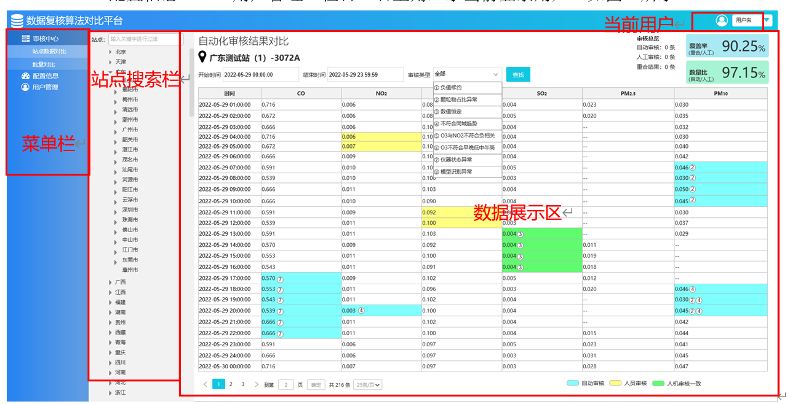

图 2 首页功能区

功能内容概要：

审核中心：主要包括“站点数据对比”、“批量对比”页面功能，“站点数据对比”页面中，可按时间段查询某个站点的数据审核记录。“批量对比”页面支持同时查询多个站点在同一时间段的数据审核记录。

配置信息：用于管理多种异常数据审核机制的配置信息，可查看机制的ID号，设置审核机制是否启动、审核机制的标准值和窗口值等。

用户管理：查看当前软件用户的登记信息和使用权限，可以增减用户、编辑用户信息。

# 3.审核中心

## 3.1.站点数据对比

登录后，软件首页默认为“站点数据对比”页面，浏览软件的其他功能页面时，亦可通过点击左侧目录栏跳转至“站点数据对比”页面。如图3所示。

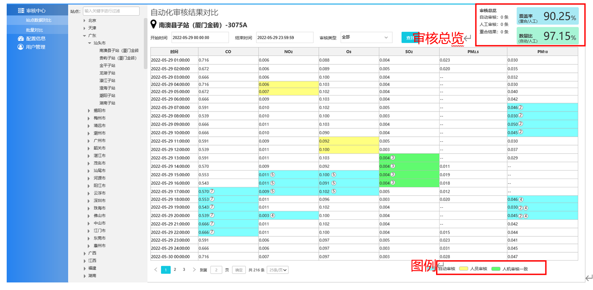

图 3 站点数据对比

### 3.1.1 单站点查询操作

在“站点数据对比”页面中，在左侧站点搜索栏选择目标站点，也可通过输入关键字搜索目标站点。如图4，站点搜索栏目录按省、市逐级排列站点清单。

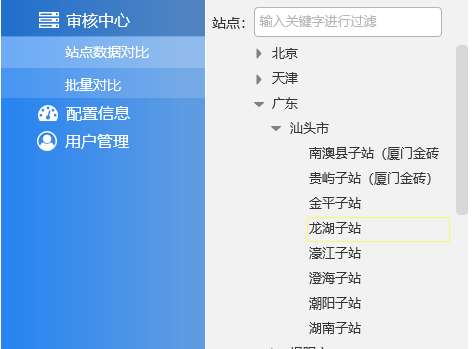

图 4 站点搜索栏目录

已选中目标站点后，选择开始时间和结束时间确定查询的时间段间隔。并选择需查询的异常数据类型。点击“查找”即可显示相应数据，如图5所示。


图 5起止时间、审核类型选择

| 异常类型 | 序号 |
| ---- | ---- |
| 全部 | 无序号 |
| 负值修约 | ① |
| 颗粒物占比异常 | ② |
| 数值恒定 | ③ |
| 不符合同城趋势 | ④ |
| O3与NO2不符合负相关 | ⑤ |
| O3不符合中午高早晚低 | ⑥ |
| 仪器状态异常 | ⑦ |
| 模型识别异常 | ⑧ |

表 1 数据异常类型及其标识

### 3.1.2单站点查询结果显示

数据显示区展示查询结果，结合右下角图例和序号展示异常数据识别状态，可设置每页的显示的数据条数。如图6所示。

蓝色标记：通过软件自动审核识别出异常的数据
黄色标记：通过人工审核识别出异常的数据
绿色标记：软件和人工均参与审核，且异常识别结果一致

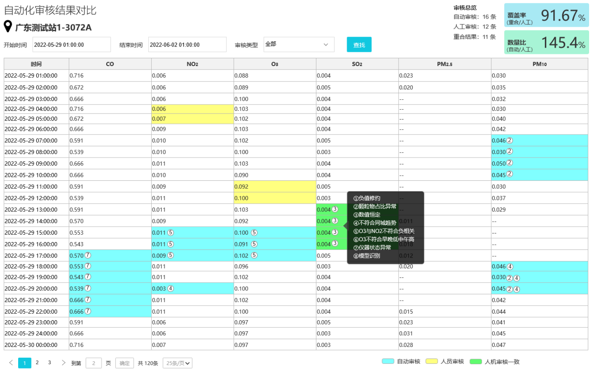

图 6单个站点数据对比结果

鼠标悬停在标识序号上会显示异常类型名称。如图7所示。

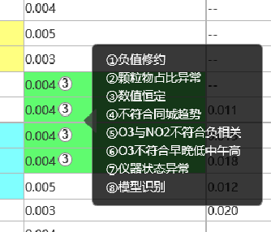

图 7鼠标悬停效果

若查询条件中的“异常类型”选择“全部”，对于同时出现几种异常的某一数据，数值后会显示异常类型序号，如图8所示。

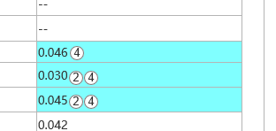

图 8同一数据上多种标识

### 3.1.3审核总览

审核总览位于数据展示区右上角。如图9所示。
自动审核：在查询时间段内，由软件自动审核识别出的异常数据条数。
人工审核：在查询时间段内，由人工审核识别出的异常数据条数。
重合结果：在查询时间段内，软件和人工审核结果一致的异常数据条数。

覆盖率：在查询时间段内，重合条数和人工审核条数的比率。
数量比：在查询时间段内，软件识别异常数据条数和人工识别异常数据条数的比率。

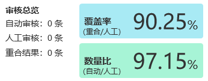

图 9审核总览

## 3.2.批量对比

点击左侧菜单栏，进入“审核中心- 站点数据对比”页面。如图10所示。

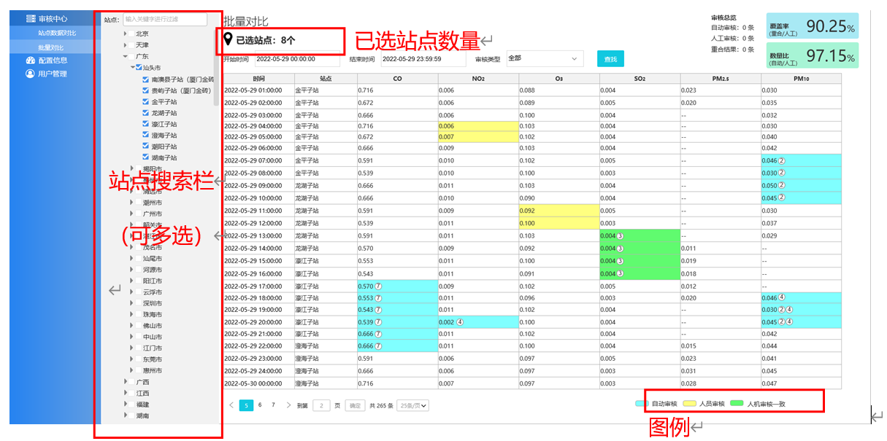

图10 批量对比

### 3.2.1多个站点查询

在“批量对比”页面中，在左侧站点搜索栏选择目标站点，也可通过输入关键字搜索目标站点，可同时选中站点，右侧数据展示区会显示已选站点数量。如图11所示。

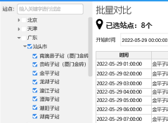

图11 批量站点选择

已选中目标站点后，选择开始时间和结束时间确定查询的时间段间隔。并选择需查询的异常数据类型。点击“查找”即可显示相应数据，操作与图5一致。

### 3.1.2多个站点查询结果显示

数据显示区同时显示统一时间段内的多个站点的数据查询结果，数据按照时间顺序、站点名称在搜索栏中的先后顺序排列。如图12所示。
审核方式的颜色图例、异常数据类型和对应标记序号、鼠标悬停效果、与“站点数据对比”页面一致（见3.1.1、3.1.2）。
可在左下方选择单页显示的数据条数，或进行页数跳转。

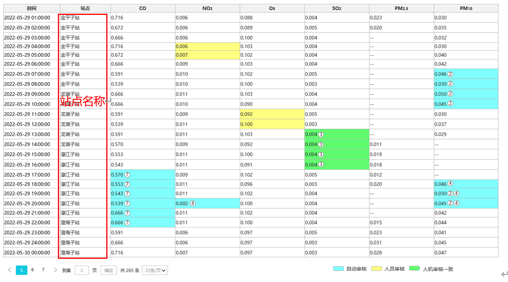

图 12 批量站点数据对比结果

审核总览位于数据展示区右上角，基于查询时间段，综合被选中的多个站点数据，进行异常识别条数汇总和比率计算。
自动审核：软件自动审核识别出的异常数据条数。
人工审核：人工审核识别出的异常数据条数。
重合结果：软件和人工同时审核一致的异常数据条数。
覆盖率：重合结果条数和人工审核条数的比率。
数量比：软件识别异常数据条数和人工识别异常数据条数的比率。

# 4.配置信息

“配置信息”功能页面，用于管理现有异常数据类型的识别机制配置参数，点击“编辑”即可编辑对应类型的配置信息。如图13所示。

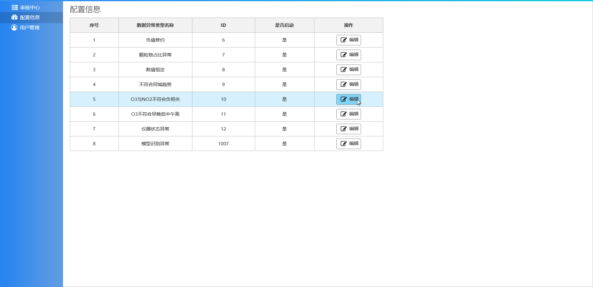

图 13配置信息

单个类型的审核机制配置参数一般包含名称、启用状态、标准值、窗口值。完成设置后，点击“确定”即可保存最新编辑的配置参数，点击“取消”则不作保存，退出至配置信息列表。

配置参数更改后，会影响该异常数据类型的识别机制，建议慎重修改。操作见图14。

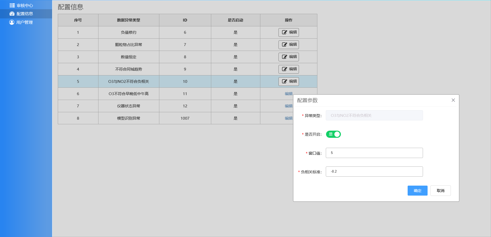

图 14 配置参数编辑

# 5.用户管理

点击左侧菜单栏“用户管理”，即可查看现有的用户登记信息。

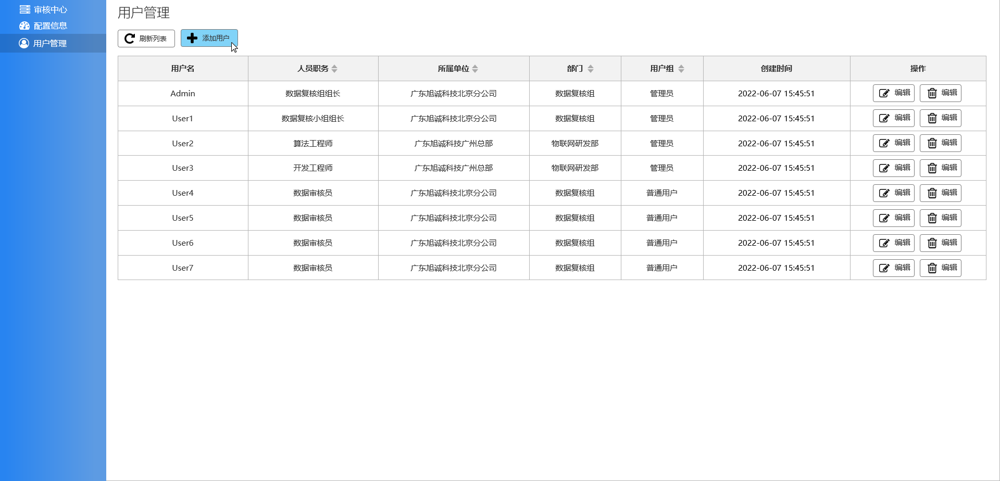

图 15 用户管理

用户信息包括：用户名、人员职位、所属单位、部门、用户组、创建时间、密码等。点击右侧的“新增用户”按键，跳出弹窗后，即可填写信息，红色为必填项目，如图16所示。

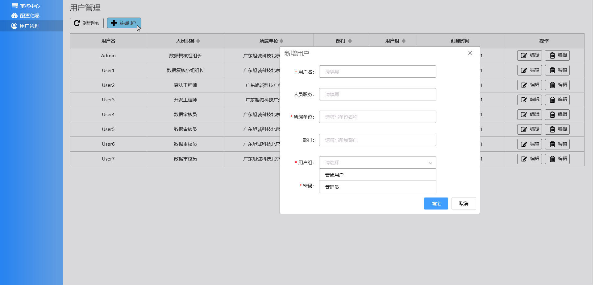

图 16 新增用户

可对现有用户信息进行编辑，点击对应用户右侧的“编辑”按键，进入编辑。点击“确定”即可保存最新编辑的用户信息，点击“取消”则不作保存，退出至用户管理列表。如图17所示。
不同用户的密码互不可见，如需修改密码请本人登录修改。

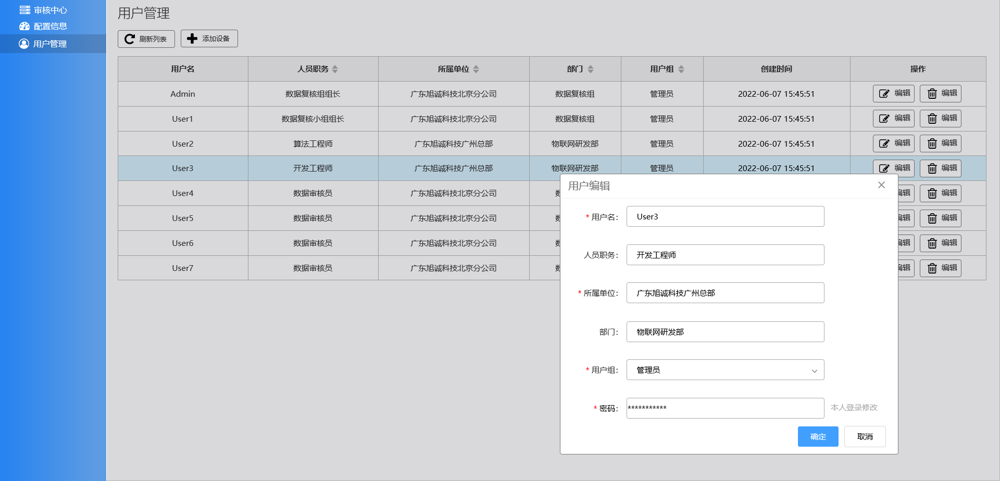

图 17 编辑用户信息

演示视频：

::: demo

```html
<video width="100%" controls>
  <source :src="url" type="video/mp4">
</video>
<script>
  export default{
    data(){
      return {
        url: require('../../../assets/video/ai/13异常数据审核-演示视频.mp4')
      }
    }
  }
</script>
```

:::
