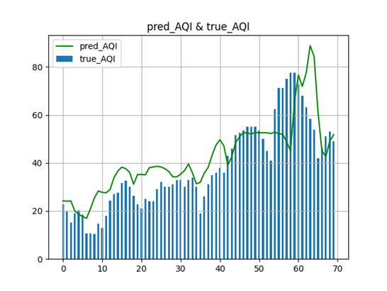
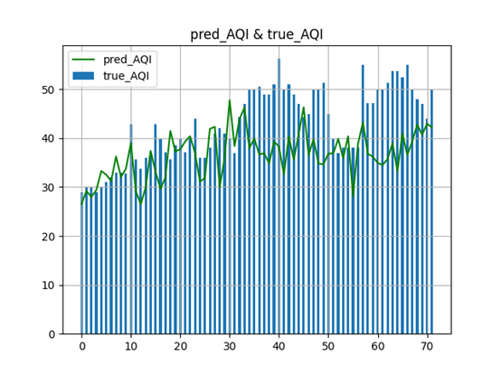

# 介绍

| 部署方式 | 相关技术点 |
| ---- | --- |
| 联网平台 | Xgboost、AutoML、集成学习 |

该算法对空气质量监测数据和气象数据进行预处理（数据提取、缺失值处理、异常值处理、平滑滤波、风向风速处理、划分滑动窗口、数据集划分），进行主成分分析，并融合季节、月份特征，采用基于Xgboost模型回归实现未来三天空气质量小时值和未来七天日均值滚动预测。

Xgboost、是经过优化的分布式梯度提升库。作为现今大规模并行boosting tree的开源工具包，它相比于其他常见的工具包，具备迅速、高效、灵活且可移植，在分类和回归上应用均为广泛的特点。

Xgboost作为一个集成的极端梯度提升的树模型， Xgboost具备显著的底层算法优点：

  1.在惩罚函数上加入正则化，防止了过拟合；

  2.算法过程用到了一阶和二阶泰勒公式，使损失更加精确；

  3.Xgboost还支持并行计算。

空气质量预测算法中，XgBoost模型有通用参数、提升参数和学习任务参数这三类关键参数。通用参数控制空气质量预测模型的宏观能力；提升参数控制每一轮迭代的树生成；学习任务参数决定了学习场景，如损失函数和评价函数，根据任务和目标设置参数。

空气质量预测结果的优良除了表现在充分的特征工程外，关键因素在于模型参数调优，尤其是对提升参数的调优。模型调优方面主要应用FLAML的AutoML、集成学习（集成LSTM、集成NARX、随机森林、GBDT、Bagging、Boosting、Stacking）。

空气质量预测算法可应用于大气污染防治平台、智慧环保项目等，为污染防治决策和管理提供参考和起到预警作用。后续迭代中，亦计划将该类算法用于应对具体的或其他污染物浓度值预测的衍生需求。

空气质量预测效果

