# 1、算法概述

| 部署方式 | 相关技术点 |
| ---- | ---- |
| 动管仪、质控仪 | 基于不同规则的判定，自动触发摄像头转向、抓拍、录像、录屏、360度巡视录屏等动作，拍摄预置点、拍摄方式方式触发机制可自定义配置。 |

对于站房、车间、厂房等监控区域内门长时间未关、仪器状态异常、仪器质控不合格、设备离线、被远程控制、数值突变、数值恒定、数值异常、数据篡改、关键参数改动等各种运维事件或异常人员行为，可自动触发摄像装置在预置点抓拍或录像，进行智能化动态管控、关键事件报警、非现场执法取证。

# 2、操作说明

以烟气动态管控仪为例，点击菜单栏中的“动态管控”右侧下拉按钮，显示所有子模块。动态管控功能包含报警记录、报警关联配置、报警联动记录、门禁记录、移动侦测记录、人脸识别记录、异常行为记录、门状态监测记录、设备灯监测结果、视频监控、视频回放十一个子模块。

## 2.1.报警记录

点击动态管控菜单栏中的“报警记录”，进入报警记录界面，可以查看系统警报的具体信息，系统警报将反映系统出现的异常情况，从而帮助使用者解决问题。

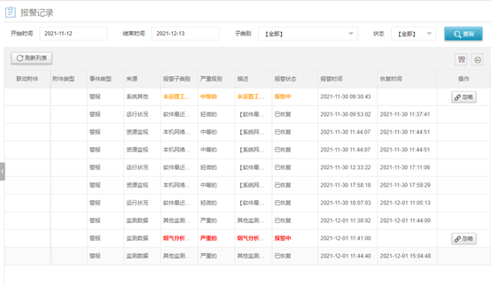

图 1 报警记录界面

在报警记录界面选择时间、类别和状态，点击“查询”按钮即可查询符合条件的警报。对于已经解决的问题可以点击警报右侧的“忽略”按钮清除警报。报警记录界面右上角的筛选和打印按钮分别可以筛选需要显示的信息列与打印报警记录信息。

## 2.2报警关联配置

点击动态管控菜单栏中的“报警关联配置”，进入报警联动配置界面。此界面可以查看所有报警联动的配置信息，可以新增、删除或修改已有的报警联动配置。在配置好报警关联后，发出报警时，系统将会联动摄像头进行相应的转向抓拍、录像、拍照等动作。

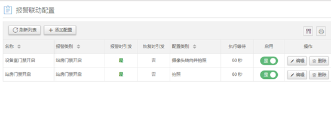

图 2 报警联动配置界面

点击相应报警联动配置启用一栏的按钮，可以启用/停止报警联动配置。
报警联动配置界面右上角的筛选和打印按钮分别可以筛选需要显示的信息列与打印报警联动配置信息。

### 2.2.1添加报警关联配置

在报警联动配置界面中，点击“添加配置”，进入报警关联配置-添加配置界面。
可选以下取证动作类型：

拍照、摄像头转向、摄像头转向并拍照、录屏、摄像头转向并录屏、360度巡视录屏。

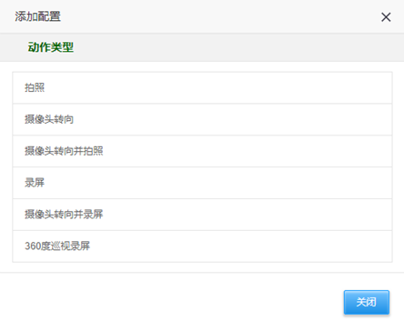

图 3报警关联配置-添加配置界面

在报警关联配置-添加配置界面中，选择点击需要添加的动作类型，进入参数设置界面。

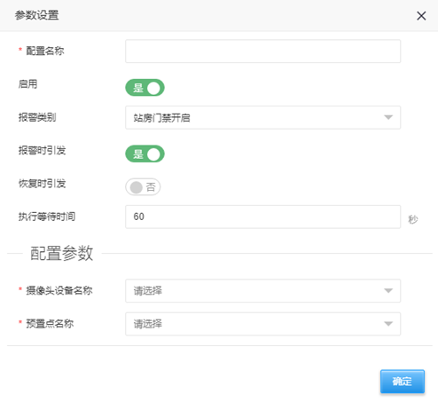

图 4 报警关联配置-参数设置界面

在报警关联配置-参数设置界面，输入配置名称、报警类型、配置参数，点击“确定”按钮，即可添加报警关联配置。

### 2.2.2编辑、删除报警关联配置

在报警联动配置界面中，点击相应的报警关联配置的“编辑”按钮进入参数设置界面，修改配置参数。编辑界面与图 4报警关联配置-参数设置界面相同；点击“删除”按钮即可删除相应的报警关联配置。

## 2.3.报警联动记录

点击动态管控菜单栏中的“报警联动”，进入报警联动记录界面，可以查看系统进行报警联动的记录情况。

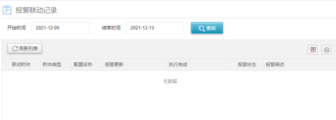

图 5报警联动记录界面

在报警联动记录界面，选择开始时间、结束时间，点击“查询”按钮，即可查询相应时间段的报警联动记录。关键事件的抓拍或录像证据在每条报警联动记录左侧的“联动附件”中。界面右上角的筛选和打印按钮分别可以筛选需要显示的信息列与打印报警联动配置信息。

## 2.4.门禁记录

点击动态管控菜单栏中的“门禁记录”，进入门禁记录界面。此界面显示门禁记录信息。

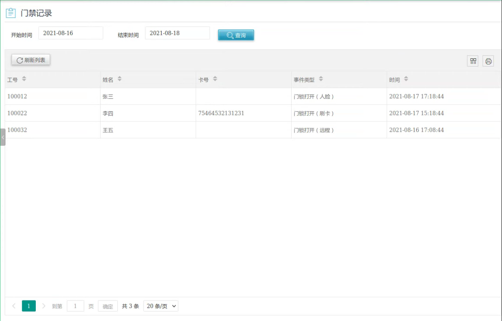

图 6门禁记录界面

在门禁记录界面选择时间范围即可查询该段时间内进行的门禁记录、门禁识别记录、进出人员。门禁记录界面右上角的筛选和打印按钮分别可以筛选需要显示的信息列与打印门禁记录信息。

## 2.5.移动侦测记录

在动态管控菜单栏中，点击“移动侦测记录”进入移动侦测记录界面。此界面可以查看移动侦测记录结果。

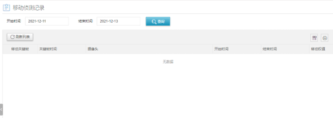

图 7 移动侦测记录界面

在移动侦测记录界面，选择开始时间、结束时间，点击“查询”按钮即可查询该时间范围内的移动关键帧、关键帧时间、持续时间、移动权值等移动侦测记录结果。右上角的筛选和打印按钮分别可以筛选需要显示的信息列与打印人脸识别记录信息。

## 2.6.人脸识别记录

点击动态管控菜单栏中的“人脸识别”，进入人脸识别记录界面，可以查看系统进行人脸识别的记录情况。

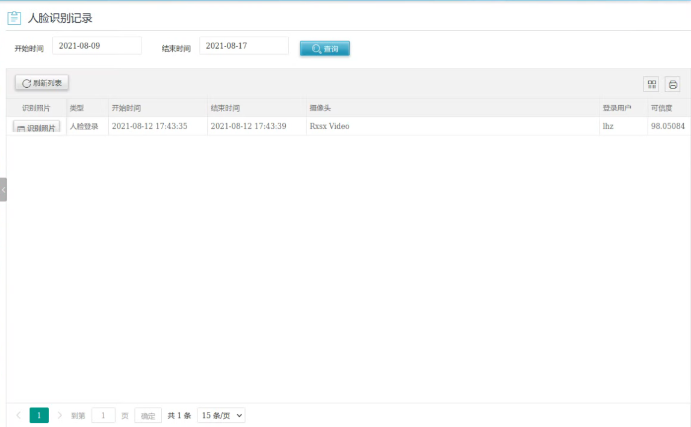

图 8 人脸识别记录界面

在人脸识别记录界面选择时间范围即可查询该段时间内进行的人脸识别登录系统记录情况。可查询该登录人员的系统使用时间，点击相应人脸识别记录左边的“识别照片”，可以查看识别时拍摄的照片。右上角的筛选和打印按钮分别可以筛选需要显示的信息列与打印人脸识别记录信息。

## 2.7.异常行为记录

点击动态管控菜单栏的“异常行为记录”，进入异常行为记录界面。此界面可以查看异常行为的记录结果。

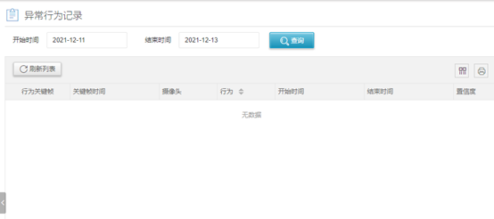

图 9 异常行为记录界面

在异常行为记录界面，选择开始时间、结束时间后，点击“查询”按钮，即可查询该时间段内的异常行为记录（行为关键帧、关键帧时间、摄像头、行为、持续时间、置信度）。界面右上角的筛选和打印按钮分别可以筛选需要显示的信息列与打印异常行为记录信息。

## 2.8.门状态监测结果

点击动态管控菜单栏中的“门状态监测结果”，进入门状态监测结果界面。此界面可以直接查看门状态的监测结果。

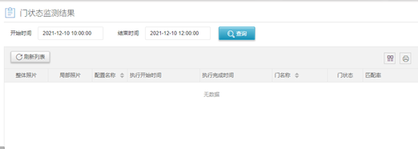

图 10 门状态监测结果界面

在门状态监测结果界面中选择时间范围即可查询该段时间内门状态记录情况。点击相应人脸识别记录左边的“整体照片”或者“局部照片”，可以查看监测时的照片，并可查询配置名称、执行持续时间、门名称及状态、匹配率。界面右上角的筛选和打印按钮分别可以筛选需要显示的信息列与打印门状态记录信息。

## 2.9.设备灯按钮监测结果

点击动态管控菜单栏中的“设备灯监测结果”，进入设备灯监测结果界面。此界面可以查看设备灯的监测结果。

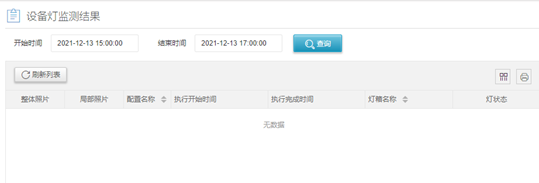

图 11 设备灯监测结果

在设备灯监测结果界面中选择时间范围即可查询该段时间内设备灯的监测结果记录情况。点击相应监测记录左边的“整体照片”或者“局部照片”，可以查看监测时的设备灯照片。界面右上角的筛选和打印按钮分别可以筛选需要显示的信息列与打印设备灯监测结果记录信息。

## 2.10.视频监控

点击动态管控菜单栏中的“视频监控”，进入视频监控界面。此界面可以直接查看摄像头监控画面，并且可以进行屏幕画面截取、缩放与设置。

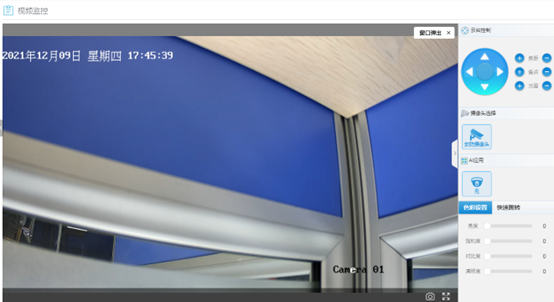

图 12 视频监控界面

在云台控制中点击方向键，可以控制摄像头的转动。点击焦距、焦点、光圈的“+”或者“-”可以设置焦距、焦点、光圈的大小。
在摄像头选择区域中，点击相应的摄像头，可以切换不同摄像头的监控画面。
在AI应用区域中，点击响应的应用图标可以选择相应的AI算法应用。在色彩设置中可以对摄像头进行亮度、饱和度、对比度以及清晰度的设置。
在快速跳转中可以选择摄像头的预置点和新增预置点。

## 2.11 视频回放

点击动态管控菜单栏中的“视频回放”，进入视频回放界面。此界面可以直接查看视频监控的回放画面。

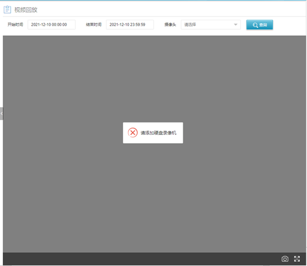

图 13 视频回放界面

选择开始时间、结束时间、摄像头，点击“查询”，可以查看监控视频的回放。视频回放需要为系统添加硬盘录像机。

# 3.AI算法应用配置

以烟气动态管控仪为例，进入AI应用配置界面。此界面可以查看、添加、编辑、删除AI算法应用配置。配置好的AI算法类型可以在视频监控中应用。

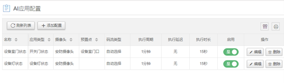

图 14 AI应用配置界面

AI应用配置界面右上角的筛选和打印按钮分别可以筛选需要显示的信息列与打印数据标记规则信息。点击相应AI应用启用一栏的按钮，可以启用/停止相应的AI应用。

## 3.1添加AI算法应用配置

在AI应用配置界面点击“添加配置”按钮，进入添加配置界面。

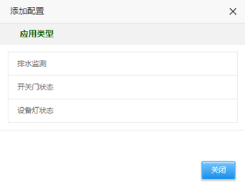

图 15 添加配置界面

在添加配置界面选择点击需要添加的应用类型，进入参数设置界面。

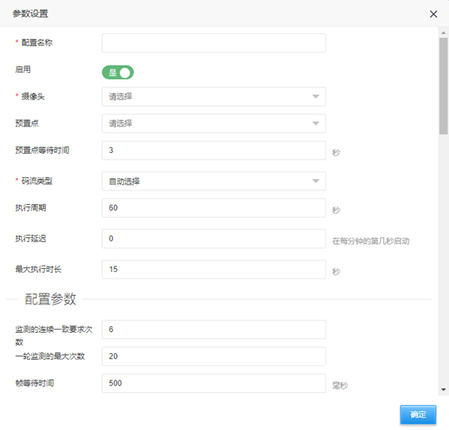

图 16 参数设置界面

在参数设置界面中输入配置名称、配置参数、门信息等，选择摄像头以及码流类型，选择是否启用。点击“确定”按钮即可添加AI应用配置。

### 3.1.1.编辑、删除AI算法应用配置

在AI应用配置界面中，点击相应的AI应用配置的“编辑”按钮，进入参数设置界面，修改相应的配置信息。参数设置界面同图 16参数设置界面；点击相应的AI应用配置的“删除”按钮，即可删除AI应用配置。
