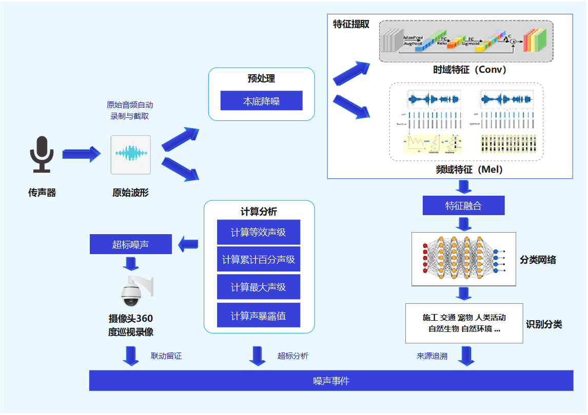

# 介绍

| 部署方式 | 相关技术点 |
| ---- | ---- |
| 噪声监测仪、平台 | logmel频谱图、mobilenet v2、int8量化推理 |

融合声音的时域特征和频域特征进行声纹识别匹配和声音分类。联合超标音频和现场视频抓拍，输出噪声监测数据、AI声纹识别结果、超标音频、联动巡航音频、频谱图记录，辅助噪声监管人员判断超标声源主体，为噪声监管执法与声环境分析提供依据。

建立覆盖面广的音频样例库(生活噪声、施工噪声、工业噪声、交通噪声、自然噪声),并持续扩充音频样例，优化模型准确率。可自动或手动评估声纹识别准确性或置信度，触发规则启动重新的标注、训练和部署。

声纹识别和声音分类算法目前应用于环境噪声自动监测系统（XC-ZS200），该系统是集成噪声监测、车流量监测、气象监测、视频监控、户外LED显示等多功能于一体的噪声监测子站。该系统具备物联网感知技术、数据采集技术、自动化控制技术、无线通信技术、声纹AI智能分析等技术，实现噪声自动监测与远程控制，并组建一站式数据服务平台，实现噪声监测与管控水平智能化。




监控场景：

- 敏感区域噪声

    学校、医院、行政中心等敏感区域噪声监管

- 常规声环境噪声

    城市功能区、住宅区、交通道路两侧等

- 重点源投诉监控

    商业、金融、娱乐、工厂、居民住宅等混合区域噪声监管

演示视频：

::: demo

```html
<video width="100%" controls>
  <source :src="url" type="video/mp4">
</video>
<script>
  export default{
    data(){
      return {
        url: require('../../../assets/video/ai/12声纹识别和声音分类-演示视频.mp4')
      }
    }
  }
</script>
```

:::
